# git/github

这工具是真的烦人，条条框框一大堆，一点都不人性化。

三个区域，两个工作流，一个指针，3+2+1

git是版本控制工具

github是中央仓库

理论上git可以和任何仓库配合，以前还有用分布式仓库的，但是github还是它的最优解。

> git的发明初衷是管理代码，所以它对文本友好，最好不要用它管理office、图片等多媒体文件，这也是为什么有.gitignore文件的原因

## 三个区域

git有三个区域，它的工作就是让数据和文件在这三个区域流转


工作区：原始文件

暂存区：修改后的文件=原始文件+diff

提交区：形成阶段版本的文件，v1、v2之类

修改相当于原文件，只是小部分改动，记录在.git目录中

实际工作流程：

1. `git init`，将目录转化为git工作空间，表现为新建了.git目录
2. 修改文件
3. `git add`，将修改后的文件移入暂存区
4. `git commit`，阶段性修改完成，将暂存区里的文件移入提交区

> 为什么要有暂存区？
>
> 暂存区的最大功能是可以随时回退，如果一旦移入提交区，就已经形成了一个版本，如果再想回退就只能把这个版本删掉了。

## 两个工作流

与其说是上传，更不如说是同步，更贴切。

实际上，开发者在本地维护着一个版本流，远程仓库github也维护着一个版本流，所以要时刻维护远程仓库和本地仓库版本流的同步。最稳妥的实践就是每次`git push`推送本地仓库分支到远程仓库分支之前先`git pull`拉取远程仓库分支到本地，以维护远程分支和本地分支的同步，避免发生意外冲突。

# mermaid画图

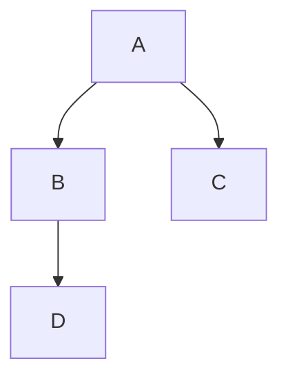

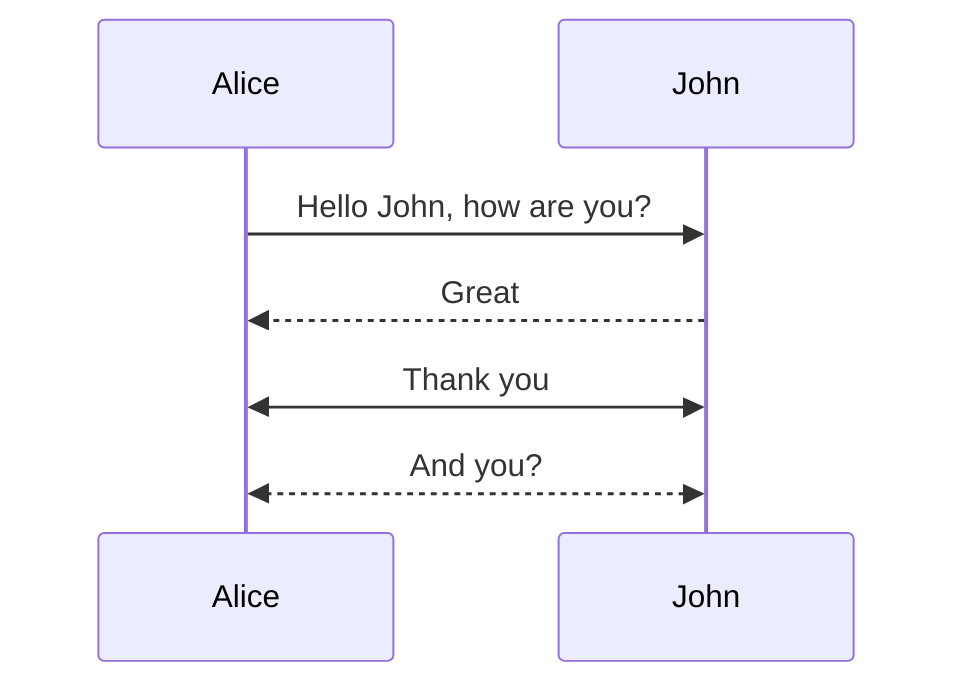


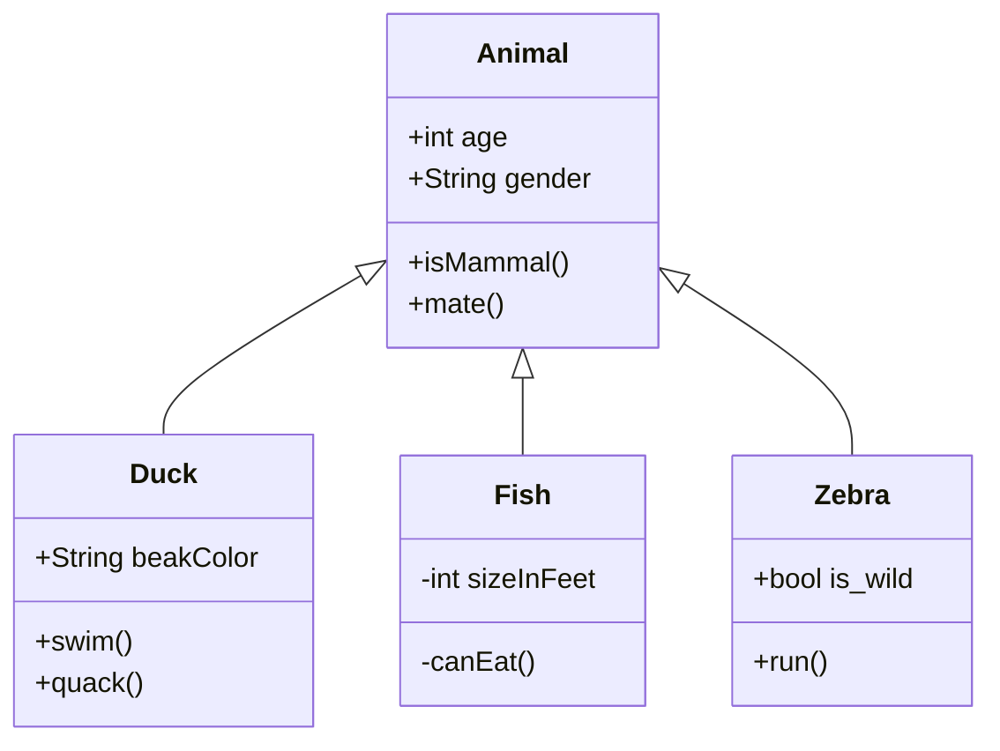

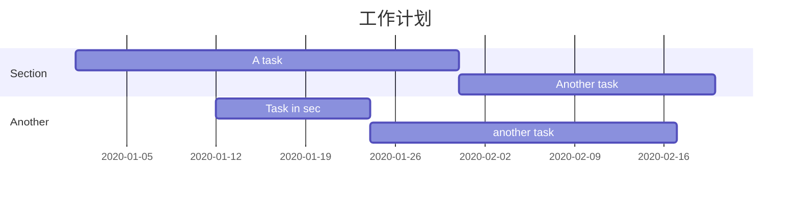

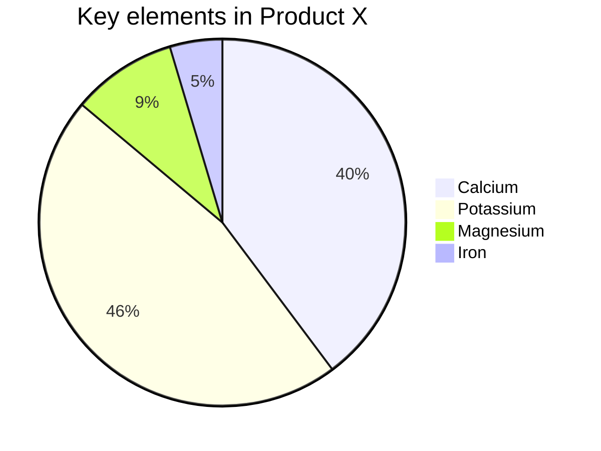

# wireshark

抓包工具

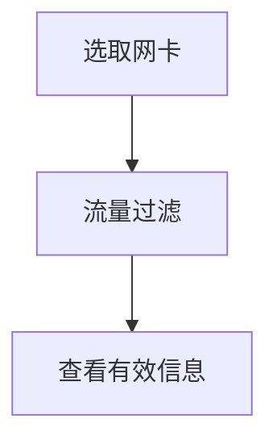

## 三个核心字段：

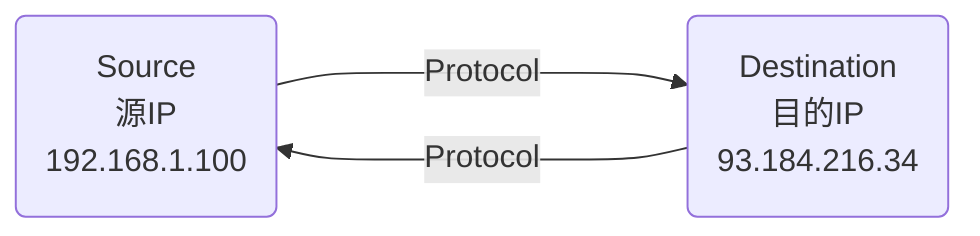

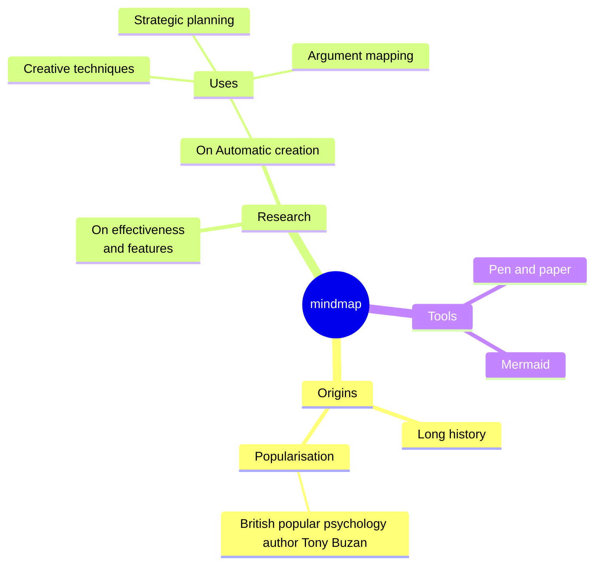

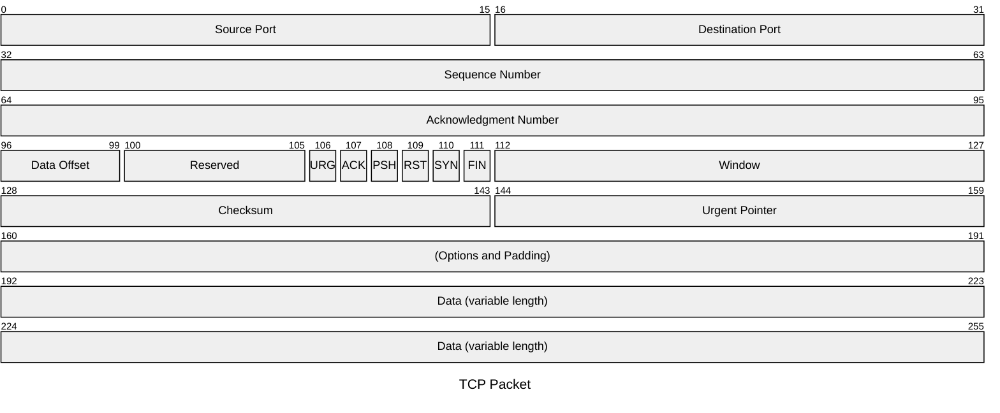

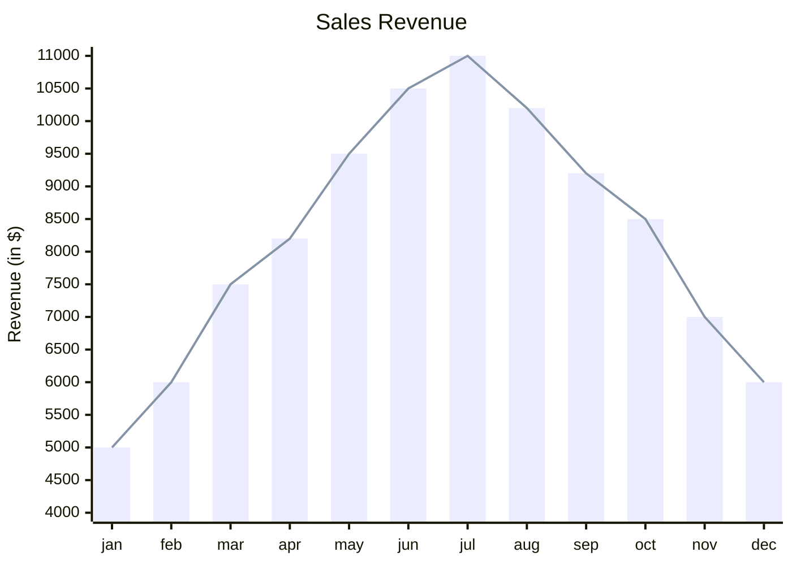

```mermaid
info
```

```mermaid
---
config:
  themeVariables:
    xyChart:
      plotColorPalette: '#000000, #0000FF, #00FF00, #FF0000'
---
xychart
title "Different Colors in xyChart"
x-axis "categoriesX" ["Category 1", "Category 2", "Category 3", "Category 4"]
y-axis "valuesY" 0 --> 50
%% Black line
line [10,20,30,40]
%% Blue bar
bar [20,30,25,35]
%% Green bar
bar [15,25,20,30]
%% Red line
line [5,15,25,35]

```

## 界面4个核心区域

### 捕获接口区

### 过滤器栏

### 数据包列表区

### 数据包详情区

# LLVM

模块化和可重用的编译器和工具链技术的集合

理想编译器架构：

![img](data:image/svg+xml;base64,PHN2ZyB4bWxucz0iaHR0cDovL3d3dy53My5vcmcvMjAwMC9zdmciIHN0eWxlPSJiYWNrZ3JvdW5kOiB0cmFuc3BhcmVudDsgYmFja2dyb3VuZC1jb2xvcjogdHJhbnNwYXJlbnQ7IiB4bWxuczp4bGluaz0iaHR0cDovL3d3dy53My5vcmcvMTk5OS94bGluayIgdmVyc2lvbj0iMS4xIiB3aWR0aD0iNTQwcHgiIGhlaWdodD0iODFweCIgdmlld0JveD0iMCAwIDU0MCA4MSI+PGRlZnMvPjxnPjxnIGRhdGEtY2VsbC1pZD0iMCI+PGcgZGF0YS1jZWxsLWlkPSIxIj48ZyBkYXRhLWNlbGwtaWQ9IlJ2cExvdXI3SGZrZ3BXcmROdEJCLTEiPjxnIHRyYW5zZm9ybT0idHJhbnNsYXRlKDAuNSwwLjUpIj48cmVjdCB4PSI4MCIgeT0iMjAiIHdpZHRoPSIxMjAiIGhlaWdodD0iNjAiIGZpbGw9IiNmZmZmZmYiIHN0cm9rZT0iIzAwMDAwMCIgcG9pbnRlci1ldmVudHM9ImFsbCIgc3R5bGU9ImZpbGw6IGxpZ2h0LWRhcmsoI2ZmZmZmZiwgdmFyKC0tZ2UtZGFyay1jb2xvciwgIzEyMTIxMikpOyBzdHJva2U6IGxpZ2h0LWRhcmsocmdiKDAsIDAsIDApLCByZ2IoMjU1LCAyNTUsIDI1NSkpOyIvPjwvZz48Zz48Zz48c3dpdGNoPjxmb3JlaWduT2JqZWN0IHN0eWxlPSJvdmVyZmxvdzogdmlzaWJsZTsgdGV4dC1hbGlnbjogbGVmdDsiIHBvaW50ZXItZXZlbnRzPSJub25lIiB3aWR0aD0iMTAwJSIgaGVpZ2h0PSIxMDAlIiByZXF1aXJlZEZlYXR1cmVzPSJodHRwOi8vd3d3LnczLm9yZy9UUi9TVkcxMS9mZWF0dXJlI0V4dGVuc2liaWxpdHkiPjxkaXYgeG1sbnM9Imh0dHA6Ly93d3cudzMub3JnLzE5OTkveGh0bWwiIHN0eWxlPSJkaXNwbGF5OiBmbGV4OyBhbGlnbi1pdGVtczogdW5zYWZlIGNlbnRlcjsganVzdGlmeS1jb250ZW50OiB1bnNhZmUgY2VudGVyOyB3aWR0aDogMTE4cHg7IGhlaWdodDogMXB4OyBwYWRkaW5nLXRvcDogNTBweDsgbWFyZ2luLWxlZnQ6IDgxcHg7Ij48ZGl2IHN0eWxlPSJib3gtc2l6aW5nOiBib3JkZXItYm94OyBmb250LXNpemU6IDA7IHRleHQtYWxpZ246IGNlbnRlcjsgY29sb3I6ICMwMDAwMDA7ICI+PGRpdiBzdHlsZT0iZGlzcGxheTogaW5saW5lLWJsb2NrOyBmb250LXNpemU6IDEycHg7IGZvbnQtZmFtaWx5OiBIZWx2ZXRpY2E7IGNvbG9yOiBsaWdodC1kYXJrKCMwMDAwMDAsICNmZmZmZmYpOyBsaW5lLWhlaWdodDogMS4yOyBwb2ludGVyLWV2ZW50czogYWxsOyB3aGl0ZS1zcGFjZTogbm9ybWFsOyB3b3JkLXdyYXA6IG5vcm1hbDsgIj5Gcm9udGVuZDxkaXY+5YmN56uvPC9kaXY+PC9kaXY+PC9kaXY+PC9kaXY+PC9mb3JlaWduT2JqZWN0Pjx0ZXh0IHg9IjE0MCIgeT0iNTQiIGZpbGw9ImxpZ2h0LWRhcmsoIzAwMDAwMCwgI2ZmZmZmZikiIGZvbnQtZmFtaWx5PSJIZWx2ZXRpY2EiIGZvbnQtc2l6ZT0iMTJweCIgdGV4dC1hbmNob3I9Im1pZGRsZSI+RnJvbnRlbmQuLi48L3RleHQ+PC9zd2l0Y2g+PC9nPjwvZz48L2c+PGcgZGF0YS1jZWxsLWlkPSJSdnBMb3VyN0hma2dwV3JkTnRCQi0yIj48ZyB0cmFuc2Zvcm09InRyYW5zbGF0ZSgwLjUsMC41KSI+PHJlY3QgeD0iMjAwIiB5PSIyMCIgd2lkdGg9IjEyMCIgaGVpZ2h0PSI2MCIgZmlsbD0iI2ZmZmZmZiIgc3Ryb2tlPSIjMDAwMDAwIiBwb2ludGVyLWV2ZW50cz0iYWxsIiBzdHlsZT0iZmlsbDogbGlnaHQtZGFyaygjZmZmZmZmLCB2YXIoLS1nZS1kYXJrLWNvbG9yLCAjMTIxMjEyKSk7IHN0cm9rZTogbGlnaHQtZGFyayhyZ2IoMCwgMCwgMCksIHJnYigyNTUsIDI1NSwgMjU1KSk7Ii8+PC9nPjxnPjxnPjxzd2l0Y2g+PGZvcmVpZ25PYmplY3Qgc3R5bGU9Im92ZXJmbG93OiB2aXNpYmxlOyB0ZXh0LWFsaWduOiBsZWZ0OyIgcG9pbnRlci1ldmVudHM9Im5vbmUiIHdpZHRoPSIxMDAlIiBoZWlnaHQ9IjEwMCUiIHJlcXVpcmVkRmVhdHVyZXM9Imh0dHA6Ly93d3cudzMub3JnL1RSL1NWRzExL2ZlYXR1cmUjRXh0ZW5zaWJpbGl0eSI+PGRpdiB4bWxucz0iaHR0cDovL3d3dy53My5vcmcvMTk5OS94aHRtbCIgc3R5bGU9ImRpc3BsYXk6IGZsZXg7IGFsaWduLWl0ZW1zOiB1bnNhZmUgY2VudGVyOyBqdXN0aWZ5LWNvbnRlbnQ6IHVuc2FmZSBjZW50ZXI7IHdpZHRoOiAxMThweDsgaGVpZ2h0OiAxcHg7IHBhZGRpbmctdG9wOiA1MHB4OyBtYXJnaW4tbGVmdDogMjAxcHg7Ij48ZGl2IHN0eWxlPSJib3gtc2l6aW5nOiBib3JkZXItYm94OyBmb250LXNpemU6IDA7IHRleHQtYWxpZ246IGNlbnRlcjsgY29sb3I6ICMwMDAwMDA7ICI+PGRpdiBzdHlsZT0iZGlzcGxheTogaW5saW5lLWJsb2NrOyBmb250LXNpemU6IDEycHg7IGZvbnQtZmFtaWx5OiBIZWx2ZXRpY2E7IGNvbG9yOiBsaWdodC1kYXJrKCMwMDAwMDAsICNmZmZmZmYpOyBsaW5lLWhlaWdodDogMS4yOyBwb2ludGVyLWV2ZW50czogYWxsOyB3aGl0ZS1zcGFjZTogbm9ybWFsOyB3b3JkLXdyYXA6IG5vcm1hbDsgIj5PcHRpbWl6ZXI8ZGl2PuS8mOWMluWZqDwvZGl2PjwvZGl2PjwvZGl2PjwvZGl2PjwvZm9yZWlnbk9iamVjdD48dGV4dCB4PSIyNjAiIHk9IjU0IiBmaWxsPSJsaWdodC1kYXJrKCMwMDAwMDAsICNmZmZmZmYpIiBmb250LWZhbWlseT0iSGVsdmV0aWNhIiBmb250LXNpemU9IjEycHgiIHRleHQtYW5jaG9yPSJtaWRkbGUiPk9wdGltaXplci4uLjwvdGV4dD48L3N3aXRjaD48L2c+PC9nPjwvZz48ZyBkYXRhLWNlbGwtaWQ9IlJ2cExvdXI3SGZrZ3BXcmROdEJCLTMiPjxnIHRyYW5zZm9ybT0idHJhbnNsYXRlKDAuNSwwLjUpIj48cmVjdCB4PSIzMjAiIHk9IjIwIiB3aWR0aD0iMTIwIiBoZWlnaHQ9IjYwIiBmaWxsPSIjZmZmZmZmIiBzdHJva2U9IiMwMDAwMDAiIHBvaW50ZXItZXZlbnRzPSJhbGwiIHN0eWxlPSJmaWxsOiBsaWdodC1kYXJrKCNmZmZmZmYsIHZhcigtLWdlLWRhcmstY29sb3IsICMxMjEyMTIpKTsgc3Ryb2tlOiBsaWdodC1kYXJrKHJnYigwLCAwLCAwKSwgcmdiKDI1NSwgMjU1LCAyNTUpKTsiLz48L2c+PGc+PGc+PHN3aXRjaD48Zm9yZWlnbk9iamVjdCBzdHlsZT0ib3ZlcmZsb3c6IHZpc2libGU7IHRleHQtYWxpZ246IGxlZnQ7IiBwb2ludGVyLWV2ZW50cz0ibm9uZSIgd2lkdGg9IjEwMCUiIGhlaWdodD0iMTAwJSIgcmVxdWlyZWRGZWF0dXJlcz0iaHR0cDovL3d3dy53My5vcmcvVFIvU1ZHMTEvZmVhdHVyZSNFeHRlbnNpYmlsaXR5Ij48ZGl2IHhtbG5zPSJodHRwOi8vd3d3LnczLm9yZy8xOTk5L3hodG1sIiBzdHlsZT0iZGlzcGxheTogZmxleDsgYWxpZ24taXRlbXM6IHVuc2FmZSBjZW50ZXI7IGp1c3RpZnktY29udGVudDogdW5zYWZlIGNlbnRlcjsgd2lkdGg6IDExOHB4OyBoZWlnaHQ6IDFweDsgcGFkZGluZy10b3A6IDUwcHg7IG1hcmdpbi1sZWZ0OiAzMjFweDsiPjxkaXYgc3R5bGU9ImJveC1zaXppbmc6IGJvcmRlci1ib3g7IGZvbnQtc2l6ZTogMDsgdGV4dC1hbGlnbjogY2VudGVyOyBjb2xvcjogIzAwMDAwMDsgIj48ZGl2IHN0eWxlPSJkaXNwbGF5OiBpbmxpbmUtYmxvY2s7IGZvbnQtc2l6ZTogMTJweDsgZm9udC1mYW1pbHk6IEhlbHZldGljYTsgY29sb3I6IGxpZ2h0LWRhcmsoIzAwMDAwMCwgI2ZmZmZmZik7IGxpbmUtaGVpZ2h0OiAxLjI7IHBvaW50ZXItZXZlbnRzOiBhbGw7IHdoaXRlLXNwYWNlOiBub3JtYWw7IHdvcmQtd3JhcDogbm9ybWFsOyAiPkJhY2tlbmQ8ZGl2PuWQjuerrzwvZGl2PjwvZGl2PjwvZGl2PjwvZGl2PjwvZm9yZWlnbk9iamVjdD48dGV4dCB4PSIzODAiIHk9IjU0IiBmaWxsPSJsaWdodC1kYXJrKCMwMDAwMDAsICNmZmZmZmYpIiBmb250LWZhbWlseT0iSGVsdmV0aWNhIiBmb250LXNpemU9IjEycHgiIHRleHQtYW5jaG9yPSJtaWRkbGUiPkJhY2tlbmQuLi48L3RleHQ+PC9zd2l0Y2g+PC9nPjwvZz48L2c+PGcgZGF0YS1jZWxsLWlkPSJSdnBMb3VyN0hma2dwV3JkTnRCQi00Ij48ZyB0cmFuc2Zvcm09InRyYW5zbGF0ZSgwLjUsMC41KSI+PHBhdGggZD0iTSAyMCA0MiBMIDU1IDQyIEwgNTUgMzAgTCA4MCA1MCBMIDU1IDcwIEwgNTUgNTggTCAyMCA1OCBMIDIwIDUwIFoiIGZpbGw9IiNmZmZmZmYiIHN0cm9rZT0iIzAwMDAwMCIgc3Ryb2tlLW1pdGVybGltaXQ9IjEwIiBwb2ludGVyLWV2ZW50cz0iYWxsIiBzdHlsZT0iZmlsbDogbGlnaHQtZGFyaygjZmZmZmZmLCB2YXIoLS1nZS1kYXJrLWNvbG9yLCAjMTIxMjEyKSk7IHN0cm9rZTogbGlnaHQtZGFyayhyZ2IoMCwgMCwgMCksIHJnYigyNTUsIDI1NSwgMjU1KSk7Ii8+PC9nPjwvZz48ZyBkYXRhLWNlbGwtaWQ9IlJ2cExvdXI3SGZrZ3BXcmROdEJCLTUiPjxnIHRyYW5zZm9ybT0idHJhbnNsYXRlKDAuNSwwLjUpIj48cGF0aCBkPSJNIDQ0MCA0MiBMIDQ3NSA0MiBMIDQ3NSAzMCBMIDUwMCA1MCBMIDQ3NSA3MCBMIDQ3NSA1OCBMIDQ0MCA1OCBMIDQ0MCA1MCBaIiBmaWxsPSIjZmZmZmZmIiBzdHJva2U9IiMwMDAwMDAiIHN0cm9rZS1taXRlcmxpbWl0PSIxMCIgcG9pbnRlci1ldmVudHM9ImFsbCIgc3R5bGU9ImZpbGw6IGxpZ2h0LWRhcmsoI2ZmZmZmZiwgdmFyKC0tZ2UtZGFyay1jb2xvciwgIzEyMTIxMikpOyBzdHJva2U6IGxpZ2h0LWRhcmsocmdiKDAsIDAsIDApLCByZ2IoMjU1LCAyNTUsIDI1NSkpOyIvPjwvZz48L2c+PGcgZGF0YS1jZWxsLWlkPSJSdnBMb3VyN0hma2dwV3JkTnRCQi02Ij48ZyB0cmFuc2Zvcm09InRyYW5zbGF0ZSgwLjUsMC41KSI+PHJlY3QgeD0iMCIgeT0iMTAiIHdpZHRoPSI2MCIgaGVpZ2h0PSIzMCIgZmlsbD0ibm9uZSIgc3Ryb2tlPSJub25lIiBwb2ludGVyLWV2ZW50cz0iYWxsIi8+PC9nPjxnPjxnPjxzd2l0Y2g+PGZvcmVpZ25PYmplY3Qgc3R5bGU9Im92ZXJmbG93OiB2aXNpYmxlOyB0ZXh0LWFsaWduOiBsZWZ0OyIgcG9pbnRlci1ldmVudHM9Im5vbmUiIHdpZHRoPSIxMDAlIiBoZWlnaHQ9IjEwMCUiIHJlcXVpcmVkRmVhdHVyZXM9Imh0dHA6Ly93d3cudzMub3JnL1RSL1NWRzExL2ZlYXR1cmUjRXh0ZW5zaWJpbGl0eSI+PGRpdiB4bWxucz0iaHR0cDovL3d3dy53My5vcmcvMTk5OS94aHRtbCIgc3R5bGU9ImRpc3BsYXk6IGZsZXg7IGFsaWduLWl0ZW1zOiB1bnNhZmUgY2VudGVyOyBqdXN0aWZ5LWNvbnRlbnQ6IHVuc2FmZSBjZW50ZXI7IHdpZHRoOiA1OHB4OyBoZWlnaHQ6IDFweDsgcGFkZGluZy10b3A6IDI1cHg7IG1hcmdpbi1sZWZ0OiAxcHg7Ij48ZGl2IHN0eWxlPSJib3gtc2l6aW5nOiBib3JkZXItYm94OyBmb250LXNpemU6IDA7IHRleHQtYWxpZ246IGNlbnRlcjsgY29sb3I6ICMwMDAwMDA7ICI+PGRpdiBzdHlsZT0iZGlzcGxheTogaW5saW5lLWJsb2NrOyBmb250LXNpemU6IDEycHg7IGZvbnQtZmFtaWx5OiBIZWx2ZXRpY2E7IGNvbG9yOiBsaWdodC1kYXJrKCMwMDAwMDAsICNmZmZmZmYpOyBsaW5lLWhlaWdodDogMS4yOyBwb2ludGVyLWV2ZW50czogYWxsOyB3aGl0ZS1zcGFjZTogbm9ybWFsOyB3b3JkLXdyYXA6IG5vcm1hbDsgIj5zb3VyY2U8ZGl2PmNvZGU8L2Rpdj48L2Rpdj48L2Rpdj48L2Rpdj48L2ZvcmVpZ25PYmplY3Q+PHRleHQgeD0iMzAiIHk9IjI5IiBmaWxsPSJsaWdodC1kYXJrKCMwMDAwMDAsICNmZmZmZmYpIiBmb250LWZhbWlseT0iSGVsdmV0aWNhIiBmb250LXNpemU9IjEycHgiIHRleHQtYW5jaG9yPSJtaWRkbGUiPnNvdXJjZS4uLjwvdGV4dD48L3N3aXRjaD48L2c+PC9nPjwvZz48ZyBkYXRhLWNlbGwtaWQ9IlJ2cExvdXI3SGZrZ3BXcmROdEJCLTciPjxnIHRyYW5zZm9ybT0idHJhbnNsYXRlKDAuNSwwLjUpIj48cmVjdCB4PSI0ODAiIHk9IjAiIHdpZHRoPSI2MCIgaGVpZ2h0PSIzMCIgZmlsbD0ibm9uZSIgc3Ryb2tlPSJub25lIiBwb2ludGVyLWV2ZW50cz0iYWxsIi8+PC9nPjxnPjxnPjxzd2l0Y2g+PGZvcmVpZ25PYmplY3Qgc3R5bGU9Im92ZXJmbG93OiB2aXNpYmxlOyB0ZXh0LWFsaWduOiBsZWZ0OyIgcG9pbnRlci1ldmVudHM9Im5vbmUiIHdpZHRoPSIxMDAlIiBoZWlnaHQ9IjEwMCUiIHJlcXVpcmVkRmVhdHVyZXM9Imh0dHA6Ly93d3cudzMub3JnL1RSL1NWRzExL2ZlYXR1cmUjRXh0ZW5zaWJpbGl0eSI+PGRpdiB4bWxucz0iaHR0cDovL3d3dy53My5vcmcvMTk5OS94aHRtbCIgc3R5bGU9ImRpc3BsYXk6IGZsZXg7IGFsaWduLWl0ZW1zOiB1bnNhZmUgY2VudGVyOyBqdXN0aWZ5LWNvbnRlbnQ6IHVuc2FmZSBjZW50ZXI7IHdpZHRoOiA1OHB4OyBoZWlnaHQ6IDFweDsgcGFkZGluZy10b3A6IDE1cHg7IG1hcmdpbi1sZWZ0OiA0ODFweDsiPjxkaXYgc3R5bGU9ImJveC1zaXppbmc6IGJvcmRlci1ib3g7IGZvbnQtc2l6ZTogMDsgdGV4dC1hbGlnbjogY2VudGVyOyBjb2xvcjogIzAwMDAwMDsgIj48ZGl2IHN0eWxlPSJkaXNwbGF5OiBpbmxpbmUtYmxvY2s7IGZvbnQtc2l6ZTogMTJweDsgZm9udC1mYW1pbHk6IEhlbHZldGljYTsgY29sb3I6IGxpZ2h0LWRhcmsoIzAwMDAwMCwgI2ZmZmZmZik7IGxpbmUtaGVpZ2h0OiAxLjI7IHBvaW50ZXItZXZlbnRzOiBhbGw7IHdoaXRlLXNwYWNlOiBub3JtYWw7IHdvcmQtd3JhcDogbm9ybWFsOyAiPuacuuWZqOeggTwvZGl2PjwvZGl2PjwvZGl2PjwvZm9yZWlnbk9iamVjdD48dGV4dCB4PSI1MTAiIHk9IjE5IiBmaWxsPSJsaWdodC1kYXJrKCMwMDAwMDAsICNmZmZmZmYpIiBmb250LWZhbWlseT0iSGVsdmV0aWNhIiBmb250LXNpemU9IjEycHgiIHRleHQtYW5jaG9yPSJtaWRkbGUiPuacuuWZqOeggTwvdGV4dD48L3N3aXRjaD48L2c+PC9nPjwvZz48L2c+PC9nPjwvZz48c3dpdGNoPjxnIHJlcXVpcmVkRmVhdHVyZXM9Imh0dHA6Ly93d3cudzMub3JnL1RSL1NWRzExL2ZlYXR1cmUjRXh0ZW5zaWJpbGl0eSIvPjxhIHRyYW5zZm9ybT0idHJhbnNsYXRlKDAsLTUpIiB4bGluazpocmVmPSJodHRwczovL3d3dy5kcmF3aW8uY29tL2RvYy9mYXEvc3ZnLWV4cG9ydC10ZXh0LXByb2JsZW1zIiB0YXJnZXQ9Il9ibGFuayI+PHRleHQgdGV4dC1hbmNob3I9Im1pZGRsZSIgZm9udC1zaXplPSIxMHB4IiB4PSI1MCUiIHk9IjEwMCUiPlRleHQgaXMgbm90IFNWRyAtIGNhbm5vdCBkaXNwbGF5PC90ZXh0PjwvYT48L3N3aXRjaD48L3N2Zz4=)

**前端**：解析源代码：词法分析、语法分析、语义分析、检查错误，最终构建抽象语法树（Abstract Syntax Tree, AST）来表示源代码。

**优化器**：优化代码，如消除冗余。

**后端**： 将中间代码转化为目标机器指令集

现实是，编译器往往特定于某一种或者某几种语言，无法实现复用。

LLVM架构

![img](data:image/svg+xml;base64,PHN2ZyB4bWxucz0iaHR0cDovL3d3dy53My5vcmcvMjAwMC9zdmciIHN0eWxlPSJiYWNrZ3JvdW5kOiB0cmFuc3BhcmVudDsgYmFja2dyb3VuZC1jb2xvcjogdHJhbnNwYXJlbnQ7IiB4bWxuczp4bGluaz0iaHR0cDovL3d3dy53My5vcmcvMTk5OS94bGluayIgdmVyc2lvbj0iMS4xIiB3aWR0aD0iNjUxcHgiIGhlaWdodD0iMjYycHgiIHZpZXdCb3g9IjAgMCA2NTEgMjYyIj48ZGVmcy8+PGc+PGcgZGF0YS1jZWxsLWlkPSIwIj48ZyBkYXRhLWNlbGwtaWQ9IjEiPjxnIGRhdGEtY2VsbC1pZD0iUnZwTG91cjdIZmtncFdyZE50QkItMjQiPjxnIHRyYW5zZm9ybT0idHJhbnNsYXRlKDAuNSwwLjUpIj48cGF0aCBkPSJNIDIxMCAzNSBMIDI1Ny4xNSAxMjkuMyIgZmlsbD0ibm9uZSIgc3Ryb2tlPSIjMDAwMDAwIiBzdHJva2UtbWl0ZXJsaW1pdD0iMTAiIHBvaW50ZXItZXZlbnRzPSJzdHJva2UiIHN0eWxlPSJzdHJva2U6IGxpZ2h0LWRhcmsocmdiKDAsIDAsIDApLCByZ2IoMjU1LCAyNTUsIDI1NSkpOyIvPjxwYXRoIGQ9Ik0gMjU5LjUgMTM0IEwgMjUzLjI0IDEyOS4zIEwgMjU3LjE1IDEyOS4zIEwgMjU5LjUgMTI2LjE3IFoiIGZpbGw9IiMwMDAwMDAiIHN0cm9rZT0iIzAwMDAwMCIgc3Ryb2tlLW1pdGVybGltaXQ9IjEwIiBwb2ludGVyLWV2ZW50cz0iYWxsIiBzdHlsZT0iZmlsbDogbGlnaHQtZGFyayhyZ2IoMCwgMCwgMCksIHJnYigyNTUsIDI1NSwgMjU1KSk7IHN0cm9rZTogbGlnaHQtZGFyayhyZ2IoMCwgMCwgMCksIHJnYigyNTUsIDI1NSwgMjU1KSk7Ii8+PC9nPjwvZz48ZyBkYXRhLWNlbGwtaWQ9IlJ2cExvdXI3SGZrZ3BXcmROdEJCLTgiPjxnIHRyYW5zZm9ybT0idHJhbnNsYXRlKDAuNSwwLjUpIj48cmVjdCB4PSI4MCIgeT0iMCIgd2lkdGg9IjEzMCIgaGVpZ2h0PSI3MCIgZmlsbD0iI2ZmZmZmZiIgc3Ryb2tlPSIjMDAwMDAwIiBwb2ludGVyLWV2ZW50cz0iYWxsIiBzdHlsZT0iZmlsbDogbGlnaHQtZGFyaygjZmZmZmZmLCB2YXIoLS1nZS1kYXJrLWNvbG9yLCAjMTIxMjEyKSk7IHN0cm9rZTogbGlnaHQtZGFyayhyZ2IoMCwgMCwgMCksIHJnYigyNTUsIDI1NSwgMjU1KSk7Ii8+PC9nPjxnPjxnPjxzd2l0Y2g+PGZvcmVpZ25PYmplY3Qgc3R5bGU9Im92ZXJmbG93OiB2aXNpYmxlOyB0ZXh0LWFsaWduOiBsZWZ0OyIgcG9pbnRlci1ldmVudHM9Im5vbmUiIHdpZHRoPSIxMDAlIiBoZWlnaHQ9IjEwMCUiIHJlcXVpcmVkRmVhdHVyZXM9Imh0dHA6Ly93d3cudzMub3JnL1RSL1NWRzExL2ZlYXR1cmUjRXh0ZW5zaWJpbGl0eSI+PGRpdiB4bWxucz0iaHR0cDovL3d3dy53My5vcmcvMTk5OS94aHRtbCIgc3R5bGU9ImRpc3BsYXk6IGZsZXg7IGFsaWduLWl0ZW1zOiB1bnNhZmUgY2VudGVyOyBqdXN0aWZ5LWNvbnRlbnQ6IHVuc2FmZSBjZW50ZXI7IHdpZHRoOiAxMjhweDsgaGVpZ2h0OiAxcHg7IHBhZGRpbmctdG9wOiAzNXB4OyBtYXJnaW4tbGVmdDogODFweDsiPjxkaXYgc3R5bGU9ImJveC1zaXppbmc6IGJvcmRlci1ib3g7IGZvbnQtc2l6ZTogMDsgdGV4dC1hbGlnbjogY2VudGVyOyBjb2xvcjogIzAwMDAwMDsgIj48ZGl2IHN0eWxlPSJkaXNwbGF5OiBpbmxpbmUtYmxvY2s7IGZvbnQtc2l6ZTogMTJweDsgZm9udC1mYW1pbHk6IEhlbHZldGljYTsgY29sb3I6IGxpZ2h0LWRhcmsoIzAwMDAwMCwgI2ZmZmZmZik7IGxpbmUtaGVpZ2h0OiAxLjI7IHBvaW50ZXItZXZlbnRzOiBhbGw7IHdoaXRlLXNwYWNlOiBub3JtYWw7IHdvcmQtd3JhcDogbm9ybWFsOyAiPkNsYW5nIEMvQysrL09iamVjdCBDPGRpdj7liY3nq688L2Rpdj48L2Rpdj48L2Rpdj48L2Rpdj48L2ZvcmVpZ25PYmplY3Q+PHRleHQgeD0iMTQ1IiB5PSIzOSIgZmlsbD0ibGlnaHQtZGFyaygjMDAwMDAwLCAjZmZmZmZmKSIgZm9udC1mYW1pbHk9IkhlbHZldGljYSIgZm9udC1zaXplPSIxMnB4IiB0ZXh0LWFuY2hvcj0ibWlkZGxlIj5DbGFuZyBDL0MrKy9PYmplY3QgQy4uLjwvdGV4dD48L3N3aXRjaD48L2c+PC9nPjwvZz48ZyBkYXRhLWNlbGwtaWQ9IlJ2cExvdXI3SGZrZ3BXcmROdEJCLTI1Ij48ZyB0cmFuc2Zvcm09InRyYW5zbGF0ZSgwLjUsMC41KSI+PHBhdGggZD0iTSAyMTAgMTM1IEwgMjUzLjYzIDEzNSIgZmlsbD0ibm9uZSIgc3Ryb2tlPSIjMDAwMDAwIiBzdHJva2UtbWl0ZXJsaW1pdD0iMTAiIHBvaW50ZXItZXZlbnRzPSJzdHJva2UiIHN0eWxlPSJzdHJva2U6IGxpZ2h0LWRhcmsocmdiKDAsIDAsIDApLCByZ2IoMjU1LCAyNTUsIDI1NSkpOyIvPjxwYXRoIGQ9Ik0gMjU4Ljg4IDEzNSBMIDI1MS44OCAxMzguNSBMIDI1My42MyAxMzUgTCAyNTEuODggMTMxLjUgWiIgZmlsbD0iIzAwMDAwMCIgc3Ryb2tlPSIjMDAwMDAwIiBzdHJva2UtbWl0ZXJsaW1pdD0iMTAiIHBvaW50ZXItZXZlbnRzPSJhbGwiIHN0eWxlPSJmaWxsOiBsaWdodC1kYXJrKHJnYigwLCAwLCAwKSwgcmdiKDI1NSwgMjU1LCAyNTUpKTsgc3Ryb2tlOiBsaWdodC1kYXJrKHJnYigwLCAwLCAwKSwgcmdiKDI1NSwgMjU1LCAyNTUpKTsiLz48L2c+PC9nPjxnIGRhdGEtY2VsbC1pZD0iUnZwTG91cjdIZmtncFdyZE50QkItMTEiPjxnIHRyYW5zZm9ybT0idHJhbnNsYXRlKDAuNSwwLjUpIj48cmVjdCB4PSI4MCIgeT0iMTAwIiB3aWR0aD0iMTMwIiBoZWlnaHQ9IjcwIiBmaWxsPSIjZmZmZmZmIiBzdHJva2U9IiMwMDAwMDAiIHBvaW50ZXItZXZlbnRzPSJhbGwiIHN0eWxlPSJmaWxsOiBsaWdodC1kYXJrKCNmZmZmZmYsIHZhcigtLWdlLWRhcmstY29sb3IsICMxMjEyMTIpKTsgc3Ryb2tlOiBsaWdodC1kYXJrKHJnYigwLCAwLCAwKSwgcmdiKDI1NSwgMjU1LCAyNTUpKTsiLz48L2c+PGc+PGc+PHN3aXRjaD48Zm9yZWlnbk9iamVjdCBzdHlsZT0ib3ZlcmZsb3c6IHZpc2libGU7IHRleHQtYWxpZ246IGxlZnQ7IiBwb2ludGVyLWV2ZW50cz0ibm9uZSIgd2lkdGg9IjEwMCUiIGhlaWdodD0iMTAwJSIgcmVxdWlyZWRGZWF0dXJlcz0iaHR0cDovL3d3dy53My5vcmcvVFIvU1ZHMTEvZmVhdHVyZSNFeHRlbnNpYmlsaXR5Ij48ZGl2IHhtbG5zPSJodHRwOi8vd3d3LnczLm9yZy8xOTk5L3hodG1sIiBzdHlsZT0iZGlzcGxheTogZmxleDsgYWxpZ24taXRlbXM6IHVuc2FmZSBjZW50ZXI7IGp1c3RpZnktY29udGVudDogdW5zYWZlIGNlbnRlcjsgd2lkdGg6IDEyOHB4OyBoZWlnaHQ6IDFweDsgcGFkZGluZy10b3A6IDEzNXB4OyBtYXJnaW4tbGVmdDogODFweDsiPjxkaXYgc3R5bGU9ImJveC1zaXppbmc6IGJvcmRlci1ib3g7IGZvbnQtc2l6ZTogMDsgdGV4dC1hbGlnbjogY2VudGVyOyBjb2xvcjogIzAwMDAwMDsgIj48ZGl2IHN0eWxlPSJkaXNwbGF5OiBpbmxpbmUtYmxvY2s7IGZvbnQtc2l6ZTogMTJweDsgZm9udC1mYW1pbHk6IEhlbHZldGljYTsgY29sb3I6IGxpZ2h0LWRhcmsoIzAwMDAwMCwgI2ZmZmZmZik7IGxpbmUtaGVpZ2h0OiAxLjI7IHBvaW50ZXItZXZlbnRzOiBhbGw7IHdoaXRlLXNwYWNlOiBub3JtYWw7IHdvcmQtd3JhcDogbm9ybWFsOyAiPmxsdm0tZ2NjPGRpdj7liY3nq688L2Rpdj48L2Rpdj48L2Rpdj48L2Rpdj48L2ZvcmVpZ25PYmplY3Q+PHRleHQgeD0iMTQ1IiB5PSIxMzkiIGZpbGw9ImxpZ2h0LWRhcmsoIzAwMDAwMCwgI2ZmZmZmZikiIGZvbnQtZmFtaWx5PSJIZWx2ZXRpY2EiIGZvbnQtc2l6ZT0iMTJweCIgdGV4dC1hbmNob3I9Im1pZGRsZSI+bGx2bS1nY2MuLi48L3RleHQ+PC9zd2l0Y2g+PC9nPjwvZz48L2c+PGcgZGF0YS1jZWxsLWlkPSJSdnBMb3VyN0hma2dwV3JkTnRCQi0yNiI+PGcgdHJhbnNmb3JtPSJ0cmFuc2xhdGUoMC41LDAuNSkiPjxwYXRoIGQ9Ik0gMjEwIDIyNSBMIDI1Ni45MSAxNDAuNTciIGZpbGw9Im5vbmUiIHN0cm9rZT0iIzAwMDAwMCIgc3Ryb2tlLW1pdGVybGltaXQ9IjEwIiBwb2ludGVyLWV2ZW50cz0ic3Ryb2tlIiBzdHlsZT0ic3Ryb2tlOiBsaWdodC1kYXJrKHJnYigwLCAwLCAwKSwgcmdiKDI1NSwgMjU1LCAyNTUpKTsiLz48cGF0aCBkPSJNIDI1OS40NiAxMzUuOTggTCAyNTkuMTIgMTQzLjggTCAyNTYuOTEgMTQwLjU3IEwgMjUzIDE0MC40IFoiIGZpbGw9IiMwMDAwMDAiIHN0cm9rZT0iIzAwMDAwMCIgc3Ryb2tlLW1pdGVybGltaXQ9IjEwIiBwb2ludGVyLWV2ZW50cz0iYWxsIiBzdHlsZT0iZmlsbDogbGlnaHQtZGFyayhyZ2IoMCwgMCwgMCksIHJnYigyNTUsIDI1NSwgMjU1KSk7IHN0cm9rZTogbGlnaHQtZGFyayhyZ2IoMCwgMCwgMCksIHJnYigyNTUsIDI1NSwgMjU1KSk7Ii8+PC9nPjwvZz48ZyBkYXRhLWNlbGwtaWQ9IlJ2cExvdXI3SGZrZ3BXcmROdEJCLTEyIj48ZyB0cmFuc2Zvcm09InRyYW5zbGF0ZSgwLjUsMC41KSI+PHJlY3QgeD0iODAiIHk9IjE5MCIgd2lkdGg9IjEzMCIgaGVpZ2h0PSI3MCIgZmlsbD0iI2ZmZmZmZiIgc3Ryb2tlPSIjMDAwMDAwIiBwb2ludGVyLWV2ZW50cz0iYWxsIiBzdHlsZT0iZmlsbDogbGlnaHQtZGFyaygjZmZmZmZmLCB2YXIoLS1nZS1kYXJrLWNvbG9yLCAjMTIxMjEyKSk7IHN0cm9rZTogbGlnaHQtZGFyayhyZ2IoMCwgMCwgMCksIHJnYigyNTUsIDI1NSwgMjU1KSk7Ii8+PC9nPjxnPjxnPjxzd2l0Y2g+PGZvcmVpZ25PYmplY3Qgc3R5bGU9Im92ZXJmbG93OiB2aXNpYmxlOyB0ZXh0LWFsaWduOiBsZWZ0OyIgcG9pbnRlci1ldmVudHM9Im5vbmUiIHdpZHRoPSIxMDAlIiBoZWlnaHQ9IjEwMCUiIHJlcXVpcmVkRmVhdHVyZXM9Imh0dHA6Ly93d3cudzMub3JnL1RSL1NWRzExL2ZlYXR1cmUjRXh0ZW5zaWJpbGl0eSI+PGRpdiB4bWxucz0iaHR0cDovL3d3dy53My5vcmcvMTk5OS94aHRtbCIgc3R5bGU9ImRpc3BsYXk6IGZsZXg7IGFsaWduLWl0ZW1zOiB1bnNhZmUgY2VudGVyOyBqdXN0aWZ5LWNvbnRlbnQ6IHVuc2FmZSBjZW50ZXI7IHdpZHRoOiAxMjhweDsgaGVpZ2h0OiAxcHg7IHBhZGRpbmctdG9wOiAyMjVweDsgbWFyZ2luLWxlZnQ6IDgxcHg7Ij48ZGl2IHN0eWxlPSJib3gtc2l6aW5nOiBib3JkZXItYm94OyBmb250LXNpemU6IDA7IHRleHQtYWxpZ246IGNlbnRlcjsgY29sb3I6ICMwMDAwMDA7ICI+PGRpdiBzdHlsZT0iZGlzcGxheTogaW5saW5lLWJsb2NrOyBmb250LXNpemU6IDEycHg7IGZvbnQtZmFtaWx5OiBIZWx2ZXRpY2E7IGNvbG9yOiBsaWdodC1kYXJrKCMwMDAwMDAsICNmZmZmZmYpOyBsaW5lLWhlaWdodDogMS4yOyBwb2ludGVyLWV2ZW50czogYWxsOyB3aGl0ZS1zcGFjZTogbm9ybWFsOyB3b3JkLXdyYXA6IG5vcm1hbDsgIj5HSEM8ZGl2PuWJjeerrzwvZGl2PjwvZGl2PjwvZGl2PjwvZGl2PjwvZm9yZWlnbk9iamVjdD48dGV4dCB4PSIxNDUiIHk9IjIyOSIgZmlsbD0ibGlnaHQtZGFyaygjMDAwMDAwLCAjZmZmZmZmKSIgZm9udC1mYW1pbHk9IkhlbHZldGljYSIgZm9udC1zaXplPSIxMnB4IiB0ZXh0LWFuY2hvcj0ibWlkZGxlIj5HSEMuLi48L3RleHQ+PC9zd2l0Y2g+PC9nPjwvZz48L2c+PGcgZGF0YS1jZWxsLWlkPSJSdnBMb3VyN0hma2dwV3JkTnRCQi0xNCI+PGcgdHJhbnNmb3JtPSJ0cmFuc2xhdGUoMC41LDAuNSkiPjxwYXRoIGQ9Ik0gNTAgMzUgTCA3MS44OCAzNSIgZmlsbD0ibm9uZSIgc3Ryb2tlPSIjMDAwMDAwIiBzdHJva2UtbWl0ZXJsaW1pdD0iMTAiIHBvaW50ZXItZXZlbnRzPSJzdHJva2UiIHN0eWxlPSJzdHJva2U6IGxpZ2h0LWRhcmsocmdiKDAsIDAsIDApLCByZ2IoMjU1LCAyNTUsIDI1NSkpOyIvPjxwYXRoIGQ9Ik0gNzguODggMzUgTCA3MS44OCAzNy4zMyBMIDcxLjg4IDMyLjY3IFoiIGZpbGw9IiMwMDAwMDAiIHN0cm9rZT0iIzAwMDAwMCIgc3Ryb2tlLW1pdGVybGltaXQ9IjEwIiBwb2ludGVyLWV2ZW50cz0iYWxsIiBzdHlsZT0iZmlsbDogbGlnaHQtZGFyayhyZ2IoMCwgMCwgMCksIHJnYigyNTUsIDI1NSwgMjU1KSk7IHN0cm9rZTogbGlnaHQtZGFyayhyZ2IoMCwgMCwgMCksIHJnYigyNTUsIDI1NSwgMjU1KSk7Ii8+PC9nPjwvZz48ZyBkYXRhLWNlbGwtaWQ9IlJ2cExvdXI3SGZrZ3BXcmROdEJCLTE1Ij48ZyB0cmFuc2Zvcm09InRyYW5zbGF0ZSgwLjUsMC41KSI+PHBhdGggZD0iTSA1MCAxMzQuNzEgTCA3MS44OCAxMzQuNzEiIGZpbGw9Im5vbmUiIHN0cm9rZT0iIzAwMDAwMCIgc3Ryb2tlLW1pdGVybGltaXQ9IjEwIiBwb2ludGVyLWV2ZW50cz0ic3Ryb2tlIiBzdHlsZT0ic3Ryb2tlOiBsaWdodC1kYXJrKHJnYigwLCAwLCAwKSwgcmdiKDI1NSwgMjU1LCAyNTUpKTsiLz48cGF0aCBkPSJNIDc4Ljg4IDEzNC43MSBMIDcxLjg4IDEzNy4wNCBMIDcxLjg4IDEzMi4zOCBaIiBmaWxsPSIjMDAwMDAwIiBzdHJva2U9IiMwMDAwMDAiIHN0cm9rZS1taXRlcmxpbWl0PSIxMCIgcG9pbnRlci1ldmVudHM9ImFsbCIgc3R5bGU9ImZpbGw6IGxpZ2h0LWRhcmsocmdiKDAsIDAsIDApLCByZ2IoMjU1LCAyNTUsIDI1NSkpOyBzdHJva2U6IGxpZ2h0LWRhcmsocmdiKDAsIDAsIDApLCByZ2IoMjU1LCAyNTUsIDI1NSkpOyIvPjwvZz48L2c+PGcgZGF0YS1jZWxsLWlkPSJSdnBMb3VyN0hma2dwV3JkTnRCQi0xNiI+PGcgdHJhbnNmb3JtPSJ0cmFuc2xhdGUoMC41LDAuNSkiPjxwYXRoIGQ9Ik0gNTAgMjI0LjcxIEwgNzEuODggMjI0LjcxIiBmaWxsPSJub25lIiBzdHJva2U9IiMwMDAwMDAiIHN0cm9rZS1taXRlcmxpbWl0PSIxMCIgcG9pbnRlci1ldmVudHM9InN0cm9rZSIgc3R5bGU9InN0cm9rZTogbGlnaHQtZGFyayhyZ2IoMCwgMCwgMCksIHJnYigyNTUsIDI1NSwgMjU1KSk7Ii8+PHBhdGggZD0iTSA3OC44OCAyMjQuNzEgTCA3MS44OCAyMjcuMDQgTCA3MS44OCAyMjIuMzggWiIgZmlsbD0iIzAwMDAwMCIgc3Ryb2tlPSIjMDAwMDAwIiBzdHJva2UtbWl0ZXJsaW1pdD0iMTAiIHBvaW50ZXItZXZlbnRzPSJhbGwiIHN0eWxlPSJmaWxsOiBsaWdodC1kYXJrKHJnYigwLCAwLCAwKSwgcmdiKDI1NSwgMjU1LCAyNTUpKTsgc3Ryb2tlOiBsaWdodC1kYXJrKHJnYigwLCAwLCAwKSwgcmdiKDI1NSwgMjU1LCAyNTUpKTsiLz48L2c+PC9nPjxnIGRhdGEtY2VsbC1pZD0iUnZwTG91cjdIZmtncFdyZE50QkItMTciPjxnIHRyYW5zZm9ybT0idHJhbnNsYXRlKDAuNSwwLjUpIj48cmVjdCB4PSIxMCIgeT0iMjAiIHdpZHRoPSI2MCIgaGVpZ2h0PSIzMCIgZmlsbD0ibm9uZSIgc3Ryb2tlPSJub25lIiBwb2ludGVyLWV2ZW50cz0iYWxsIi8+PC9nPjxnPjxnPjxzd2l0Y2g+PGZvcmVpZ25PYmplY3Qgc3R5bGU9Im92ZXJmbG93OiB2aXNpYmxlOyB0ZXh0LWFsaWduOiBsZWZ0OyIgcG9pbnRlci1ldmVudHM9Im5vbmUiIHdpZHRoPSIxMDAlIiBoZWlnaHQ9IjEwMCUiIHJlcXVpcmVkRmVhdHVyZXM9Imh0dHA6Ly93d3cudzMub3JnL1RSL1NWRzExL2ZlYXR1cmUjRXh0ZW5zaWJpbGl0eSI+PGRpdiB4bWxucz0iaHR0cDovL3d3dy53My5vcmcvMTk5OS94aHRtbCIgc3R5bGU9ImRpc3BsYXk6IGZsZXg7IGFsaWduLWl0ZW1zOiB1bnNhZmUgY2VudGVyOyBqdXN0aWZ5LWNvbnRlbnQ6IHVuc2FmZSBjZW50ZXI7IHdpZHRoOiA1OHB4OyBoZWlnaHQ6IDFweDsgcGFkZGluZy10b3A6IDM1cHg7IG1hcmdpbi1sZWZ0OiAxMXB4OyI+PGRpdiBzdHlsZT0iYm94LXNpemluZzogYm9yZGVyLWJveDsgZm9udC1zaXplOiAwOyB0ZXh0LWFsaWduOiBjZW50ZXI7IGNvbG9yOiAjMDAwMDAwOyAiPjxkaXYgc3R5bGU9ImRpc3BsYXk6IGlubGluZS1ibG9jazsgZm9udC1zaXplOiAxMnB4OyBmb250LWZhbWlseTogSGVsdmV0aWNhOyBjb2xvcjogbGlnaHQtZGFyaygjMDAwMDAwLCAjZmZmZmZmKTsgbGluZS1oZWlnaHQ6IDEuMjsgcG9pbnRlci1ldmVudHM6IGFsbDsgd2hpdGUtc3BhY2U6IG5vcm1hbDsgd29yZC13cmFwOiBub3JtYWw7ICI+QzwvZGl2PjwvZGl2PjwvZGl2PjwvZm9yZWlnbk9iamVjdD48dGV4dCB4PSI0MCIgeT0iMzkiIGZpbGw9ImxpZ2h0LWRhcmsoIzAwMDAwMCwgI2ZmZmZmZikiIGZvbnQtZmFtaWx5PSJIZWx2ZXRpY2EiIGZvbnQtc2l6ZT0iMTJweCIgdGV4dC1hbmNob3I9Im1pZGRsZSI+QzwvdGV4dD48L3N3aXRjaD48L2c+PC9nPjwvZz48ZyBkYXRhLWNlbGwtaWQ9IlJ2cExvdXI3SGZrZ3BXcmROdEJCLTE4Ij48ZyB0cmFuc2Zvcm09InRyYW5zbGF0ZSgwLjUsMC41KSI+PHJlY3QgeD0iMCIgeT0iMTIwIiB3aWR0aD0iNjAiIGhlaWdodD0iMzAiIGZpbGw9Im5vbmUiIHN0cm9rZT0ibm9uZSIgcG9pbnRlci1ldmVudHM9ImFsbCIvPjwvZz48Zz48Zz48c3dpdGNoPjxmb3JlaWduT2JqZWN0IHN0eWxlPSJvdmVyZmxvdzogdmlzaWJsZTsgdGV4dC1hbGlnbjogbGVmdDsiIHBvaW50ZXItZXZlbnRzPSJub25lIiB3aWR0aD0iMTAwJSIgaGVpZ2h0PSIxMDAlIiByZXF1aXJlZEZlYXR1cmVzPSJodHRwOi8vd3d3LnczLm9yZy9UUi9TVkcxMS9mZWF0dXJlI0V4dGVuc2liaWxpdHkiPjxkaXYgeG1sbnM9Imh0dHA6Ly93d3cudzMub3JnLzE5OTkveGh0bWwiIHN0eWxlPSJkaXNwbGF5OiBmbGV4OyBhbGlnbi1pdGVtczogdW5zYWZlIGNlbnRlcjsganVzdGlmeS1jb250ZW50OiB1bnNhZmUgY2VudGVyOyB3aWR0aDogNThweDsgaGVpZ2h0OiAxcHg7IHBhZGRpbmctdG9wOiAxMzVweDsgbWFyZ2luLWxlZnQ6IDFweDsiPjxkaXYgc3R5bGU9ImJveC1zaXppbmc6IGJvcmRlci1ib3g7IGZvbnQtc2l6ZTogMDsgdGV4dC1hbGlnbjogY2VudGVyOyBjb2xvcjogIzAwMDAwMDsgIj48ZGl2IHN0eWxlPSJkaXNwbGF5OiBpbmxpbmUtYmxvY2s7IGZvbnQtc2l6ZTogMTJweDsgZm9udC1mYW1pbHk6IEhlbHZldGljYTsgY29sb3I6IGxpZ2h0LWRhcmsoIzAwMDAwMCwgI2ZmZmZmZik7IGxpbmUtaGVpZ2h0OiAxLjI7IHBvaW50ZXItZXZlbnRzOiBhbGw7IHdoaXRlLXNwYWNlOiBub3JtYWw7IHdvcmQtd3JhcDogbm9ybWFsOyAiPkZvcnRyYW48L2Rpdj48L2Rpdj48L2Rpdj48L2ZvcmVpZ25PYmplY3Q+PHRleHQgeD0iMzAiIHk9IjEzOSIgZmlsbD0ibGlnaHQtZGFyaygjMDAwMDAwLCAjZmZmZmZmKSIgZm9udC1mYW1pbHk9IkhlbHZldGljYSIgZm9udC1zaXplPSIxMnB4IiB0ZXh0LWFuY2hvcj0ibWlkZGxlIj5Gb3J0cmFuPC90ZXh0Pjwvc3dpdGNoPjwvZz48L2c+PC9nPjxnIGRhdGEtY2VsbC1pZD0iUnZwTG91cjdIZmtncFdyZE50QkItMTkiPjxnIHRyYW5zZm9ybT0idHJhbnNsYXRlKDAuNSwwLjUpIj48cmVjdCB4PSIwIiB5PSIyMTAiIHdpZHRoPSI2MCIgaGVpZ2h0PSIzMCIgZmlsbD0ibm9uZSIgc3Ryb2tlPSJub25lIiBwb2ludGVyLWV2ZW50cz0iYWxsIi8+PC9nPjxnPjxnPjxzd2l0Y2g+PGZvcmVpZ25PYmplY3Qgc3R5bGU9Im92ZXJmbG93OiB2aXNpYmxlOyB0ZXh0LWFsaWduOiBsZWZ0OyIgcG9pbnRlci1ldmVudHM9Im5vbmUiIHdpZHRoPSIxMDAlIiBoZWlnaHQ9IjEwMCUiIHJlcXVpcmVkRmVhdHVyZXM9Imh0dHA6Ly93d3cudzMub3JnL1RSL1NWRzExL2ZlYXR1cmUjRXh0ZW5zaWJpbGl0eSI+PGRpdiB4bWxucz0iaHR0cDovL3d3dy53My5vcmcvMTk5OS94aHRtbCIgc3R5bGU9ImRpc3BsYXk6IGZsZXg7IGFsaWduLWl0ZW1zOiB1bnNhZmUgY2VudGVyOyBqdXN0aWZ5LWNvbnRlbnQ6IHVuc2FmZSBjZW50ZXI7IHdpZHRoOiA1OHB4OyBoZWlnaHQ6IDFweDsgcGFkZGluZy10b3A6IDIyNXB4OyBtYXJnaW4tbGVmdDogMXB4OyI+PGRpdiBzdHlsZT0iYm94LXNpemluZzogYm9yZGVyLWJveDsgZm9udC1zaXplOiAwOyB0ZXh0LWFsaWduOiBjZW50ZXI7IGNvbG9yOiAjMDAwMDAwOyAiPjxkaXYgc3R5bGU9ImRpc3BsYXk6IGlubGluZS1ibG9jazsgZm9udC1zaXplOiAxMnB4OyBmb250LWZhbWlseTogSGVsdmV0aWNhOyBjb2xvcjogbGlnaHQtZGFyaygjMDAwMDAwLCAjZmZmZmZmKTsgbGluZS1oZWlnaHQ6IDEuMjsgcG9pbnRlci1ldmVudHM6IGFsbDsgd2hpdGUtc3BhY2U6IG5vcm1hbDsgd29yZC13cmFwOiBub3JtYWw7ICI+SGFza2VsbDwvZGl2PjwvZGl2PjwvZGl2PjwvZm9yZWlnbk9iamVjdD48dGV4dCB4PSIzMCIgeT0iMjI5IiBmaWxsPSJsaWdodC1kYXJrKCMwMDAwMDAsICNmZmZmZmYpIiBmb250LWZhbWlseT0iSGVsdmV0aWNhIiBmb250LXNpemU9IjEycHgiIHRleHQtYW5jaG9yPSJtaWRkbGUiPkhhc2tlbGw8L3RleHQ+PC9zd2l0Y2g+PC9nPjwvZz48L2c+PGcgZGF0YS1jZWxsLWlkPSJSdnBMb3VyN0hma2dwV3JkTnRCQi0yNyI+PGcgdHJhbnNmb3JtPSJ0cmFuc2xhdGUoMC41LDAuNSkiPjxwYXRoIGQ9Ik0gMzkwIDEzNSBMIDQyNy42MyA0MC45MSIgZmlsbD0ibm9uZSIgc3Ryb2tlPSIjMDAwMDAwIiBzdHJva2UtbWl0ZXJsaW1pdD0iMTAiIHBvaW50ZXItZXZlbnRzPSJzdHJva2UiIHN0eWxlPSJzdHJva2U6IGxpZ2h0LWRhcmsocmdiKDAsIDAsIDApLCByZ2IoMjU1LCAyNTUsIDI1NSkpOyIvPjxwYXRoIGQ9Ik0gNDI5LjU4IDM2LjA0IEwgNDMwLjIzIDQzLjg0IEwgNDI3LjYzIDQwLjkxIEwgNDIzLjc0IDQxLjI0IFoiIGZpbGw9IiMwMDAwMDAiIHN0cm9rZT0iIzAwMDAwMCIgc3Ryb2tlLW1pdGVybGltaXQ9IjEwIiBwb2ludGVyLWV2ZW50cz0iYWxsIiBzdHlsZT0iZmlsbDogbGlnaHQtZGFyayhyZ2IoMCwgMCwgMCksIHJnYigyNTUsIDI1NSwgMjU1KSk7IHN0cm9rZTogbGlnaHQtZGFyayhyZ2IoMCwgMCwgMCksIHJnYigyNTUsIDI1NSwgMjU1KSk7Ii8+PC9nPjwvZz48ZyBkYXRhLWNlbGwtaWQ9IlJ2cExvdXI3SGZrZ3BXcmROdEJCLTI4Ij48ZyB0cmFuc2Zvcm09InRyYW5zbGF0ZSgwLjUsMC41KSI+PHBhdGggZD0iTSAzOTAgMTM1IEwgNDIzLjYzIDEzNSIgZmlsbD0ibm9uZSIgc3Ryb2tlPSIjMDAwMDAwIiBzdHJva2UtbWl0ZXJsaW1pdD0iMTAiIHBvaW50ZXItZXZlbnRzPSJzdHJva2UiIHN0eWxlPSJzdHJva2U6IGxpZ2h0LWRhcmsocmdiKDAsIDAsIDApLCByZ2IoMjU1LCAyNTUsIDI1NSkpOyIvPjxwYXRoIGQ9Ik0gNDI4Ljg4IDEzNSBMIDQyMS44OCAxMzguNSBMIDQyMy42MyAxMzUgTCA0MjEuODggMTMxLjUgWiIgZmlsbD0iIzAwMDAwMCIgc3Ryb2tlPSIjMDAwMDAwIiBzdHJva2UtbWl0ZXJsaW1pdD0iMTAiIHBvaW50ZXItZXZlbnRzPSJhbGwiIHN0eWxlPSJmaWxsOiBsaWdodC1kYXJrKHJnYigwLCAwLCAwKSwgcmdiKDI1NSwgMjU1LCAyNTUpKTsgc3Ryb2tlOiBsaWdodC1kYXJrKHJnYigwLCAwLCAwKSwgcmdiKDI1NSwgMjU1LCAyNTUpKTsiLz48L2c+PC9nPjxnIGRhdGEtY2VsbC1pZD0iUnZwTG91cjdIZmtncFdyZE50QkItMjkiPjxnIHRyYW5zZm9ybT0idHJhbnNsYXRlKDAuNSwwLjUpIj48cGF0aCBkPSJNIDM5MCAxMzUgTCA0MjcuNDEgMjE5LjE4IiBmaWxsPSJub25lIiBzdHJva2U9IiMwMDAwMDAiIHN0cm9rZS1taXRlcmxpbWl0PSIxMCIgcG9pbnRlci1ldmVudHM9InN0cm9rZSIgc3R5bGU9InN0cm9rZTogbGlnaHQtZGFyayhyZ2IoMCwgMCwgMCksIHJnYigyNTUsIDI1NSwgMjU1KSk7Ii8+PHBhdGggZD0iTSA0MjkuNTUgMjIzLjk4IEwgNDIzLjUgMjE5IEwgNDI3LjQxIDIxOS4xOCBMIDQyOS45IDIxNi4xNiBaIiBmaWxsPSIjMDAwMDAwIiBzdHJva2U9IiMwMDAwMDAiIHN0cm9rZS1taXRlcmxpbWl0PSIxMCIgcG9pbnRlci1ldmVudHM9ImFsbCIgc3R5bGU9ImZpbGw6IGxpZ2h0LWRhcmsocmdiKDAsIDAsIDApLCByZ2IoMjU1LCAyNTUsIDI1NSkpOyBzdHJva2U6IGxpZ2h0LWRhcmsocmdiKDAsIDAsIDApLCByZ2IoMjU1LCAyNTUsIDI1NSkpOyIvPjwvZz48L2c+PGcgZGF0YS1jZWxsLWlkPSJSdnBMb3VyN0hma2dwV3JkTnRCQi0yMCI+PGcgdHJhbnNmb3JtPSJ0cmFuc2xhdGUoMC41LDAuNSkiPjxyZWN0IHg9IjI2MCIgeT0iMTAwIiB3aWR0aD0iMTMwIiBoZWlnaHQ9IjcwIiBmaWxsPSIjZmZmZmZmIiBzdHJva2U9IiMwMDAwMDAiIHBvaW50ZXItZXZlbnRzPSJhbGwiIHN0eWxlPSJmaWxsOiBsaWdodC1kYXJrKCNmZmZmZmYsIHZhcigtLWdlLWRhcmstY29sb3IsICMxMjEyMTIpKTsgc3Ryb2tlOiBsaWdodC1kYXJrKHJnYigwLCAwLCAwKSwgcmdiKDI1NSwgMjU1LCAyNTUpKTsiLz48L2c+PGc+PGc+PHN3aXRjaD48Zm9yZWlnbk9iamVjdCBzdHlsZT0ib3ZlcmZsb3c6IHZpc2libGU7IHRleHQtYWxpZ246IGxlZnQ7IiBwb2ludGVyLWV2ZW50cz0ibm9uZSIgd2lkdGg9IjEwMCUiIGhlaWdodD0iMTAwJSIgcmVxdWlyZWRGZWF0dXJlcz0iaHR0cDovL3d3dy53My5vcmcvVFIvU1ZHMTEvZmVhdHVyZSNFeHRlbnNpYmlsaXR5Ij48ZGl2IHhtbG5zPSJodHRwOi8vd3d3LnczLm9yZy8xOTk5L3hodG1sIiBzdHlsZT0iZGlzcGxheTogZmxleDsgYWxpZ24taXRlbXM6IHVuc2FmZSBjZW50ZXI7IGp1c3RpZnktY29udGVudDogdW5zYWZlIGNlbnRlcjsgd2lkdGg6IDEyOHB4OyBoZWlnaHQ6IDFweDsgcGFkZGluZy10b3A6IDEzNXB4OyBtYXJnaW4tbGVmdDogMjYxcHg7Ij48ZGl2IHN0eWxlPSJib3gtc2l6aW5nOiBib3JkZXItYm94OyBmb250LXNpemU6IDA7IHRleHQtYWxpZ246IGNlbnRlcjsgY29sb3I6ICMwMDAwMDA7ICI+PGRpdiBzdHlsZT0iZGlzcGxheTogaW5saW5lLWJsb2NrOyBmb250LXNpemU6IDEycHg7IGZvbnQtZmFtaWx5OiBIZWx2ZXRpY2E7IGNvbG9yOiBsaWdodC1kYXJrKCMwMDAwMDAsICNmZmZmZmYpOyBsaW5lLWhlaWdodDogMS4yOyBwb2ludGVyLWV2ZW50czogYWxsOyB3aGl0ZS1zcGFjZTogbm9ybWFsOyB3b3JkLXdyYXA6IG5vcm1hbDsgIj5MTFZNPGRpdj7kvJjljJblmag8L2Rpdj48L2Rpdj48L2Rpdj48L2Rpdj48L2ZvcmVpZ25PYmplY3Q+PHRleHQgeD0iMzI1IiB5PSIxMzkiIGZpbGw9ImxpZ2h0LWRhcmsoIzAwMDAwMCwgI2ZmZmZmZikiIGZvbnQtZmFtaWx5PSJIZWx2ZXRpY2EiIGZvbnQtc2l6ZT0iMTJweCIgdGV4dC1hbmNob3I9Im1pZGRsZSI+TExWTS4uLjwvdGV4dD48L3N3aXRjaD48L2c+PC9nPjwvZz48ZyBkYXRhLWNlbGwtaWQ9IlJ2cExvdXI3SGZrZ3BXcmROdEJCLTIxIj48ZyB0cmFuc2Zvcm09InRyYW5zbGF0ZSgwLjUsMC41KSI+PHJlY3QgeD0iNDMwIiB5PSIwIiB3aWR0aD0iMTMwIiBoZWlnaHQ9IjcwIiBmaWxsPSIjZmZmZmZmIiBzdHJva2U9IiMwMDAwMDAiIHBvaW50ZXItZXZlbnRzPSJhbGwiIHN0eWxlPSJmaWxsOiBsaWdodC1kYXJrKCNmZmZmZmYsIHZhcigtLWdlLWRhcmstY29sb3IsICMxMjEyMTIpKTsgc3Ryb2tlOiBsaWdodC1kYXJrKHJnYigwLCAwLCAwKSwgcmdiKDI1NSwgMjU1LCAyNTUpKTsiLz48L2c+PGc+PGc+PHN3aXRjaD48Zm9yZWlnbk9iamVjdCBzdHlsZT0ib3ZlcmZsb3c6IHZpc2libGU7IHRleHQtYWxpZ246IGxlZnQ7IiBwb2ludGVyLWV2ZW50cz0ibm9uZSIgd2lkdGg9IjEwMCUiIGhlaWdodD0iMTAwJSIgcmVxdWlyZWRGZWF0dXJlcz0iaHR0cDovL3d3dy53My5vcmcvVFIvU1ZHMTEvZmVhdHVyZSNFeHRlbnNpYmlsaXR5Ij48ZGl2IHhtbG5zPSJodHRwOi8vd3d3LnczLm9yZy8xOTk5L3hodG1sIiBzdHlsZT0iZGlzcGxheTogZmxleDsgYWxpZ24taXRlbXM6IHVuc2FmZSBjZW50ZXI7IGp1c3RpZnktY29udGVudDogdW5zYWZlIGNlbnRlcjsgd2lkdGg6IDEyOHB4OyBoZWlnaHQ6IDFweDsgcGFkZGluZy10b3A6IDM1cHg7IG1hcmdpbi1sZWZ0OiA0MzFweDsiPjxkaXYgc3R5bGU9ImJveC1zaXppbmc6IGJvcmRlci1ib3g7IGZvbnQtc2l6ZTogMDsgdGV4dC1hbGlnbjogY2VudGVyOyBjb2xvcjogIzAwMDAwMDsgIj48ZGl2IHN0eWxlPSJkaXNwbGF5OiBpbmxpbmUtYmxvY2s7IGZvbnQtc2l6ZTogMTJweDsgZm9udC1mYW1pbHk6IEhlbHZldGljYTsgY29sb3I6IGxpZ2h0LWRhcmsoIzAwMDAwMCwgI2ZmZmZmZik7IGxpbmUtaGVpZ2h0OiAxLjI7IHBvaW50ZXItZXZlbnRzOiBhbGw7IHdoaXRlLXNwYWNlOiBub3JtYWw7IHdvcmQtd3JhcDogbm9ybWFsOyAiPkxMVk08ZGl2Plg4NuWQjuerrzwvZGl2PjwvZGl2PjwvZGl2PjwvZGl2PjwvZm9yZWlnbk9iamVjdD48dGV4dCB4PSI0OTUiIHk9IjM5IiBmaWxsPSJsaWdodC1kYXJrKCMwMDAwMDAsICNmZmZmZmYpIiBmb250LWZhbWlseT0iSGVsdmV0aWNhIiBmb250LXNpemU9IjEycHgiIHRleHQtYW5jaG9yPSJtaWRkbGUiPkxMVk0uLi48L3RleHQ+PC9zd2l0Y2g+PC9nPjwvZz48L2c+PGcgZGF0YS1jZWxsLWlkPSJSdnBMb3VyN0hma2dwV3JkTnRCQi0yMiI+PGcgdHJhbnNmb3JtPSJ0cmFuc2xhdGUoMC41LDAuNSkiPjxyZWN0IHg9IjQzMCIgeT0iMTAwIiB3aWR0aD0iMTMwIiBoZWlnaHQ9IjcwIiBmaWxsPSIjZmZmZmZmIiBzdHJva2U9IiMwMDAwMDAiIHBvaW50ZXItZXZlbnRzPSJhbGwiIHN0eWxlPSJmaWxsOiBsaWdodC1kYXJrKCNmZmZmZmYsIHZhcigtLWdlLWRhcmstY29sb3IsICMxMjEyMTIpKTsgc3Ryb2tlOiBsaWdodC1kYXJrKHJnYigwLCAwLCAwKSwgcmdiKDI1NSwgMjU1LCAyNTUpKTsiLz48L2c+PGc+PGc+PHN3aXRjaD48Zm9yZWlnbk9iamVjdCBzdHlsZT0ib3ZlcmZsb3c6IHZpc2libGU7IHRleHQtYWxpZ246IGxlZnQ7IiBwb2ludGVyLWV2ZW50cz0ibm9uZSIgd2lkdGg9IjEwMCUiIGhlaWdodD0iMTAwJSIgcmVxdWlyZWRGZWF0dXJlcz0iaHR0cDovL3d3dy53My5vcmcvVFIvU1ZHMTEvZmVhdHVyZSNFeHRlbnNpYmlsaXR5Ij48ZGl2IHhtbG5zPSJodHRwOi8vd3d3LnczLm9yZy8xOTk5L3hodG1sIiBzdHlsZT0iZGlzcGxheTogZmxleDsgYWxpZ24taXRlbXM6IHVuc2FmZSBjZW50ZXI7IGp1c3RpZnktY29udGVudDogdW5zYWZlIGNlbnRlcjsgd2lkdGg6IDEyOHB4OyBoZWlnaHQ6IDFweDsgcGFkZGluZy10b3A6IDEzNXB4OyBtYXJnaW4tbGVmdDogNDMxcHg7Ij48ZGl2IHN0eWxlPSJib3gtc2l6aW5nOiBib3JkZXItYm94OyBmb250LXNpemU6IDA7IHRleHQtYWxpZ246IGNlbnRlcjsgY29sb3I6ICMwMDAwMDA7ICI+PGRpdiBzdHlsZT0iZGlzcGxheTogaW5saW5lLWJsb2NrOyBmb250LXNpemU6IDEycHg7IGZvbnQtZmFtaWx5OiBIZWx2ZXRpY2E7IGNvbG9yOiBsaWdodC1kYXJrKCMwMDAwMDAsICNmZmZmZmYpOyBsaW5lLWhlaWdodDogMS4yOyBwb2ludGVyLWV2ZW50czogYWxsOyB3aGl0ZS1zcGFjZTogbm9ybWFsOyB3b3JkLXdyYXA6IG5vcm1hbDsgIj5MTFZNPGRpdj5Qb3dlclBD5ZCO56uvPC9kaXY+PC9kaXY+PC9kaXY+PC9kaXY+PC9mb3JlaWduT2JqZWN0Pjx0ZXh0IHg9IjQ5NSIgeT0iMTM5IiBmaWxsPSJsaWdodC1kYXJrKCMwMDAwMDAsICNmZmZmZmYpIiBmb250LWZhbWlseT0iSGVsdmV0aWNhIiBmb250LXNpemU9IjEycHgiIHRleHQtYW5jaG9yPSJtaWRkbGUiPkxMVk0uLi48L3RleHQ+PC9zd2l0Y2g+PC9nPjwvZz48L2c+PGcgZGF0YS1jZWxsLWlkPSJSdnBMb3VyN0hma2dwV3JkTnRCQi0yMyI+PGcgdHJhbnNmb3JtPSJ0cmFuc2xhdGUoMC41LDAuNSkiPjxyZWN0IHg9IjQzMCIgeT0iMTkwIiB3aWR0aD0iMTMwIiBoZWlnaHQ9IjcwIiBmaWxsPSIjZmZmZmZmIiBzdHJva2U9IiMwMDAwMDAiIHBvaW50ZXItZXZlbnRzPSJhbGwiIHN0eWxlPSJmaWxsOiBsaWdodC1kYXJrKCNmZmZmZmYsIHZhcigtLWdlLWRhcmstY29sb3IsICMxMjEyMTIpKTsgc3Ryb2tlOiBsaWdodC1kYXJrKHJnYigwLCAwLCAwKSwgcmdiKDI1NSwgMjU1LCAyNTUpKTsiLz48L2c+PGc+PGc+PHN3aXRjaD48Zm9yZWlnbk9iamVjdCBzdHlsZT0ib3ZlcmZsb3c6IHZpc2libGU7IHRleHQtYWxpZ246IGxlZnQ7IiBwb2ludGVyLWV2ZW50cz0ibm9uZSIgd2lkdGg9IjEwMCUiIGhlaWdodD0iMTAwJSIgcmVxdWlyZWRGZWF0dXJlcz0iaHR0cDovL3d3dy53My5vcmcvVFIvU1ZHMTEvZmVhdHVyZSNFeHRlbnNpYmlsaXR5Ij48ZGl2IHhtbG5zPSJodHRwOi8vd3d3LnczLm9yZy8xOTk5L3hodG1sIiBzdHlsZT0iZGlzcGxheTogZmxleDsgYWxpZ24taXRlbXM6IHVuc2FmZSBjZW50ZXI7IGp1c3RpZnktY29udGVudDogdW5zYWZlIGNlbnRlcjsgd2lkdGg6IDEyOHB4OyBoZWlnaHQ6IDFweDsgcGFkZGluZy10b3A6IDIyNXB4OyBtYXJnaW4tbGVmdDogNDMxcHg7Ij48ZGl2IHN0eWxlPSJib3gtc2l6aW5nOiBib3JkZXItYm94OyBmb250LXNpemU6IDA7IHRleHQtYWxpZ246IGNlbnRlcjsgY29sb3I6ICMwMDAwMDA7ICI+PGRpdiBzdHlsZT0iZGlzcGxheTogaW5saW5lLWJsb2NrOyBmb250LXNpemU6IDEycHg7IGZvbnQtZmFtaWx5OiBIZWx2ZXRpY2E7IGNvbG9yOiBsaWdodC1kYXJrKCMwMDAwMDAsICNmZmZmZmYpOyBsaW5lLWhlaWdodDogMS4yOyBwb2ludGVyLWV2ZW50czogYWxsOyB3aGl0ZS1zcGFjZTogbm9ybWFsOyB3b3JkLXdyYXA6IG5vcm1hbDsgIj5MTFZNPGRpdj5BUk3lkI7nq688L2Rpdj48L2Rpdj48L2Rpdj48L2Rpdj48L2ZvcmVpZ25PYmplY3Q+PHRleHQgeD0iNDk1IiB5PSIyMjkiIGZpbGw9ImxpZ2h0LWRhcmsoIzAwMDAwMCwgI2ZmZmZmZikiIGZvbnQtZmFtaWx5PSJIZWx2ZXRpY2EiIGZvbnQtc2l6ZT0iMTJweCIgdGV4dC1hbmNob3I9Im1pZGRsZSI+TExWTS4uLjwvdGV4dD48L3N3aXRjaD48L2c+PC9nPjwvZz48ZyBkYXRhLWNlbGwtaWQ9IlJ2cExvdXI3SGZrZ3BXcmROdEJCLTMwIj48ZyB0cmFuc2Zvcm09InRyYW5zbGF0ZSgwLjUsMC41KSI+PHBhdGggZD0iTSA1NjAgMzUgTCA1ODEuODggMzUiIGZpbGw9Im5vbmUiIHN0cm9rZT0iIzAwMDAwMCIgc3Ryb2tlLW1pdGVybGltaXQ9IjEwIiBwb2ludGVyLWV2ZW50cz0ic3Ryb2tlIiBzdHlsZT0ic3Ryb2tlOiBsaWdodC1kYXJrKHJnYigwLCAwLCAwKSwgcmdiKDI1NSwgMjU1LCAyNTUpKTsiLz48cGF0aCBkPSJNIDU4OC44OCAzNSBMIDU4MS44OCAzNy4zMyBMIDU4MS44OCAzMi42NyBaIiBmaWxsPSIjMDAwMDAwIiBzdHJva2U9IiMwMDAwMDAiIHN0cm9rZS1taXRlcmxpbWl0PSIxMCIgcG9pbnRlci1ldmVudHM9ImFsbCIgc3R5bGU9ImZpbGw6IGxpZ2h0LWRhcmsocmdiKDAsIDAsIDApLCByZ2IoMjU1LCAyNTUsIDI1NSkpOyBzdHJva2U6IGxpZ2h0LWRhcmsocmdiKDAsIDAsIDApLCByZ2IoMjU1LCAyNTUsIDI1NSkpOyIvPjwvZz48L2c+PGcgZGF0YS1jZWxsLWlkPSJSdnBMb3VyN0hma2dwV3JkTnRCQi0zMSI+PGcgdHJhbnNmb3JtPSJ0cmFuc2xhdGUoMC41LDAuNSkiPjxwYXRoIGQ9Ik0gNTYwIDEzNC43MSBMIDU4MS44OCAxMzQuNzEiIGZpbGw9Im5vbmUiIHN0cm9rZT0iIzAwMDAwMCIgc3Ryb2tlLW1pdGVybGltaXQ9IjEwIiBwb2ludGVyLWV2ZW50cz0ic3Ryb2tlIiBzdHlsZT0ic3Ryb2tlOiBsaWdodC1kYXJrKHJnYigwLCAwLCAwKSwgcmdiKDI1NSwgMjU1LCAyNTUpKTsiLz48cGF0aCBkPSJNIDU4OC44OCAxMzQuNzEgTCA1ODEuODggMTM3LjA0IEwgNTgxLjg4IDEzMi4zOCBaIiBmaWxsPSIjMDAwMDAwIiBzdHJva2U9IiMwMDAwMDAiIHN0cm9rZS1taXRlcmxpbWl0PSIxMCIgcG9pbnRlci1ldmVudHM9ImFsbCIgc3R5bGU9ImZpbGw6IGxpZ2h0LWRhcmsocmdiKDAsIDAsIDApLCByZ2IoMjU1LCAyNTUsIDI1NSkpOyBzdHJva2U6IGxpZ2h0LWRhcmsocmdiKDAsIDAsIDApLCByZ2IoMjU1LCAyNTUsIDI1NSkpOyIvPjwvZz48L2c+PGcgZGF0YS1jZWxsLWlkPSJSdnBMb3VyN0hma2dwV3JkTnRCQi0zMiI+PGcgdHJhbnNmb3JtPSJ0cmFuc2xhdGUoMC41LDAuNSkiPjxwYXRoIGQ9Ik0gNTYwIDIyNC43MSBMIDU4MS44OCAyMjQuNzEiIGZpbGw9Im5vbmUiIHN0cm9rZT0iIzAwMDAwMCIgc3Ryb2tlLW1pdGVybGltaXQ9IjEwIiBwb2ludGVyLWV2ZW50cz0ic3Ryb2tlIiBzdHlsZT0ic3Ryb2tlOiBsaWdodC1kYXJrKHJnYigwLCAwLCAwKSwgcmdiKDI1NSwgMjU1LCAyNTUpKTsiLz48cGF0aCBkPSJNIDU4OC44OCAyMjQuNzEgTCA1ODEuODggMjI3LjA0IEwgNTgxLjg4IDIyMi4zOCBaIiBmaWxsPSIjMDAwMDAwIiBzdHJva2U9IiMwMDAwMDAiIHN0cm9rZS1taXRlcmxpbWl0PSIxMCIgcG9pbnRlci1ldmVudHM9ImFsbCIgc3R5bGU9ImZpbGw6IGxpZ2h0LWRhcmsocmdiKDAsIDAsIDApLCByZ2IoMjU1LCAyNTUsIDI1NSkpOyBzdHJva2U6IGxpZ2h0LWRhcmsocmdiKDAsIDAsIDApLCByZ2IoMjU1LCAyNTUsIDI1NSkpOyIvPjwvZz48L2c+PGcgZGF0YS1jZWxsLWlkPSJSdnBMb3VyN0hma2dwV3JkTnRCQi0zNiI+PGcgdHJhbnNmb3JtPSJ0cmFuc2xhdGUoMC41LDAuNSkiPjxyZWN0IHg9IjU4MCIgeT0iMjAiIHdpZHRoPSI2MCIgaGVpZ2h0PSIzMCIgZmlsbD0ibm9uZSIgc3Ryb2tlPSJub25lIiBwb2ludGVyLWV2ZW50cz0iYWxsIi8+PC9nPjxnPjxnPjxzd2l0Y2g+PGZvcmVpZ25PYmplY3Qgc3R5bGU9Im92ZXJmbG93OiB2aXNpYmxlOyB0ZXh0LWFsaWduOiBsZWZ0OyIgcG9pbnRlci1ldmVudHM9Im5vbmUiIHdpZHRoPSIxMDAlIiBoZWlnaHQ9IjEwMCUiIHJlcXVpcmVkRmVhdHVyZXM9Imh0dHA6Ly93d3cudzMub3JnL1RSL1NWRzExL2ZlYXR1cmUjRXh0ZW5zaWJpbGl0eSI+PGRpdiB4bWxucz0iaHR0cDovL3d3dy53My5vcmcvMTk5OS94aHRtbCIgc3R5bGU9ImRpc3BsYXk6IGZsZXg7IGFsaWduLWl0ZW1zOiB1bnNhZmUgY2VudGVyOyBqdXN0aWZ5LWNvbnRlbnQ6IHVuc2FmZSBjZW50ZXI7IHdpZHRoOiA1OHB4OyBoZWlnaHQ6IDFweDsgcGFkZGluZy10b3A6IDM1cHg7IG1hcmdpbi1sZWZ0OiA1ODFweDsiPjxkaXYgc3R5bGU9ImJveC1zaXppbmc6IGJvcmRlci1ib3g7IGZvbnQtc2l6ZTogMDsgdGV4dC1hbGlnbjogY2VudGVyOyBjb2xvcjogIzAwMDAwMDsgIj48ZGl2IHN0eWxlPSJkaXNwbGF5OiBpbmxpbmUtYmxvY2s7IGZvbnQtc2l6ZTogMTJweDsgZm9udC1mYW1pbHk6IEhlbHZldGljYTsgY29sb3I6IGxpZ2h0LWRhcmsoIzAwMDAwMCwgI2ZmZmZmZik7IGxpbmUtaGVpZ2h0OiAxLjI7IHBvaW50ZXItZXZlbnRzOiBhbGw7IHdoaXRlLXNwYWNlOiBub3JtYWw7IHdvcmQtd3JhcDogbm9ybWFsOyAiPlg4NjwvZGl2PjwvZGl2PjwvZGl2PjwvZm9yZWlnbk9iamVjdD48dGV4dCB4PSI2MTAiIHk9IjM5IiBmaWxsPSJsaWdodC1kYXJrKCMwMDAwMDAsICNmZmZmZmYpIiBmb250LWZhbWlseT0iSGVsdmV0aWNhIiBmb250LXNpemU9IjEycHgiIHRleHQtYW5jaG9yPSJtaWRkbGUiPlg4NjwvdGV4dD48L3N3aXRjaD48L2c+PC9nPjwvZz48ZyBkYXRhLWNlbGwtaWQ9IlJ2cExvdXI3SGZrZ3BXcmROdEJCLTM3Ij48ZyB0cmFuc2Zvcm09InRyYW5zbGF0ZSgwLjUsMC41KSI+PHJlY3QgeD0iNTkwIiB5PSIxMjAiIHdpZHRoPSI2MCIgaGVpZ2h0PSIzMCIgZmlsbD0ibm9uZSIgc3Ryb2tlPSJub25lIiBwb2ludGVyLWV2ZW50cz0iYWxsIi8+PC9nPjxnPjxnPjxzd2l0Y2g+PGZvcmVpZ25PYmplY3Qgc3R5bGU9Im92ZXJmbG93OiB2aXNpYmxlOyB0ZXh0LWFsaWduOiBsZWZ0OyIgcG9pbnRlci1ldmVudHM9Im5vbmUiIHdpZHRoPSIxMDAlIiBoZWlnaHQ9IjEwMCUiIHJlcXVpcmVkRmVhdHVyZXM9Imh0dHA6Ly93d3cudzMub3JnL1RSL1NWRzExL2ZlYXR1cmUjRXh0ZW5zaWJpbGl0eSI+PGRpdiB4bWxucz0iaHR0cDovL3d3dy53My5vcmcvMTk5OS94aHRtbCIgc3R5bGU9ImRpc3BsYXk6IGZsZXg7IGFsaWduLWl0ZW1zOiB1bnNhZmUgY2VudGVyOyBqdXN0aWZ5LWNvbnRlbnQ6IHVuc2FmZSBjZW50ZXI7IHdpZHRoOiA1OHB4OyBoZWlnaHQ6IDFweDsgcGFkZGluZy10b3A6IDEzNXB4OyBtYXJnaW4tbGVmdDogNTkxcHg7Ij48ZGl2IHN0eWxlPSJib3gtc2l6aW5nOiBib3JkZXItYm94OyBmb250LXNpemU6IDA7IHRleHQtYWxpZ246IGNlbnRlcjsgY29sb3I6ICMwMDAwMDA7ICI+PGRpdiBzdHlsZT0iZGlzcGxheTogaW5saW5lLWJsb2NrOyBmb250LXNpemU6IDEycHg7IGZvbnQtZmFtaWx5OiBIZWx2ZXRpY2E7IGNvbG9yOiBsaWdodC1kYXJrKCMwMDAwMDAsICNmZmZmZmYpOyBsaW5lLWhlaWdodDogMS4yOyBwb2ludGVyLWV2ZW50czogYWxsOyB3aGl0ZS1zcGFjZTogbm9ybWFsOyB3b3JkLXdyYXA6IG5vcm1hbDsgIj5Qb3dlclBDPC9kaXY+PC9kaXY+PC9kaXY+PC9mb3JlaWduT2JqZWN0Pjx0ZXh0IHg9IjYyMCIgeT0iMTM5IiBmaWxsPSJsaWdodC1kYXJrKCMwMDAwMDAsICNmZmZmZmYpIiBmb250LWZhbWlseT0iSGVsdmV0aWNhIiBmb250LXNpemU9IjEycHgiIHRleHQtYW5jaG9yPSJtaWRkbGUiPlBvd2VyUEM8L3RleHQ+PC9zd2l0Y2g+PC9nPjwvZz48L2c+PGcgZGF0YS1jZWxsLWlkPSJSdnBMb3VyN0hma2dwV3JkTnRCQi0zOCI+PGcgdHJhbnNmb3JtPSJ0cmFuc2xhdGUoMC41LDAuNSkiPjxyZWN0IHg9IjU5MCIgeT0iMjEwIiB3aWR0aD0iNjAiIGhlaWdodD0iMzAiIGZpbGw9Im5vbmUiIHN0cm9rZT0ibm9uZSIgcG9pbnRlci1ldmVudHM9ImFsbCIvPjwvZz48Zz48Zz48c3dpdGNoPjxmb3JlaWduT2JqZWN0IHN0eWxlPSJvdmVyZmxvdzogdmlzaWJsZTsgdGV4dC1hbGlnbjogbGVmdDsiIHBvaW50ZXItZXZlbnRzPSJub25lIiB3aWR0aD0iMTAwJSIgaGVpZ2h0PSIxMDAlIiByZXF1aXJlZEZlYXR1cmVzPSJodHRwOi8vd3d3LnczLm9yZy9UUi9TVkcxMS9mZWF0dXJlI0V4dGVuc2liaWxpdHkiPjxkaXYgeG1sbnM9Imh0dHA6Ly93d3cudzMub3JnLzE5OTkveGh0bWwiIHN0eWxlPSJkaXNwbGF5OiBmbGV4OyBhbGlnbi1pdGVtczogdW5zYWZlIGNlbnRlcjsganVzdGlmeS1jb250ZW50OiB1bnNhZmUgY2VudGVyOyB3aWR0aDogNThweDsgaGVpZ2h0OiAxcHg7IHBhZGRpbmctdG9wOiAyMjVweDsgbWFyZ2luLWxlZnQ6IDU5MXB4OyI+PGRpdiBzdHlsZT0iYm94LXNpemluZzogYm9yZGVyLWJveDsgZm9udC1zaXplOiAwOyB0ZXh0LWFsaWduOiBjZW50ZXI7IGNvbG9yOiAjMDAwMDAwOyAiPjxkaXYgc3R5bGU9ImRpc3BsYXk6IGlubGluZS1ibG9jazsgZm9udC1zaXplOiAxMnB4OyBmb250LWZhbWlseTogSGVsdmV0aWNhOyBjb2xvcjogbGlnaHQtZGFyaygjMDAwMDAwLCAjZmZmZmZmKTsgbGluZS1oZWlnaHQ6IDEuMjsgcG9pbnRlci1ldmVudHM6IGFsbDsgd2hpdGUtc3BhY2U6IG5vcm1hbDsgd29yZC13cmFwOiBub3JtYWw7ICI+QVJNPC9kaXY+PC9kaXY+PC9kaXY+PC9mb3JlaWduT2JqZWN0Pjx0ZXh0IHg9IjYyMCIgeT0iMjI5IiBmaWxsPSJsaWdodC1kYXJrKCMwMDAwMDAsICNmZmZmZmYpIiBmb250LWZhbWlseT0iSGVsdmV0aWNhIiBmb250LXNpemU9IjEycHgiIHRleHQtYW5jaG9yPSJtaWRkbGUiPkFSTTwvdGV4dD48L3N3aXRjaD48L2c+PC9nPjwvZz48L2c+PC9nPjwvZz48c3dpdGNoPjxnIHJlcXVpcmVkRmVhdHVyZXM9Imh0dHA6Ly93d3cudzMub3JnL1RSL1NWRzExL2ZlYXR1cmUjRXh0ZW5zaWJpbGl0eSIvPjxhIHRyYW5zZm9ybT0idHJhbnNsYXRlKDAsLTUpIiB4bGluazpocmVmPSJodHRwczovL3d3dy5kcmF3aW8uY29tL2RvYy9mYXEvc3ZnLWV4cG9ydC10ZXh0LXByb2JsZW1zIiB0YXJnZXQ9Il9ibGFuayI+PHRleHQgdGV4dC1hbmNob3I9Im1pZGRsZSIgZm9udC1zaXplPSIxMHB4IiB4PSI1MCUiIHk9IjEwMCUiPlRleHQgaXMgbm90IFNWRyAtIGNhbm5vdCBkaXNwbGF5PC90ZXh0PjwvYT48L3N3aXRjaD48L3N2Zz4=)

不同的前端后端使用统一的中间代码。

## Clang

Clang是LLVM编译器的前端部分，支持对C以及类C语言的编译

> 如果要使用clang，谨慎安装


