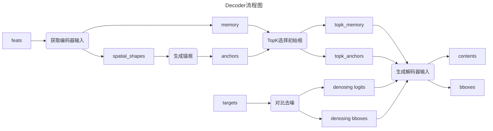

# 深度学习模块

## 可学习的仿射层

```python
class LearnableAffineBlock(nn.Module):
    def __init__(self, scale_value=1.0, bias_value=0.0):
        super().__init__()
        self.scale = nn.Parameter(torch.tensor([scale_value]), requires_grad=True)
        self.bias = nn.Parameter(torch.tensor([bias_value]), requires_grad=True)

    def forward(self, x):
        return self.scale * x + self.bias
```

名字有什么含义？

可学习的仿射块

`return self.scale * x + self.bias`

数学形式：
$$
y=a⋅x+b
$$
控制分支强度

## ConBNAct 模块

```python
class ConvBNAct(nn.Module):
    def __init__(
        self,
        in_chs,
        out_chs,
        kernel_size,
        stride=1,
        groups=1,
        padding="",
        use_act=True,
        use_lab=False,
    ):
        super().__init__()
        self.use_act = use_act
        self.use_lab = use_lab
        if padding == "same":
        # same: 保持输入输出图片尺寸不变
        # TensorFlow 风格的 SAME padding
            self.conv = nn.Sequential(
                nn.ZeroPad2d([0, 1, 0, 1]),
                nn.Conv2d(in_chs, out_chs, kernel_size, stride, groups=groups, bias=False),
            )
        else:
            self.conv = nn.Conv2d(
                in_chs,
                out_chs,
                kernel_size,
                stride,
                padding=(kernel_size - 1) // 2,
                groups=groups,
                bias=False,
            )
        self.bn = nn.BatchNorm2d(out_chs)
        if self.use_act:
            self.act = nn.ReLU()
        else:
            self.act = nn.Identity()
        if self.use_act and self.use_lab:
            self.lab = LearnableAffineBlock()
        else:
            self.lab = nn.Identity()

    def forward(self, x):
        x = self.conv(x)
        x = self.bn(x)
        x = self.act(x)
        x = self.lab(x)
        return x
```


这里的lab是Learnable Affine Block的缩写

### Light ConvBNAct

```python
class LightConvBNAct(nn.Module):
    def __init__(
        self,
        in_chs,
        out_chs,
        kernel_size,
        groups=1,
        use_lab=False,
    ):
        super().__init__()
        self.conv1 = ConvBNAct(
            in_chs,
            out_chs,
            kernel_size=1,
            use_act=False,
            use_lab=use_lab,
        )
        self.conv2 = ConvBNAct(
            out_chs,
            out_chs,
            kernel_size=kernel_size,
            groups=out_chs,
            use_act=True,
            use_lab=use_lab,
        )

    def forward(self, x):
        x = self.conv1(x)
        x = self.conv2(x)
        return x
```

## 注意力模块

### ESE

Efficient SE

**SE / ESE / CBAM 三种注意力模块**

```python
class EseModule(nn.Module):
    def __init__(self, chs):
        super().__init__()
        self.conv = nn.Conv2d(
            chs,
            chs,
            kernel_size=1,
            stride=1,
            padding=0,
        )
        self.sigmoid = nn.Sigmoid()

    def forward(self, x):
        identity = x
        x = x.mean((2, 3), keepdim=True)
        x = self.conv(x)
        x = self.sigmoid(x)
        return torch.mul(identity, x)
```

### SE

Squeeze-Excitation: 压缩-重新激发

与ESE不同：

[B, C, H, W]--->[B, C, 1, 1]--->**[B, C/r, 1, 1]**--->[B, C, 1, 1]

## Dropout


## 一些奇奇怪怪的操作

### 冻结参数

```python
def _freeze_parameters(self, m: nn.Module):
    for p in m.parameters():
        p.requires_grad = False
```

### 预训练模型下载和导入

```python
state = torch.hub.load_state_dict_from_url(
download_url, map_location="cpu", model_dir=local_model_dir
)

model_path = local_model_dir + "PPHGNetV2_" + name + "_stage1.pth"
state = torch.load(model_path, map_location="cpu")

self.load_state_dict(state)
# nn.Module的方法
```

# 目标检测

## DFINE

### FDR细粒度分布

#### 传统方法的局限性：狄拉克分布（Dirac delta）

传统的目标检测模型（如早期的 YOLO, Faster R-CNN）通常假设边界框的边缘是一个绝对精准的固定值。

* 数学形式： 建模为狄拉克 $\delta$ 分布（即概率只在某一点为 1，其余为 0）。
* 表示方式： 使用中心点 $\{x, y, w, h\}$ 或边缘距离 $\mathbf{d} = \{t, b, l, r\}$（上、下、左、右）。
* 痛点： 这种“非黑即白”的方法无法处理不确定性。例如，当物体边缘模糊（如被遮挡或光照不佳）时，强制回归一个固定值会导致严重的定位误差。

#### GFocal的改进：离散概率分布

为了解决上述问题，GFocal（2020; 2021）提出不再预测一个单一的值，而是预测一个分布。

核心逻辑： 边界框的每个边缘距离 $\mathbf{d}$ 被建模为一个在范围 $[0, N]$ 上的离散概率分布。
公式解读： 
$$
\mathbf{d} = d_{\max} \sum_{n=0}^{N} \frac{n}{N} \mathbf{P}(n)
$$
这个公式本质上是在计算期望值。

$\mathbf{P}(n)$ 是落在第 $n$ 个区间（bin）的概率。

通过这种方式，模型可以表达“我觉得边缘大概在这里，但也可能在那里”的模糊性，从而在复杂场景下更具鲁棒性。

**缺点是有限的离散区间无法完美模拟无限的连续空间**

N设太小，小目标检测性能不佳；N设太大，开销过高，难以收xiang

### 解码器部分

整体流程图



#### DFINE-Transformer

```python
def forward(self, feats, targets=None):
    # input projection and embedding
    memory, spatial_shapes = self._get_encoder_input(feats)
	# 输入部分1
    # prepare denoising training
    if self.training and self.num_denoising > 0:
        denoising_logits, denoising_bbox_unact, attn_mask, dn_meta = (
            get_contrastive_denoising_training_group(
                targets,
                self.num_classes,
                self.num_queries,
                self.denoising_class_embed,
                num_denoising=self.num_denoising,
                label_noise_ratio=self.label_noise_ratio,
                box_noise_scale=1.0,
            )
        )
    else:
        denoising_logits, denoising_bbox_unact, attn_mask, dn_meta = None, None, None, None
    init_ref_contents, init_ref_points_unact, enc_topk_bboxes_list, enc_topk_logits_list = (
        self._get_decoder_input(memory, spatial_shapes, denoising_logits, denoising_bbox_unact)
    )
```

#### 获取编码器输入

```python
def _get_encoder_input(self, feats: List[torch.Tensor]):
    # 这里的feats是多尺度特征
    # get projection features
    proj_feats = [self.input_proj[i](feat) for i, feat in enumerate(feats)]
    # 先投影到hidden_dim
    if self.num_levels > len(proj_feats):
        # num_levels一般是3，len(proj_feats)也是3
        # 但如果不一致的话，就是下面的处理情况
        len_srcs = len(proj_feats)
        for i in range(len_srcs, self.num_levels):
            if i == len_srcs:
                proj_feats.append(self.input_proj[i](feats[-1]))
            else:
                proj_feats.append(self.input_proj[i](proj_feats[-1]))

    # get encoder inputs
    feat_flatten = []
    spatial_shapes = []
    for i, feat in enumerate(proj_feats):
        _, _, h, w = feat.shape
        # [b, c, h, w] -> [b, h*w, c]
        feat_flatten.append(feat.flatten(2).permute(0, 2, 1))
        # 将特征展平，然后重排，把c排前面
        # [num_levels, 2]
        spatial_shapes.append([h, w])

    # [b, l, c]
    feat_flatten = torch.concat(feat_flatten, 1)
    # [b,n,c]在n通道上拼接
    return feat_flatten, spatial_shapes
```

> torch.permute
> 不改变数据，只改变视图

#### 对比去噪

```python
def get_contrastive_denoising_training_group(
    targets,
    num_classes,
    num_queries,
    class_embed,
    num_denoising=100,
    label_noise_ratio=0.5,
    box_noise_scale=1.0,
):
```

首先观察输入：

* targets是dict类型，`{"labels": ...,"bboxes": ..}`
* num_classes是数据集的类别数（coco默认80），
* num_queries是DETRs一张图上能出的最大框数（默认300）。
* class_embed是可学习参数：dim：C--->num_classes
* num_denosing：要加噪声的gt

```python
num_gts = [len(t["labels"]) for t in targets]
device = targets[0]["labels"].device

max_gt_num = max(num_gts)
if max_gt_num == 0:
    dn_meta = {"dn_positive_idx": None, "dn_num_group": 0, "dn_num_split": [0, num_queries]}
    return None, None, None, dn_meta
```

首先，这里的targets是一个batch的图片标注

所以这里num_gts形状是[1,3,5,6,9]，元素是每张图片的bbox数，长度是batchsize

**max_gt_num**，因为要矩阵计算，所以为了统一计算，按一张图片的最大bbox数算

如果**max_gt_num**为0，说明这个batch没有框

**dn_meta**：应该是元数据，作为返回数据的补充说明。

```python
num_group = num_denoising // max_gt_num
num_group = 1 if num_group == 0 else num_group
# pad gt to max_num of a batch
bs = len(num_gts)

input_query_class = torch.full([bs, max_gt_num], num_classes, dtype=torch.int32, device=device)
input_query_bbox = torch.zeros([bs, max_gt_num, 4], device=device)
pad_gt_mask = torch.zeros([bs, max_gt_num], dtype=torch.bool, device=device)
```

**num_group**，这里**num_denosing**为100，整除分组，如果不够一组，也算作一组

**bs**，前文所言，batch_size

**input_query_class**，形状意义为假定每张图片**max_gt_num**个框对应的类别标签（[bs, max_gt_num, 1]这样好理解，但类别标签维度），后面还有掩码，这里是为了便于计算，初始化为num_classes（0到num_classes-1是有效目标，num_classes是背景）。

**input_query_bbox**，和类别标签不一样，描述bbox需要4个值，初始化为0

**pad_gt_mask**，前面先用max_gt_num占了位，但是很多位置是没有意义的，每个图片都有自己的gt_num，所以有这个掩码。

```python
for i in range(bs):
    num_gt = num_gts[i]
    if num_gt > 0:
        input_query_class[i, :num_gt] = targets[i]["labels"]
        input_query_bbox[i, :num_gt] = targets[i]["boxes"]
        pad_gt_mask[i, :num_gt] = 1
# each group has positive and negative queries.
input_query_class = input_query_class.tile([1, 2 * num_group])
input_query_bbox = input_query_bbox.tile([1, 2 * num_group, 1])
pad_gt_mask = pad_gt_mask.tile([1, 2 * num_group])
```

上面是初始化，现在开始实际赋值。

赋予每个图片实际的bbox数（初始化是0，所以0的情况不用管）

如果num_gt>0，则说明max_num_gt的前num_gt个框是有意义的，并赋予它ground truth真实值。

并地pad_gt_mask的前num_gt的值赋1，说明这个位置有意义

然后把他们都推广到group组

```python
# positive and negative mask
negative_gt_mask = torch.zeros([bs, max_gt_num * 2, 1], device=device)
negative_gt_mask[:, max_gt_num:] = 1
negative_gt_mask = negative_gt_mask.tile([1, num_group, 1])
positive_gt_mask = 1 - negative_gt_mask
# contrastive denoising training positive index
positive_gt_mask = positive_gt_mask.squeeze(-1) * pad_gt_mask
dn_positive_idx = torch.nonzero(positive_gt_mask)[:, 1]
dn_positive_idx = torch.split(dn_positive_idx, [n * num_group for n in num_gts])
# total denoising queries
num_denoising = int(max_gt_num * 2 * num_group)
```

然后要构建group组正负样本

**negative_gt_mask**

首先构建一组正负样本，然后展开num_group个组

```python
positive_gt_mask = positive_gt_mask.squeeze(-1) * pad_gt_mask
```

对于这一句

首先将positive_gt_mask压缩最后一维的维度，这是广播运算，对应项相乘

positive_gt_mask维度[bs, max_gt_num * 2 * group]

pad_gt_mask的维度[bs,max_gt_num * 2 * group]

结果是，positive_gt_mask为1的位置 ∩ pad_gt_mask为1的位置

表示，既是正样本，又有意义的位置

```python
dn_positive_idx = torch.nonzero(positive_gt_mask)[:, 1]
dn_positive_idx = torch.split(dn_positive_idx, [n * num_group for n in num_gts])
# total denoising queries
num_denoising = int(max_gt_num * 2 * num_group)
```

返回一个 二维张量，每一行表示一个非零元素的坐标。

这里返回的是这个batch的所有框在各自的2 * max_gt_num中的位置[1,3,5,7,9]

长度等于总的框数

然后我按每个图片的框数将其分割，也就是按图片分割

为了重新凑齐整数个group，

按照现在的总数重新赋给num_denosing

```python
if label_noise_ratio > 0:
    mask = torch.rand_like(input_query_class, dtype=torch.float) < (label_noise_ratio * 0.5)
    # randomly put a new one here
    new_label = torch.randint_like(mask, 0, num_classes, dtype=input_query_class.dtype)
    input_query_class = torch.where(mask & pad_gt_mask, new_label, input_query_class)
```

现在label_noise_ratio = 0.5

input_query_class [bs, 2 * max_gt_num * group]

以0.25的概率，噪声mask

随机在0到num_classes之间生成随机数

只保留需要加噪声的位置的标签

最后**input_query_class**

torch.where方法

torch.where(condition, x, y)

condition=True, 取x

condition=False, 取y

```python
if box_noise_scale > 0:
    known_bbox = box_cxcywh_to_xyxy(input_query_bbox)
    diff = torch.tile(input_query_bbox[..., 2:] * 0.5, [1, 1, 2]) * box_noise_scale
    rand_sign = torch.randint_like(input_query_bbox, 0, 2) * 2.0 - 1.0
    rand_part = torch.rand_like(input_query_bbox)
    rand_part = (rand_part + 1.0) * negative_gt_mask + rand_part * (1 - negative_gt_mask)
    known_bbox += rand_sign * rand_part * diff
    known_bbox = torch.clip(known_bbox, min=0.0, max=1.0)
    input_query_bbox = box_xyxy_to_cxcywh(known_bbox)
    input_query_bbox[input_query_bbox < 0] *= -1
    input_query_bbox_unact = inverse_sigmoid(input_query_bbox)
```

先把bbox建模由cxcywh转为xyxy

```python
diff = torch.tile(input_query_bbox[..., 2:] * 0.5, [1, 1, 2]) * box_noise_scale
```

[x, y, w, h]
取w/2, h/2，再复制两次，变成了[w/2, h/2, w/2, h/2]

给它的scale加噪声

```python
rand_sign = torch.randint_like(input_query_bbox, 0, 2) * 2.0 - 1.0
```

生成-1或1，符号

```python
rand_part = torch.rand_like(input_query_bbox)
rand_part = (rand_part + 1.0) * negative_gt_mask + rand_part * (1 - negative_gt_mask)
```

input_query_bbox形状，0到1随机数

（1， 2） * negative + (0,1) * positive

(0, 1)positive部分，(1,2)negative部分

```python
known_bbox += rand_sign * rand_part * diff
known_bbox = torch.clip(known_bbox, min=0.0, max=1.0)
input_query_bbox = box_xyxy_to_cxcywh(known_bbox)
input_query_bbox[input_query_bbox < 0] *= -1
input_query_bbox_unact = inverse_sigmoid(input_query_bbox)
```

**known_bbox**是xyxy格式，

然后给**known_bbox**加噪声，

随机放缩bbox，正样本放缩范围小，模型能够容忍偏差

然后只保留在图片范围内的框

然后又转回cxxywh

这里input_query_bbox<0，保留下来的是[x,y,w,h]四个维度中<0的维度，只对他们操作

**inverse_sigmoid**

是反sigmoid函数，公式如下：
$$
logit(p)=In \big( \frac{p}{1-p} \big)
$$
目的是与输入空间反向对齐

```python
input_query_logits = class_embed(input_query_class)
tgt_size = num_denoising + num_queries
attn_mask = torch.full([tgt_size, tgt_size], False, dtype=torch.bool, device=device)
# match query cannot see the reconstruction
attn_mask[num_denoising:, :num_denoising] = True
```

将input_query_class现在只是离散的索引，

class_embed的作用是将其转变为稠密向量

1-->node_dim

对比去噪，将噪声query附加到正常query外

**atten_mask**

去噪query的作用，是训练错误答案向正确答案靠拢的能力，它能看到自己对应的什么答案，但是他所知道的正确答案不能透露给普通的queries

所以有这样一个掩码，默认为Fasle

外部的话，正常查询看不到去噪查询

```python
# reconstruct cannot see each other
for i in range(num_group):
    if i == 0:
        attn_mask[
            max_gt_num * 2 * i : max_gt_num * 2 * (i + 1),
            max_gt_num * 2 * (i + 1) : num_denoising,
        ] = True
    if i == num_group - 1:
        attn_mask[max_gt_num * 2 * i : max_gt_num * 2 * (i + 1), : max_gt_num * i * 2] = True
    else:
        attn_mask[
            max_gt_num * 2 * i : max_gt_num * 2 * (i + 1),
            max_gt_num * 2 * (i + 1) : num_denoising,
        ] = True
        attn_mask[max_gt_num * 2 * i : max_gt_num * 2 * (i + 1), : max_gt_num * 2 * i] = True
```

在去噪query内部，不同组之间
所有组都看不到其他所有的组

分成三类：

1. 组0看不到后面的组
2. 组group-1看不到前面的组
3. 其他情况，既看不到前面，又看不到后面的组

```python
dn_meta = {
    "dn_positive_idx": dn_positive_idx,
    "dn_num_group": num_group,
    "dn_num_split": [num_denoising, num_queries],
}
return input_query_logits, input_query_bbox_unact, attn_mask, dn_meta
```

**dn_meta**传递给损失函数，去噪query采用不同的策略

需要返回的参数：

1. **input_query_logits**，[bs, num_denosing, node_dim]
2. **input_query_bbox_unact**，[bs, num_denosing, 4]
3. **attn_mask**，掩码，掩藏重要信息
4. **dn_meta**
   1. **dn_positive_idx**，正样本的索引，bs维度数组[[],[],[]]，图片中正样本的索引
   2. **num_group**，组数
   3. **dn_num_split**，有几个去噪查询，几个普通查询，怎么划分

#### 生成解码器输入

```python
def _get_decoder_input(
    self, memory: torch.Tensor, spatial_shapes, denoising_logits=None, denoising_bbox_unact=None
):
```

输入：

* memory，编码器的输出
* denoising_logits和denoising_bbox_unact，去噪查询的输入

```python
# prepare input for decoder
if self.training or self.eval_spatial_size is None:
    anchors, valid_mask = self._generate_anchors(spatial_shapes, device=memory.device)
else:
    anchors = self.anchors
    valid_mask = self.valid_mask
if memory.shape[0] > 1:
    anchors = anchors.repeat(memory.shape[0], 1, 1)
```

详细见生成锚框部分

总之获取锚框后，将其推广到Batchsize

```python
output_memory: torch.Tensor = self.enc_output(memory)
# 映射到hidden_dim
enc_outputs_logits: torch.Tensor = self.enc_score_head(output_memory)
# 映射到C
enc_topk_bboxes_list, enc_topk_logits_list = [], []
enc_topk_memory, enc_topk_logits, enc_topk_anchors = self._select_topk(
    output_memory, enc_outputs_logits, anchors, self.num_queries
)
# 获取topk的各项
# enc_topk_logits，推理时为None
enc_topk_bbox_unact: torch.Tensor = self.enc_bbox_head(enc_topk_memory) + enc_topk_anchors
# unact，是指未激活，简单点说，未经sigmoid函数压缩
# 同时结合了topk编码器输入和topk的预设anchor
if self.training:
    enc_topk_bboxes = F.sigmoid(enc_topk_bbox_unact)
    enc_topk_bboxes_list.append(enc_topk_bboxes)
    enc_topk_logits_list.append(enc_topk_logits)
# 训练时的策略
# 1. 激活topk_bboxes
# 2. 将topk_boxes和topk_logits放到列表了，暂时不知道为什么这样干
```

```python
if self.learn_query_content:
    # 静态策略
    # [B, N, D]
    content = self.tgt_embed.weight.unsqueeze(0).tile([memory.shape[0], 1, 1])
else:
    content = enc_topk_memory.detach()
    # 动态策略
    # 因为topk是从编码器学到，避免流向解码器，所以detach

enc_topk_bbox_unact = enc_topk_bbox_unact.detach()
# 同理
if denoising_bbox_unact is not None:
    enc_topk_bbox_unact = torch.concat([denoising_bbox_unact, enc_topk_bbox_unact], dim=1)
    # 300+100
    content = torch.concat([denoising_logits, content], dim=1)
    # 300+100

return content, enc_topk_bbox_unact, enc_topk_bboxes_list, enc_topk_logits_list
# content: [B, N, D]
# enc_topk_bbox_unact: [B, N, 4]
# 两个list保留enc_topk {logits/bboxes}
```

> 关于tgt_embed
>
> ```python
> if learn_query_content:
>     self.tgt_embed = nn.Embedding(num_queries, hidden_dim)
> ```
>
> ```python
> if self.learn_query_content:
>     init.xavier_uniform_(self.tgt_embed.weight)
> ```
>
> 

#### 生成锚框：

```python
def _generate_anchors(
self, spatial_shapes=None, grid_size=0.05, dtype=torch.float32, device="cpu"
):
if spatial_shapes is None:
    spatial_shapes = []
    eval_h, eval_w = self.eval_spatial_size
    for s in self.feat_strides:
        spatial_shapes.append([int(eval_h / s), int(eval_w / s)])
# 如果在推理阶段
# 模型尺寸640x640，B3，B4，B5，分别降8/16/32倍采样
# spatial_shapes=[
# [80,80],[40,40],[20,20]
# ]
# 必须要有spatial_shapes
anchors = []
for lvl, (h, w) in enumerate(spatial_shapes):
    # lvl:	0,1,2
    # sptial_shapes=[[80,80],[40,40],[20,20]]
    grid_y, grid_x = torch.meshgrid(torch.arange(h), torch.arange(w), indexing="ij")
    # 生成网络坐标矩阵
    # gridy[i][j]=i		gridx[i][j]=j
    grid_xy = torch.stack([grid_x, grid_y], dim=-1)
    # stack后，gird_xy[i][j]=[j,i]
    grid_xy = (grid_xy.unsqueeze(0) + 0.5) / torch.tensor([w, h], dtype=dtype)
    # 将点移到grid的中心点，然后再归一化，得到锚框中心点[cx, cy]
    wh = torch.ones_like(grid_xy) * grid_size * (2.0**lvl)
    # 得到锚框w和h，基于特征图大小自适应
    lvl_anchors = torch.concat([grid_xy, wh], dim=-1).reshape(-1, h * w, 4)
    # 拼接得到完整锚框[cx, cy, w, h]
    # 然后reshape成[1, h*w, 4]
    anchors.append(lvl_anchors)

anchors = torch.concat(anchors, dim=1).to(device)
valid_mask = ((anchors > self.eps) * (anchors < 1 - self.eps)).all(-1, keepdim=True)
anchors = torch.log(anchors / (1 - anchors))
anchors = torch.where(valid_mask, anchors, torch.inf)

return anchors, valid_mask
```

```python
def _generate_anchors(
    self, spatial_shapes=None, grid_size=0.05, dtype=torch.float32, device="cpu"
):
```

输入：

* spatial_shapes：[bs, 2]，存储图片宽高

```python
if spatial_shapes is None:
    spatial_shapes = []
    eval_h, eval_w = self.eval_spatial_size
    for s in self.feat_strides:
        spatial_shapes.append([int(eval_h / s), int(eval_w / s)])
```

如果spatial_shapes为None，说明是推理阶段，获取推理阶段的size，一般是640x640

多尺度特征图，比如/8，/16，/32

将锚框的尺寸append到spatial_shapeds中

```python
anchors = []
for lvl, (h, w) in enumerate(spatial_shapes):
    grid_y, grid_x = torch.meshgrid(torch.arange(h), torch.arange(w), indexing="ij")
    grid_xy = torch.stack([grid_x, grid_y], dim=-1)
    grid_xy = (grid_xy.unsqueeze(0) + 0.5) / torch.tensor([w, h], dtype=dtype)
    wh = torch.ones_like(grid_xy) * grid_size * (2.0**lvl)
    lvl_anchors = torch.concat([grid_xy, wh], dim=-1).reshape(-1, h * w, 4)
    anchors.append(lvl_anchors)
```

训练阶段，每张图片都是大小不一的，需要动态更新锚框

```python
# grid_y
[[0, 0, 0, ..., 0],
[1, 1, 1, ..., 1],
[2, 2, 2, ..., 2],
...
[h-1, h-1, ..., h-1]]
```

torch.stack
拼接，并新增一个维度

这个结果会是：

```python
[
[[0,0], [0,1], [0,2], ..., [0,w-1]],
[[1,0], [1,1], [1,2], ..., [1,w-1]],
[[2,0], [2,1], [2,2], ..., [2,w-1]],
...
[[h-1,0], [h-1,1], ..., [h-1,w-1]]
]
```

```python
grid_xy = (grid_xy.unsqueeze(0) + 0.5) / torch.tensor([w, h], dtype=dtype)
```

添加一个维度

(x+0.5)/w

(y+0.5)/h

移到中心再归一化

```python
wh = torch.ones_like(grid_xy) * grid_size * (2.0**lvl)
lvl_anchors = torch.concat([grid_xy, wh], dim=-1).reshape(-1, h * w, 4)
anchors.append(lvl_anchors)
```

生成一个这个形状的全1张量
$$
wh = xy * grid\_size * 2^{lvl}
$$
这里的grid_size是一个隐参数，默认为0.05，意思是原图的5%

一般多尺度，P3;P4;P5

80;40;20

640/20=32

多尺度特征图动态调整grid_size大小

锚框形式[cx, cy, w, h]

**torch.reshape**，按内存顺序重新解释

这里是把h和w维度展平了

```python
anchors = torch.concat(anchors, dim=1).to(device)
valid_mask = ((anchors > self.eps) * (anchors < 1 - self.eps)).all(-1, keepdim=True)
anchors = torch.log(anchors / (1 - anchors))
anchors = torch.where(valid_mask, anchors, torch.inf)

return anchors, valid_mask
```

(eps, 1-eps)置信区间

[cx, cy, w, h]都在有效区间内，才会置为True

最终valid_mask形状[1, total_anchors, 1]

说实话，我也不知道反sigmoid有什么意义，先记住

torch.inf，正无穷大，sigmoid后对应趋于1

#### TopK

```python
def _select_topk(
    self,
    memory: torch.Tensor,
    outputs_logits: torch.Tensor,
    outputs_anchors_unact: torch.Tensor,
    topk: int,
):
    if self.query_select_method == "default":
        _, topk_ind = torch.topk(outputs_logits.max(-1).values, topk, dim=-1)

    elif self.query_select_method == "one2many":
        _, topk_ind = torch.topk(outputs_logits.flatten(1), topk, dim=-1)
        topk_ind = topk_ind // self.num_classes

    elif self.query_select_method == "agnostic":
        _, topk_ind = torch.topk(outputs_logits.squeeze(-1), topk, dim=-1)

    topk_ind: torch.Tensor

    topk_anchors = outputs_anchors_unact.gather(
        dim=1, index=topk_ind.unsqueeze(-1).repeat(1, 1, outputs_anchors_unact.shape[-1])
    )

    topk_logits = (
        outputs_logits.gather(
            dim=1, index=topk_ind.unsqueeze(-1).repeat(1, 1, outputs_logits.shape[-1])
        )
        if self.training
        else None
    )

    topk_memory = memory.gather(
        dim=1, index=topk_ind.unsqueeze(-1).repeat(1, 1, memory.shape[-1])
    )

    return topk_memory, topk_logits, topk_anchors
```


```python
def _select_topk(
    self,
    memory: torch.Tensor,
    outputs_logits: torch.Tensor,
    outputs_anchors_unact: torch.Tensor,
    topk: int,
):
```

输入：

* memory：编码器的输出
* outputs_logits：类别打分
* outputs_anchors_unact：锚框
* topk：要选前几个

```python
if self.query_select_method == "default":
    _, topk_ind = torch.topk(outputs_logits.max(-1).values, topk, dim=-1)

elif self.query_select_method == "one2many":
    _, topk_ind = torch.topk(outputs_logits.flatten(1), topk, dim=-1)
    topk_ind = topk_ind // self.num_classes

elif self.query_select_method == "agnostic":
    _, topk_ind = torch.topk(outputs_logits.squeeze(-1), topk, dim=-1)
```

torch.topk方法

> values, indices = torch.topk(input, k, dim=None, largest=True, sorted=True)

1. 默认的话，按照类别打分选取topk：先在类别中找到分最高的，再用最高的在bbox之间相互比较。
2. 如果method是OVM，那么N*C铺平，算出来索引再整除C，就是所在的N的索引
3. 如果类别无关，那么形状[bs, N, 1]，最后一个维度可squeeze，挤掉，挤掉后就是简单的排序了

```python
topk_ind: torch.Tensor

topk_anchors = outputs_anchors_unact.gather(
    dim=1, index=topk_ind.unsqueeze(-1).repeat(1, 1, outputs_anchors_unact.shape[-1])
)
```

> torch.gather(input, dim, index)

* outputs_anchors_unact: [B, h*w, 4]
* topk_ind: [B, topk]

先增加一个维度，然后，再重复4次

结果，topk_anchors形状[B, topk, 4]

```python
topk_logits = (
    outputs_logits.gather(
        dim=1, index=topk_ind.unsqueeze(-1).repeat(1, 1, outputs_logits.shape[-1])
    )
    if self.training
    else None
)

topk_memory = memory.gather(
    dim=1, index=topk_ind.unsqueeze(-1).repeat(1, 1, memory.shape[-1])
)

return topk_memory, topk_logits, topk_anchors
```

Nothing to say.

为什么topk_logits只需要在训练的时候找topk？

#### Tranformer Decoder(结合源码)

```python
class TransformerDecoder(nn.Module):
"""
Transformer Decoder implementing Fine-grained Distribution Refinement (FDR).

This decoder refines object detection predictions through iterative updates across multiple layers,
utilizing attention mechanisms, location quality estimators, and distribution refinement techniques
to improve bounding box accuracy and robustness.
"""
```

翻译：

Transformer Decoder实现了FDR模块。

通过多层迭代更新重新定义了目标检测任务，实现了注意力机制，定位质量评估，和分布细化技术，改善了bbox定位精度和鲁棒性。

```python
def __init__(
    self,
    hidden_dim,
    decoder_layer,
    decoder_layer_wide,
    num_layers,
    num_head,
    reg_max,
    reg_scale,
    up,
    eval_idx=-1,
    layer_scale=2,
):
    super(TransformerDecoder, self).__init__()
    self.hidden_dim = hidden_dim
    self.num_layers = num_layers
    self.layer_scale = layer_scale
    self.num_head = num_head
    self.eval_idx = eval_idx if eval_idx >= 0 else num_layers + eval_idx
    self.up, self.reg_scale, self.reg_max = up, reg_scale, reg_max
    self.layers = nn.ModuleList(
        [copy.deepcopy(decoder_layer) for _ in range(self.eval_idx + 1)]
        + [copy.deepcopy(decoder_layer_wide) for _ in range(num_layers - self.eval_idx - 1)]
    )
    self.lqe_layers = nn.ModuleList(
        [copy.deepcopy(LQE(4, 64, 2, reg_max)) for _ in range(num_layers)]
    )
```

```python
def value_op(self, memory, value_proj, value_scale, memory_mask, memory_spatial_shapes):
    """
    Preprocess values for MSDeformableAttention.
    为MSDeformableAttention预处理一些values
    """
    value = value_proj(memory) if value_proj is not None else memory
    # 是否需要通道映射
    value = F.interpolate(memory, size=value_scale) if value_scale is not None else value
    # 是否需要上采样
    if memory_mask is not None:
        value = value * memory_mask.to(value.dtype).unsqueeze(-1)
    value = value.reshape(value.shape[0], value.shape[1], self.num_head, -1)
    # 这是个多头注意力
    split_shape = [h * w for h, w in memory_spatial_shapes]
    return value.permute(0, 2, 3, 1).split(split_shape, dim=-1)
```

```python
def forward(
        self,
        target,# contents
        ref_points_unact,# bboxes
        memory,# memory
        spatial_shapes,
        bbox_head,
        score_head,
        query_pos_head,
        pre_bbox_head,
        integral,
        up,
        reg_scale,
        attn_mask=None,
        memory_mask=None,
        dn_meta=None,
    ):
```

> ```python
> self.dec_bbox_head = nn.ModuleList(
> [
>     MLP(hidden_dim, hidden_dim, 4 * (self.reg_max + 1), 3)
>     for _ in range(self.eval_idx + 1)
>     # self.eval_idx 层索引
> ]
> + [
>     MLP(scaled_dim, scaled_dim, 4 * (self.reg_max + 1), 3)
>     for _ in range(num_layers - self.eval_idx - 1)
> ]
> )
> ```
>
> 


