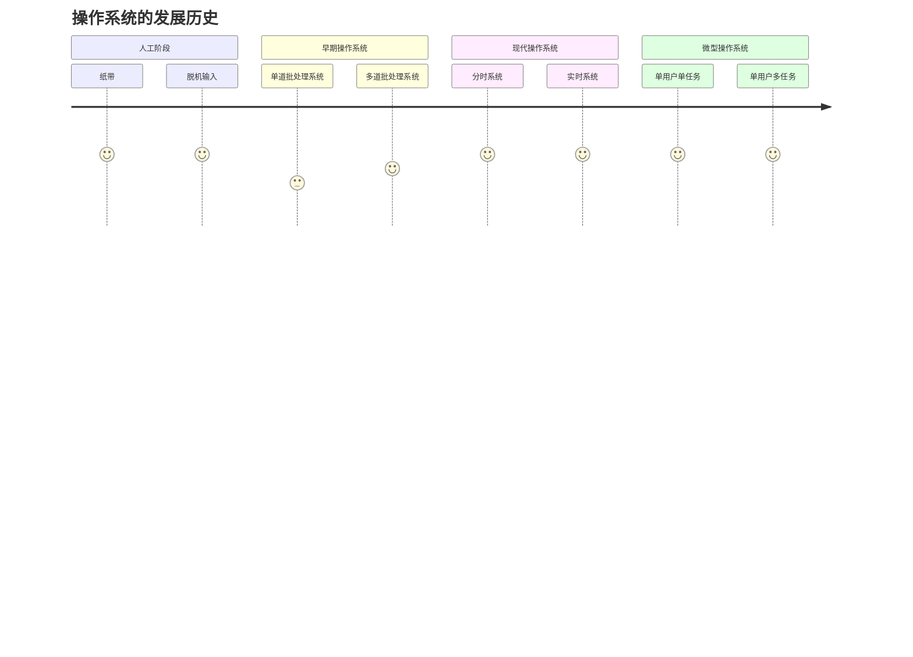
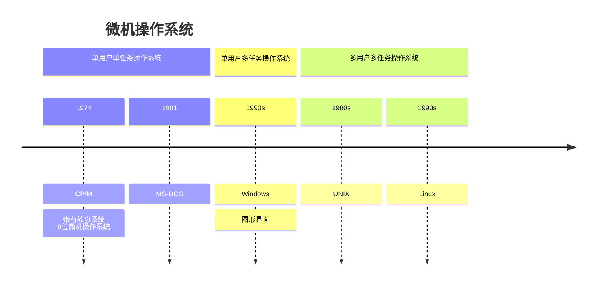
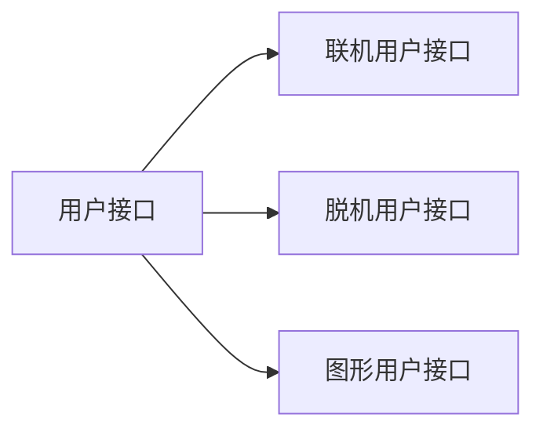

# 操作系统

## 操作系统的发展历史

以现在的个人计算机为锚点，来了解这段历史会比较容易。

操作系统四大特性：

1. 并发
2. 共享
3. 虚拟
4. 异步

现代个人计算机，主要是单用户多任务的操作系统，另外融合了过往时期的操作系统的一些方面。

最早的操作系统是[纸带][1]，一张打好孔的纸带就是一个操作系统，数据+程序的集合体。

开始的纸带属于联机输入，通俗的解释，就是人为地控制输入，在纸带时期是一位一位的输入，在现在计算机多为字符设备，如键盘等。

不想一直盯着纸带，就需要将纸带托管给外围机，也就是脱机。

> 官方解释：
>
> 联机：在主机的直接控制下进行输入输出的方式
>
> 脱机： 脱离主机的情况下输入输出

单道批处理系统

![img](data:image/svg+xml;base64,PHN2ZyB4bWxucz0iaHR0cDovL3d3dy53My5vcmcvMjAwMC9zdmciIHN0eWxlPSJiYWNrZ3JvdW5kOiB0cmFuc3BhcmVudDsgYmFja2dyb3VuZC1jb2xvcjogdHJhbnNwYXJlbnQ7IiB4bWxuczp4bGluaz0iaHR0cDovL3d3dy53My5vcmcvMTk5OS94bGluayIgdmVyc2lvbj0iMS4xIiB3aWR0aD0iNDAxcHgiIGhlaWdodD0iMjkycHgiIHZpZXdCb3g9IjAgMCA0MDEgMjkyIj48ZGVmcy8+PGc+PGcgZGF0YS1jZWxsLWlkPSIwIj48ZyBkYXRhLWNlbGwtaWQ9IjEiPjxnIGRhdGEtY2VsbC1pZD0iV2pYZ1RTODJ6eFctVmpfMC00UGItNCI+PGcgdHJhbnNmb3JtPSJ0cmFuc2xhdGUoMC41LDAuNSkiPjxwYXRoIGQ9Ik0gMjAwIDQwIEwgMjczLjYzIDQwIiBmaWxsPSJub25lIiBzdHJva2U9IiMwMDAwMDAiIHN0cm9rZS1taXRlcmxpbWl0PSIxMCIgcG9pbnRlci1ldmVudHM9InN0cm9rZSIgc3R5bGU9InN0cm9rZTogbGlnaHQtZGFyayhyZ2IoMCwgMCwgMCksIHJnYigyNTUsIDI1NSwgMjU1KSk7Ii8+PHBhdGggZD0iTSAyNzguODggNDAgTCAyNzEuODggNDMuNSBMIDI3My42MyA0MCBMIDI3MS44OCAzNi41IFoiIGZpbGw9IiMwMDAwMDAiIHN0cm9rZT0iIzAwMDAwMCIgc3Ryb2tlLW1pdGVybGltaXQ9IjEwIiBwb2ludGVyLWV2ZW50cz0iYWxsIiBzdHlsZT0iZmlsbDogbGlnaHQtZGFyayhyZ2IoMCwgMCwgMCksIHJnYigyNTUsIDI1NSwgMjU1KSk7IHN0cm9rZTogbGlnaHQtZGFyayhyZ2IoMCwgMCwgMCksIHJnYigyNTUsIDI1NSwgMjU1KSk7Ii8+PC9nPjwvZz48ZyBkYXRhLWNlbGwtaWQ9IldqWGdUUzgyenhXLVZqXzAtNFBiLTciPjxnIHRyYW5zZm9ybT0idHJhbnNsYXRlKDAuNSwwLjUpIj48cGF0aCBkPSJNIDgwIDQwIEwgMCA0MCIgZmlsbD0ibm9uZSIgc3Ryb2tlPSIjMDAwMDAwIiBzdHJva2UtbWl0ZXJsaW1pdD0iMTAiIHBvaW50ZXItZXZlbnRzPSJzdHJva2UiIHN0eWxlPSJzdHJva2U6IGxpZ2h0LWRhcmsocmdiKDAsIDAsIDApLCByZ2IoMjU1LCAyNTUsIDI1NSkpOyIvPjwvZz48L2c+PGcgZGF0YS1jZWxsLWlkPSJXalhnVFM4Mnp4Vy1Wal8wLTRQYi0xMiI+PGcgdHJhbnNmb3JtPSJ0cmFuc2xhdGUoMC41LDAuNSkiPjxwYXRoIGQ9Ik0gMTQwIDgwIEwgMTQwIDExMy42MyIgZmlsbD0ibm9uZSIgc3Ryb2tlPSIjMDAwMDAwIiBzdHJva2UtbWl0ZXJsaW1pdD0iMTAiIHBvaW50ZXItZXZlbnRzPSJzdHJva2UiIHN0eWxlPSJzdHJva2U6IGxpZ2h0LWRhcmsocmdiKDAsIDAsIDApLCByZ2IoMjU1LCAyNTUsIDI1NSkpOyIvPjxwYXRoIGQ9Ik0gMTQwIDExOC44OCBMIDEzNi41IDExMS44OCBMIDE0MCAxMTMuNjMgTCAxNDMuNSAxMTEuODggWiIgZmlsbD0iIzAwMDAwMCIgc3Ryb2tlPSIjMDAwMDAwIiBzdHJva2UtbWl0ZXJsaW1pdD0iMTAiIHBvaW50ZXItZXZlbnRzPSJhbGwiIHN0eWxlPSJmaWxsOiBsaWdodC1kYXJrKHJnYigwLCAwLCAwKSwgcmdiKDI1NSwgMjU1LCAyNTUpKTsgc3Ryb2tlOiBsaWdodC1kYXJrKHJnYigwLCAwLCAwKSwgcmdiKDI1NSwgMjU1LCAyNTUpKTsiLz48L2c+PC9nPjxnIGRhdGEtY2VsbC1pZD0iV2pYZ1RTODJ6eFctVmpfMC00UGItMiI+PGcgdHJhbnNmb3JtPSJ0cmFuc2xhdGUoMC41LDAuNSkiPjxwYXRoIGQ9Ik0gMTQwIDAgTCAyMDAgNDAgTCAxNDAgODAgTCA4MCA0MCBaIiBmaWxsPSIjZmZmZmZmIiBzdHJva2U9IiMwMDAwMDAiIHN0cm9rZS1taXRlcmxpbWl0PSIxMCIgcG9pbnRlci1ldmVudHM9ImFsbCIgc3R5bGU9ImZpbGw6IGxpZ2h0LWRhcmsoI2ZmZmZmZiwgdmFyKC0tZ2UtZGFyay1jb2xvciwgIzEyMTIxMikpOyBzdHJva2U6IGxpZ2h0LWRhcmsocmdiKDAsIDAsIDApLCByZ2IoMjU1LCAyNTUsIDI1NSkpOyIvPjwvZz48Zz48Zz48c3dpdGNoPjxmb3JlaWduT2JqZWN0IHN0eWxlPSJvdmVyZmxvdzogdmlzaWJsZTsgdGV4dC1hbGlnbjogbGVmdDsiIHBvaW50ZXItZXZlbnRzPSJub25lIiB3aWR0aD0iMTAwJSIgaGVpZ2h0PSIxMDAlIiByZXF1aXJlZEZlYXR1cmVzPSJodHRwOi8vd3d3LnczLm9yZy9UUi9TVkcxMS9mZWF0dXJlI0V4dGVuc2liaWxpdHkiPjxkaXYgeG1sbnM9Imh0dHA6Ly93d3cudzMub3JnLzE5OTkveGh0bWwiIHN0eWxlPSJkaXNwbGF5OiBmbGV4OyBhbGlnbi1pdGVtczogdW5zYWZlIGNlbnRlcjsganVzdGlmeS1jb250ZW50OiB1bnNhZmUgY2VudGVyOyB3aWR0aDogMTE4cHg7IGhlaWdodDogMXB4OyBwYWRkaW5nLXRvcDogNDBweDsgbWFyZ2luLWxlZnQ6IDgxcHg7Ij48ZGl2IHN0eWxlPSJib3gtc2l6aW5nOiBib3JkZXItYm94OyBmb250LXNpemU6IDA7IHRleHQtYWxpZ246IGNlbnRlcjsgY29sb3I6ICMwMDAwMDA7ICI+PGRpdiBzdHlsZT0iZGlzcGxheTogaW5saW5lLWJsb2NrOyBmb250LXNpemU6IDEycHg7IGZvbnQtZmFtaWx5OiBIZWx2ZXRpY2E7IGNvbG9yOiBsaWdodC1kYXJrKCMwMDAwMDAsICNmZmZmZmYpOyBsaW5lLWhlaWdodDogMS4yOyBwb2ludGVyLWV2ZW50czogYWxsOyB3aGl0ZS1zcGFjZTogbm9ybWFsOyB3b3JkLXdyYXA6IG5vcm1hbDsgIj7ov5jmnInkuIvkuIDkuKrkvZzkuJrvvJ88L2Rpdj48L2Rpdj48L2Rpdj48L2ZvcmVpZ25PYmplY3Q+PHRleHQgeD0iMTQwIiB5PSI0NCIgZmlsbD0ibGlnaHQtZGFyaygjMDAwMDAwLCAjZmZmZmZmKSIgZm9udC1mYW1pbHk9IkhlbHZldGljYSIgZm9udC1zaXplPSIxMnB4IiB0ZXh0LWFuY2hvcj0ibWlkZGxlIj7ov5jmnInkuIvkuIDkuKrkvZzkuJrvvJ88L3RleHQ+PC9zd2l0Y2g+PC9nPjwvZz48L2c+PGcgZGF0YS1jZWxsLWlkPSJXalhnVFM4Mnp4Vy1Wal8wLTRQYi0xMCI+PGcgdHJhbnNmb3JtPSJ0cmFuc2xhdGUoMC41LDAuNSkiPjxwYXRoIGQ9Ik0gMzQwIDcwIEwgMzQwIDEwOC42MyIgZmlsbD0ibm9uZSIgc3Ryb2tlPSIjMDAwMDAwIiBzdHJva2UtbWl0ZXJsaW1pdD0iMTAiIHBvaW50ZXItZXZlbnRzPSJzdHJva2UiIHN0eWxlPSJzdHJva2U6IGxpZ2h0LWRhcmsocmdiKDAsIDAsIDApLCByZ2IoMjU1LCAyNTUsIDI1NSkpOyIvPjxwYXRoIGQ9Ik0gMzQwIDExMy44OCBMIDMzNi41IDEwNi44OCBMIDM0MCAxMDguNjMgTCAzNDMuNSAxMDYuODggWiIgZmlsbD0iIzAwMDAwMCIgc3Ryb2tlPSIjMDAwMDAwIiBzdHJva2UtbWl0ZXJsaW1pdD0iMTAiIHBvaW50ZXItZXZlbnRzPSJhbGwiIHN0eWxlPSJmaWxsOiBsaWdodC1kYXJrKHJnYigwLCAwLCAwKSwgcmdiKDI1NSwgMjU1LCAyNTUpKTsgc3Ryb2tlOiBsaWdodC1kYXJrKHJnYigwLCAwLCAwKSwgcmdiKDI1NSwgMjU1LCAyNTUpKTsiLz48L2c+PC9nPjxnIGRhdGEtY2VsbC1pZD0iV2pYZ1RTODJ6eFctVmpfMC00UGItMyI+PGcgdHJhbnNmb3JtPSJ0cmFuc2xhdGUoMC41LDAuNSkiPjxyZWN0IHg9IjI4MCIgeT0iMTAiIHdpZHRoPSIxMjAiIGhlaWdodD0iNjAiIGZpbGw9IiNmZmZmZmYiIHN0cm9rZT0iIzAwMDAwMCIgcG9pbnRlci1ldmVudHM9ImFsbCIgc3R5bGU9ImZpbGw6IGxpZ2h0LWRhcmsoI2ZmZmZmZiwgdmFyKC0tZ2UtZGFyay1jb2xvciwgIzEyMTIxMikpOyBzdHJva2U6IGxpZ2h0LWRhcmsocmdiKDAsIDAsIDApLCByZ2IoMjU1LCAyNTUsIDI1NSkpOyIvPjwvZz48Zz48Zz48c3dpdGNoPjxmb3JlaWduT2JqZWN0IHN0eWxlPSJvdmVyZmxvdzogdmlzaWJsZTsgdGV4dC1hbGlnbjogbGVmdDsiIHBvaW50ZXItZXZlbnRzPSJub25lIiB3aWR0aD0iMTAwJSIgaGVpZ2h0PSIxMDAlIiByZXF1aXJlZEZlYXR1cmVzPSJodHRwOi8vd3d3LnczLm9yZy9UUi9TVkcxMS9mZWF0dXJlI0V4dGVuc2liaWxpdHkiPjxkaXYgeG1sbnM9Imh0dHA6Ly93d3cudzMub3JnLzE5OTkveGh0bWwiIHN0eWxlPSJkaXNwbGF5OiBmbGV4OyBhbGlnbi1pdGVtczogdW5zYWZlIGNlbnRlcjsganVzdGlmeS1jb250ZW50OiB1bnNhZmUgY2VudGVyOyB3aWR0aDogMTE4cHg7IGhlaWdodDogMXB4OyBwYWRkaW5nLXRvcDogNDBweDsgbWFyZ2luLWxlZnQ6IDI4MXB4OyI+PGRpdiBzdHlsZT0iYm94LXNpemluZzogYm9yZGVyLWJveDsgZm9udC1zaXplOiAwOyB0ZXh0LWFsaWduOiBjZW50ZXI7IGNvbG9yOiAjMDAwMDAwOyAiPjxkaXYgc3R5bGU9ImRpc3BsYXk6IGlubGluZS1ibG9jazsgZm9udC1zaXplOiAxMnB4OyBmb250LWZhbWlseTogSGVsdmV0aWNhOyBjb2xvcjogbGlnaHQtZGFyaygjMDAwMDAwLCAjZmZmZmZmKTsgbGluZS1oZWlnaHQ6IDEuMjsgcG9pbnRlci1ldmVudHM6IGFsbDsgd2hpdGUtc3BhY2U6IG5vcm1hbDsgd29yZC13cmFwOiBub3JtYWw7ICI+5oqK5L2c5Lia55qE5rqQ56iL5bqP6L2s5o2i5Li655uu5qCH56iL5bqPPC9kaXY+PC9kaXY+PC9kaXY+PC9mb3JlaWduT2JqZWN0Pjx0ZXh0IHg9IjM0MCIgeT0iNDQiIGZpbGw9ImxpZ2h0LWRhcmsoIzAwMDAwMCwgI2ZmZmZmZikiIGZvbnQtZmFtaWx5PSJIZWx2ZXRpY2EiIGZvbnQtc2l6ZT0iMTJweCIgdGV4dC1hbmNob3I9Im1pZGRsZSI+5oqK5L2c5Lia55qE5rqQ56iL5bqP6L2s5o2i5Li655uu5qCH56iL5bqPPC90ZXh0Pjwvc3dpdGNoPjwvZz48L2c+PC9nPjxnIGRhdGEtY2VsbC1pZD0iV2pYZ1RTODJ6eFctVmpfMC00UGItNSI+PGcgdHJhbnNmb3JtPSJ0cmFuc2xhdGUoMC41LDAuNSkiPjxyZWN0IHg9IjIwMCIgeT0iMTAiIHdpZHRoPSI2MCIgaGVpZ2h0PSIzMCIgZmlsbD0ibm9uZSIgc3Ryb2tlPSJub25lIiBwb2ludGVyLWV2ZW50cz0iYWxsIi8+PC9nPjxnPjxnPjxzd2l0Y2g+PGZvcmVpZ25PYmplY3Qgc3R5bGU9Im92ZXJmbG93OiB2aXNpYmxlOyB0ZXh0LWFsaWduOiBsZWZ0OyIgcG9pbnRlci1ldmVudHM9Im5vbmUiIHdpZHRoPSIxMDAlIiBoZWlnaHQ9IjEwMCUiIHJlcXVpcmVkRmVhdHVyZXM9Imh0dHA6Ly93d3cudzMub3JnL1RSL1NWRzExL2ZlYXR1cmUjRXh0ZW5zaWJpbGl0eSI+PGRpdiB4bWxucz0iaHR0cDovL3d3dy53My5vcmcvMTk5OS94aHRtbCIgc3R5bGU9ImRpc3BsYXk6IGZsZXg7IGFsaWduLWl0ZW1zOiB1bnNhZmUgY2VudGVyOyBqdXN0aWZ5LWNvbnRlbnQ6IHVuc2FmZSBjZW50ZXI7IHdpZHRoOiA1OHB4OyBoZWlnaHQ6IDFweDsgcGFkZGluZy10b3A6IDI1cHg7IG1hcmdpbi1sZWZ0OiAyMDFweDsiPjxkaXYgc3R5bGU9ImJveC1zaXppbmc6IGJvcmRlci1ib3g7IGZvbnQtc2l6ZTogMDsgdGV4dC1hbGlnbjogY2VudGVyOyBjb2xvcjogIzAwMDAwMDsgIj48ZGl2IHN0eWxlPSJkaXNwbGF5OiBpbmxpbmUtYmxvY2s7IGZvbnQtc2l6ZTogMTJweDsgZm9udC1mYW1pbHk6IEhlbHZldGljYTsgY29sb3I6IGxpZ2h0LWRhcmsoIzAwMDAwMCwgI2ZmZmZmZik7IGxpbmUtaGVpZ2h0OiAxLjI7IHBvaW50ZXItZXZlbnRzOiBhbGw7IHdoaXRlLXNwYWNlOiBub3JtYWw7IHdvcmQtd3JhcDogbm9ybWFsOyAiPuaYrzwvZGl2PjwvZGl2PjwvZGl2PjwvZm9yZWlnbk9iamVjdD48dGV4dCB4PSIyMzAiIHk9IjI5IiBmaWxsPSJsaWdodC1kYXJrKCMwMDAwMDAsICNmZmZmZmYpIiBmb250LWZhbWlseT0iSGVsdmV0aWNhIiBmb250LXNpemU9IjEycHgiIHRleHQtYW5jaG9yPSJtaWRkbGUiPuaYrzwvdGV4dD48L3N3aXRjaD48L2c+PC9nPjwvZz48ZyBkYXRhLWNlbGwtaWQ9IldqWGdUUzgyenhXLVZqXzAtNFBiLTgiPjxnIHRyYW5zZm9ybT0idHJhbnNsYXRlKDAuNSwwLjUpIj48cmVjdCB4PSIxMCIgeT0iMTAiIHdpZHRoPSI2MCIgaGVpZ2h0PSIzMCIgZmlsbD0ibm9uZSIgc3Ryb2tlPSJub25lIiBwb2ludGVyLWV2ZW50cz0iYWxsIi8+PC9nPjxnPjxnPjxzd2l0Y2g+PGZvcmVpZ25PYmplY3Qgc3R5bGU9Im92ZXJmbG93OiB2aXNpYmxlOyB0ZXh0LWFsaWduOiBsZWZ0OyIgcG9pbnRlci1ldmVudHM9Im5vbmUiIHdpZHRoPSIxMDAlIiBoZWlnaHQ9IjEwMCUiIHJlcXVpcmVkRmVhdHVyZXM9Imh0dHA6Ly93d3cudzMub3JnL1RSL1NWRzExL2ZlYXR1cmUjRXh0ZW5zaWJpbGl0eSI+PGRpdiB4bWxucz0iaHR0cDovL3d3dy53My5vcmcvMTk5OS94aHRtbCIgc3R5bGU9ImRpc3BsYXk6IGZsZXg7IGFsaWduLWl0ZW1zOiB1bnNhZmUgY2VudGVyOyBqdXN0aWZ5LWNvbnRlbnQ6IHVuc2FmZSBjZW50ZXI7IHdpZHRoOiA1OHB4OyBoZWlnaHQ6IDFweDsgcGFkZGluZy10b3A6IDI1cHg7IG1hcmdpbi1sZWZ0OiAxMXB4OyI+PGRpdiBzdHlsZT0iYm94LXNpemluZzogYm9yZGVyLWJveDsgZm9udC1zaXplOiAwOyB0ZXh0LWFsaWduOiBjZW50ZXI7IGNvbG9yOiAjMDAwMDAwOyAiPjxkaXYgc3R5bGU9ImRpc3BsYXk6IGlubGluZS1ibG9jazsgZm9udC1zaXplOiAxMnB4OyBmb250LWZhbWlseTogSGVsdmV0aWNhOyBjb2xvcjogbGlnaHQtZGFyaygjMDAwMDAwLCAjZmZmZmZmKTsgbGluZS1oZWlnaHQ6IDEuMjsgcG9pbnRlci1ldmVudHM6IGFsbDsgd2hpdGUtc3BhY2U6IG5vcm1hbDsgd29yZC13cmFwOiBub3JtYWw7ICI+5byA5aeLPC9kaXY+PC9kaXY+PC9kaXY+PC9mb3JlaWduT2JqZWN0Pjx0ZXh0IHg9IjQwIiB5PSIyOSIgZmlsbD0ibGlnaHQtZGFyaygjMDAwMDAwLCAjZmZmZmZmKSIgZm9udC1mYW1pbHk9IkhlbHZldGljYSIgZm9udC1zaXplPSIxMnB4IiB0ZXh0LWFuY2hvcj0ibWlkZGxlIj7lvIDlp4s8L3RleHQ+PC9zd2l0Y2g+PC9nPjwvZz48L2c+PGcgZGF0YS1jZWxsLWlkPSJXalhnVFM4Mnp4Vy1Wal8wLTRQYi0xOSI+PGcgdHJhbnNmb3JtPSJ0cmFuc2xhdGUoMC41LDAuNSkiPjxwYXRoIGQ9Ik0gMjgwIDE1NSBMIDQ2LjM3IDE1NSIgZmlsbD0ibm9uZSIgc3Ryb2tlPSIjMDAwMDAwIiBzdHJva2UtbWl0ZXJsaW1pdD0iMTAiIHBvaW50ZXItZXZlbnRzPSJzdHJva2UiIHN0eWxlPSJzdHJva2U6IGxpZ2h0LWRhcmsocmdiKDAsIDAsIDApLCByZ2IoMjU1LCAyNTUsIDI1NSkpOyIvPjxwYXRoIGQ9Ik0gNDEuMTIgMTU1IEwgNDguMTIgMTUxLjUgTCA0Ni4zNyAxNTUgTCA0OC4xMiAxNTguNSBaIiBmaWxsPSIjMDAwMDAwIiBzdHJva2U9IiMwMDAwMDAiIHN0cm9rZS1taXRlcmxpbWl0PSIxMCIgcG9pbnRlci1ldmVudHM9ImFsbCIgc3R5bGU9ImZpbGw6IGxpZ2h0LWRhcmsocmdiKDAsIDAsIDApLCByZ2IoMjU1LCAyNTUsIDI1NSkpOyBzdHJva2U6IGxpZ2h0LWRhcmsocmdiKDAsIDAsIDApLCByZ2IoMjU1LCAyNTUsIDI1NSkpOyIvPjwvZz48L2c+PGcgZGF0YS1jZWxsLWlkPSJXalhnVFM4Mnp4Vy1Wal8wLTRQYi0yMiI+PGcgdHJhbnNmb3JtPSJ0cmFuc2xhdGUoMC41LDAuNSkiPjxwYXRoIGQ9Ik0gMzQwIDE5NSBMIDM0MCAyMTUgTCAzNDAgMjExIEwgMzQwIDIyNC42MyIgZmlsbD0ibm9uZSIgc3Ryb2tlPSIjMDAwMDAwIiBzdHJva2UtbWl0ZXJsaW1pdD0iMTAiIHBvaW50ZXItZXZlbnRzPSJzdHJva2UiIHN0eWxlPSJzdHJva2U6IGxpZ2h0LWRhcmsocmdiKDAsIDAsIDApLCByZ2IoMjU1LCAyNTUsIDI1NSkpOyIvPjxwYXRoIGQ9Ik0gMzQwIDIyOS44OCBMIDMzNi41IDIyMi44OCBMIDM0MCAyMjQuNjMgTCAzNDMuNSAyMjIuODggWiIgZmlsbD0iIzAwMDAwMCIgc3Ryb2tlPSIjMDAwMDAwIiBzdHJva2UtbWl0ZXJsaW1pdD0iMTAiIHBvaW50ZXItZXZlbnRzPSJhbGwiIHN0eWxlPSJmaWxsOiBsaWdodC1kYXJrKHJnYigwLCAwLCAwKSwgcmdiKDI1NSwgMjU1LCAyNTUpKTsgc3Ryb2tlOiBsaWdodC1kYXJrKHJnYigwLCAwLCAwKSwgcmdiKDI1NSwgMjU1LCAyNTUpKTsiLz48L2c+PC9nPjxnIGRhdGEtY2VsbC1pZD0iV2pYZ1RTODJ6eFctVmpfMC00UGItOSI+PGcgdHJhbnNmb3JtPSJ0cmFuc2xhdGUoMC41LDAuNSkiPjxwYXRoIGQ9Ik0gMzQwIDExNSBMIDQwMCAxNTUgTCAzNDAgMTk1IEwgMjgwIDE1NSBaIiBmaWxsPSIjZmZmZmZmIiBzdHJva2U9IiMwMDAwMDAiIHN0cm9rZS1taXRlcmxpbWl0PSIxMCIgcG9pbnRlci1ldmVudHM9ImFsbCIgc3R5bGU9ImZpbGw6IGxpZ2h0LWRhcmsoI2ZmZmZmZiwgdmFyKC0tZ2UtZGFyay1jb2xvciwgIzEyMTIxMikpOyBzdHJva2U6IGxpZ2h0LWRhcmsocmdiKDAsIDAsIDApLCByZ2IoMjU1LCAyNTUsIDI1NSkpOyIvPjwvZz48Zz48Zz48c3dpdGNoPjxmb3JlaWduT2JqZWN0IHN0eWxlPSJvdmVyZmxvdzogdmlzaWJsZTsgdGV4dC1hbGlnbjogbGVmdDsiIHBvaW50ZXItZXZlbnRzPSJub25lIiB3aWR0aD0iMTAwJSIgaGVpZ2h0PSIxMDAlIiByZXF1aXJlZEZlYXR1cmVzPSJodHRwOi8vd3d3LnczLm9yZy9UUi9TVkcxMS9mZWF0dXJlI0V4dGVuc2liaWxpdHkiPjxkaXYgeG1sbnM9Imh0dHA6Ly93d3cudzMub3JnLzE5OTkveGh0bWwiIHN0eWxlPSJkaXNwbGF5OiBmbGV4OyBhbGlnbi1pdGVtczogdW5zYWZlIGNlbnRlcjsganVzdGlmeS1jb250ZW50OiB1bnNhZmUgY2VudGVyOyB3aWR0aDogMTE4cHg7IGhlaWdodDogMXB4OyBwYWRkaW5nLXRvcDogMTU1cHg7IG1hcmdpbi1sZWZ0OiAyODFweDsiPjxkaXYgc3R5bGU9ImJveC1zaXppbmc6IGJvcmRlci1ib3g7IGZvbnQtc2l6ZTogMDsgdGV4dC1hbGlnbjogY2VudGVyOyBjb2xvcjogIzAwMDAwMDsgIj48ZGl2IHN0eWxlPSJkaXNwbGF5OiBpbmxpbmUtYmxvY2s7IGZvbnQtc2l6ZTogMTJweDsgZm9udC1mYW1pbHk6IEhlbHZldGljYTsgY29sb3I6IGxpZ2h0LWRhcmsoIzAwMDAwMCwgI2ZmZmZmZik7IGxpbmUtaGVpZ2h0OiAxLjI7IHBvaW50ZXItZXZlbnRzOiBhbGw7IHdoaXRlLXNwYWNlOiBub3JtYWw7IHdvcmQtd3JhcDogbm9ybWFsOyAiPua6kOeoi+W6j+aciemUmTwvZGl2PjwvZGl2PjwvZGl2PjwvZm9yZWlnbk9iamVjdD48dGV4dCB4PSIzNDAiIHk9IjE1OSIgZmlsbD0ibGlnaHQtZGFyaygjMDAwMDAwLCAjZmZmZmZmKSIgZm9udC1mYW1pbHk9IkhlbHZldGljYSIgZm9udC1zaXplPSIxMnB4IiB0ZXh0LWFuY2hvcj0ibWlkZGxlIj7mupDnqIvluo/mnInplJk8L3RleHQ+PC9zd2l0Y2g+PC9nPjwvZz48L2c+PGcgZGF0YS1jZWxsLWlkPSJXalhnVFM4Mnp4Vy1Wal8wLTRQYi0xMyI+PGcgdHJhbnNmb3JtPSJ0cmFuc2xhdGUoMC41LDAuNSkiPjxyZWN0IHg9IjEwMCIgeT0iODAiIHdpZHRoPSI2MCIgaGVpZ2h0PSIzMCIgZmlsbD0ibm9uZSIgc3Ryb2tlPSJub25lIiBwb2ludGVyLWV2ZW50cz0iYWxsIi8+PC9nPjxnPjxnPjxzd2l0Y2g+PGZvcmVpZ25PYmplY3Qgc3R5bGU9Im92ZXJmbG93OiB2aXNpYmxlOyB0ZXh0LWFsaWduOiBsZWZ0OyIgcG9pbnRlci1ldmVudHM9Im5vbmUiIHdpZHRoPSIxMDAlIiBoZWlnaHQ9IjEwMCUiIHJlcXVpcmVkRmVhdHVyZXM9Imh0dHA6Ly93d3cudzMub3JnL1RSL1NWRzExL2ZlYXR1cmUjRXh0ZW5zaWJpbGl0eSI+PGRpdiB4bWxucz0iaHR0cDovL3d3dy53My5vcmcvMTk5OS94aHRtbCIgc3R5bGU9ImRpc3BsYXk6IGZsZXg7IGFsaWduLWl0ZW1zOiB1bnNhZmUgY2VudGVyOyBqdXN0aWZ5LWNvbnRlbnQ6IHVuc2FmZSBjZW50ZXI7IHdpZHRoOiA1OHB4OyBoZWlnaHQ6IDFweDsgcGFkZGluZy10b3A6IDk1cHg7IG1hcmdpbi1sZWZ0OiAxMDFweDsiPjxkaXYgc3R5bGU9ImJveC1zaXppbmc6IGJvcmRlci1ib3g7IGZvbnQtc2l6ZTogMDsgdGV4dC1hbGlnbjogY2VudGVyOyBjb2xvcjogIzAwMDAwMDsgIj48ZGl2IHN0eWxlPSJkaXNwbGF5OiBpbmxpbmUtYmxvY2s7IGZvbnQtc2l6ZTogMTJweDsgZm9udC1mYW1pbHk6IEhlbHZldGljYTsgY29sb3I6IGxpZ2h0LWRhcmsoIzAwMDAwMCwgI2ZmZmZmZik7IGxpbmUtaGVpZ2h0OiAxLjI7IHBvaW50ZXItZXZlbnRzOiBhbGw7IHdoaXRlLXNwYWNlOiBub3JtYWw7IHdvcmQtd3JhcDogbm9ybWFsOyAiPuWQpjwvZGl2PjwvZGl2PjwvZGl2PjwvZm9yZWlnbk9iamVjdD48dGV4dCB4PSIxMzAiIHk9Ijk5IiBmaWxsPSJsaWdodC1kYXJrKCMwMDAwMDAsICNmZmZmZmYpIiBmb250LWZhbWlseT0iSGVsdmV0aWNhIiBmb250LXNpemU9IjEycHgiIHRleHQtYW5jaG9yPSJtaWRkbGUiPuWQpjwvdGV4dD48L3N3aXRjaD48L2c+PC9nPjwvZz48ZyBkYXRhLWNlbGwtaWQ9IldqWGdUUzgyenhXLVZqXzAtNFBiLTE0Ij48ZyB0cmFuc2Zvcm09InRyYW5zbGF0ZSgwLjUsMC41KSI+PHJlY3QgeD0iMTEwIiB5PSIxMjAiIHdpZHRoPSI2MCIgaGVpZ2h0PSIzMCIgZmlsbD0ibm9uZSIgc3Ryb2tlPSJub25lIiBwb2ludGVyLWV2ZW50cz0iYWxsIi8+PC9nPjxnPjxnPjxzd2l0Y2g+PGZvcmVpZ25PYmplY3Qgc3R5bGU9Im92ZXJmbG93OiB2aXNpYmxlOyB0ZXh0LWFsaWduOiBsZWZ0OyIgcG9pbnRlci1ldmVudHM9Im5vbmUiIHdpZHRoPSIxMDAlIiBoZWlnaHQ9IjEwMCUiIHJlcXVpcmVkRmVhdHVyZXM9Imh0dHA6Ly93d3cudzMub3JnL1RSL1NWRzExL2ZlYXR1cmUjRXh0ZW5zaWJpbGl0eSI+PGRpdiB4bWxucz0iaHR0cDovL3d3dy53My5vcmcvMTk5OS94aHRtbCIgc3R5bGU9ImRpc3BsYXk6IGZsZXg7IGFsaWduLWl0ZW1zOiB1bnNhZmUgY2VudGVyOyBqdXN0aWZ5LWNvbnRlbnQ6IHVuc2FmZSBjZW50ZXI7IHdpZHRoOiA1OHB4OyBoZWlnaHQ6IDFweDsgcGFkZGluZy10b3A6IDEzNXB4OyBtYXJnaW4tbGVmdDogMTExcHg7Ij48ZGl2IHN0eWxlPSJib3gtc2l6aW5nOiBib3JkZXItYm94OyBmb250LXNpemU6IDA7IHRleHQtYWxpZ246IGNlbnRlcjsgY29sb3I6ICMwMDAwMDA7ICI+PGRpdiBzdHlsZT0iZGlzcGxheTogaW5saW5lLWJsb2NrOyBmb250LXNpemU6IDEycHg7IGZvbnQtZmFtaWx5OiBIZWx2ZXRpY2E7IGNvbG9yOiBsaWdodC1kYXJrKCMwMDAwMDAsICNmZmZmZmYpOyBsaW5lLWhlaWdodDogMS4yOyBwb2ludGVyLWV2ZW50czogYWxsOyB3aGl0ZS1zcGFjZTogbm9ybWFsOyB3b3JkLXdyYXA6IG5vcm1hbDsgIj7lgZzmraI8L2Rpdj48L2Rpdj48L2Rpdj48L2ZvcmVpZ25PYmplY3Q+PHRleHQgeD0iMTQwIiB5PSIxMzkiIGZpbGw9ImxpZ2h0LWRhcmsoIzAwMDAwMCwgI2ZmZmZmZikiIGZvbnQtZmFtaWx5PSJIZWx2ZXRpY2EiIGZvbnQtc2l6ZT0iMTJweCIgdGV4dC1hbmNob3I9Im1pZGRsZSI+5YGc5q2iPC90ZXh0Pjwvc3dpdGNoPjwvZz48L2c+PC9nPjxnIGRhdGEtY2VsbC1pZD0iV2pYZ1RTODJ6eFctVmpfMC00UGItMjAiPjxnIHRyYW5zZm9ybT0idHJhbnNsYXRlKDAuNSwwLjUpIj48cmVjdCB4PSIyMjAiIHk9IjEzNSIgd2lkdGg9IjYwIiBoZWlnaHQ9IjMwIiBmaWxsPSJub25lIiBzdHJva2U9Im5vbmUiIHBvaW50ZXItZXZlbnRzPSJhbGwiLz48L2c+PGc+PGc+PHN3aXRjaD48Zm9yZWlnbk9iamVjdCBzdHlsZT0ib3ZlcmZsb3c6IHZpc2libGU7IHRleHQtYWxpZ246IGxlZnQ7IiBwb2ludGVyLWV2ZW50cz0ibm9uZSIgd2lkdGg9IjEwMCUiIGhlaWdodD0iMTAwJSIgcmVxdWlyZWRGZWF0dXJlcz0iaHR0cDovL3d3dy53My5vcmcvVFIvU1ZHMTEvZmVhdHVyZSNFeHRlbnNpYmlsaXR5Ij48ZGl2IHhtbG5zPSJodHRwOi8vd3d3LnczLm9yZy8xOTk5L3hodG1sIiBzdHlsZT0iZGlzcGxheTogZmxleDsgYWxpZ24taXRlbXM6IHVuc2FmZSBjZW50ZXI7IGp1c3RpZnktY29udGVudDogdW5zYWZlIGNlbnRlcjsgd2lkdGg6IDU4cHg7IGhlaWdodDogMXB4OyBwYWRkaW5nLXRvcDogMTUwcHg7IG1hcmdpbi1sZWZ0OiAyMjFweDsiPjxkaXYgc3R5bGU9ImJveC1zaXppbmc6IGJvcmRlci1ib3g7IGZvbnQtc2l6ZTogMDsgdGV4dC1hbGlnbjogY2VudGVyOyBjb2xvcjogIzAwMDAwMDsgIj48ZGl2IHN0eWxlPSJkaXNwbGF5OiBpbmxpbmUtYmxvY2s7IGZvbnQtc2l6ZTogMTJweDsgZm9udC1mYW1pbHk6IEhlbHZldGljYTsgY29sb3I6IGxpZ2h0LWRhcmsoIzAwMDAwMCwgI2ZmZmZmZik7IGxpbmUtaGVpZ2h0OiAxLjI7IHBvaW50ZXItZXZlbnRzOiBhbGw7IHdoaXRlLXNwYWNlOiBub3JtYWw7IHdvcmQtd3JhcDogbm9ybWFsOyAiPuaYrzwvZGl2PjwvZGl2PjwvZGl2PjwvZm9yZWlnbk9iamVjdD48dGV4dCB4PSIyNTAiIHk9IjE1NCIgZmlsbD0ibGlnaHQtZGFyaygjMDAwMDAwLCAjZmZmZmZmKSIgZm9udC1mYW1pbHk9IkhlbHZldGljYSIgZm9udC1zaXplPSIxMnB4IiB0ZXh0LWFuY2hvcj0ibWlkZGxlIj7mmK88L3RleHQ+PC9zd2l0Y2g+PC9nPjwvZz48L2c+PGcgZGF0YS1jZWxsLWlkPSJXalhnVFM4Mnp4Vy1Wal8wLTRQYi0yNSI+PGcgdHJhbnNmb3JtPSJ0cmFuc2xhdGUoMC41LDAuNSkiPjxwYXRoIGQ9Ik0gMjgwIDI2MSBMIDIwNi4zNyAyNjEiIGZpbGw9Im5vbmUiIHN0cm9rZT0iIzAwMDAwMCIgc3Ryb2tlLW1pdGVybGltaXQ9IjEwIiBwb2ludGVyLWV2ZW50cz0ic3Ryb2tlIiBzdHlsZT0ic3Ryb2tlOiBsaWdodC1kYXJrKHJnYigwLCAwLCAwKSwgcmdiKDI1NSwgMjU1LCAyNTUpKTsiLz48cGF0aCBkPSJNIDIwMS4xMiAyNjEgTCAyMDguMTIgMjU3LjUgTCAyMDYuMzcgMjYxIEwgMjA4LjEyIDI2NC41IFoiIGZpbGw9IiMwMDAwMDAiIHN0cm9rZT0iIzAwMDAwMCIgc3Ryb2tlLW1pdGVybGltaXQ9IjEwIiBwb2ludGVyLWV2ZW50cz0iYWxsIiBzdHlsZT0iZmlsbDogbGlnaHQtZGFyayhyZ2IoMCwgMCwgMCksIHJnYigyNTUsIDI1NSwgMjU1KSk7IHN0cm9rZTogbGlnaHQtZGFyayhyZ2IoMCwgMCwgMCksIHJnYigyNTUsIDI1NSwgMjU1KSk7Ii8+PC9nPjwvZz48ZyBkYXRhLWNlbGwtaWQ9IldqWGdUUzgyenhXLVZqXzAtNFBiLTIxIj48ZyB0cmFuc2Zvcm09InRyYW5zbGF0ZSgwLjUsMC41KSI+PHJlY3QgeD0iMjgwIiB5PSIyMzEiIHdpZHRoPSIxMjAiIGhlaWdodD0iNjAiIGZpbGw9IiNmZmZmZmYiIHN0cm9rZT0iIzAwMDAwMCIgcG9pbnRlci1ldmVudHM9ImFsbCIgc3R5bGU9ImZpbGw6IGxpZ2h0LWRhcmsoI2ZmZmZmZiwgdmFyKC0tZ2UtZGFyay1jb2xvciwgIzEyMTIxMikpOyBzdHJva2U6IGxpZ2h0LWRhcmsocmdiKDAsIDAsIDApLCByZ2IoMjU1LCAyNTUsIDI1NSkpOyIvPjwvZz48Zz48Zz48c3dpdGNoPjxmb3JlaWduT2JqZWN0IHN0eWxlPSJvdmVyZmxvdzogdmlzaWJsZTsgdGV4dC1hbGlnbjogbGVmdDsiIHBvaW50ZXItZXZlbnRzPSJub25lIiB3aWR0aD0iMTAwJSIgaGVpZ2h0PSIxMDAlIiByZXF1aXJlZEZlYXR1cmVzPSJodHRwOi8vd3d3LnczLm9yZy9UUi9TVkcxMS9mZWF0dXJlI0V4dGVuc2liaWxpdHkiPjxkaXYgeG1sbnM9Imh0dHA6Ly93d3cudzMub3JnLzE5OTkveGh0bWwiIHN0eWxlPSJkaXNwbGF5OiBmbGV4OyBhbGlnbi1pdGVtczogdW5zYWZlIGNlbnRlcjsganVzdGlmeS1jb250ZW50OiB1bnNhZmUgY2VudGVyOyB3aWR0aDogMTE4cHg7IGhlaWdodDogMXB4OyBwYWRkaW5nLXRvcDogMjYxcHg7IG1hcmdpbi1sZWZ0OiAyODFweDsiPjxkaXYgc3R5bGU9ImJveC1zaXppbmc6IGJvcmRlci1ib3g7IGZvbnQtc2l6ZTogMDsgdGV4dC1hbGlnbjogY2VudGVyOyBjb2xvcjogIzAwMDAwMDsgIj48ZGl2IHN0eWxlPSJkaXNwbGF5OiBpbmxpbmUtYmxvY2s7IGZvbnQtc2l6ZTogMTJweDsgZm9udC1mYW1pbHk6IEhlbHZldGljYTsgY29sb3I6IGxpZ2h0LWRhcmsoIzAwMDAwMCwgI2ZmZmZmZik7IGxpbmUtaGVpZ2h0OiAxLjI7IHBvaW50ZXItZXZlbnRzOiBhbGw7IHdoaXRlLXNwYWNlOiBub3JtYWw7IHdvcmQtd3JhcDogbm9ybWFsOyAiPuijhemFjeebruagh+eoi+W6jzwvZGl2PjwvZGl2PjwvZGl2PjwvZm9yZWlnbk9iamVjdD48dGV4dCB4PSIzNDAiIHk9IjI2NSIgZmlsbD0ibGlnaHQtZGFyaygjMDAwMDAwLCAjZmZmZmZmKSIgZm9udC1mYW1pbHk9IkhlbHZldGljYSIgZm9udC1zaXplPSIxMnB4IiB0ZXh0LWFuY2hvcj0ibWlkZGxlIj7oo4XphY3nm67moIfnqIvluo88L3RleHQ+PC9zd2l0Y2g+PC9nPjwvZz48L2c+PGcgZGF0YS1jZWxsLWlkPSJXalhnVFM4Mnp4Vy1Wal8wLTRQYi0yMyI+PGcgdHJhbnNmb3JtPSJ0cmFuc2xhdGUoMC41LDAuNSkiPjxyZWN0IHg9IjI5MCIgeT0iMTk2IiB3aWR0aD0iNjAiIGhlaWdodD0iMzAiIGZpbGw9Im5vbmUiIHN0cm9rZT0ibm9uZSIgcG9pbnRlci1ldmVudHM9ImFsbCIvPjwvZz48Zz48Zz48c3dpdGNoPjxmb3JlaWduT2JqZWN0IHN0eWxlPSJvdmVyZmxvdzogdmlzaWJsZTsgdGV4dC1hbGlnbjogbGVmdDsiIHBvaW50ZXItZXZlbnRzPSJub25lIiB3aWR0aD0iMTAwJSIgaGVpZ2h0PSIxMDAlIiByZXF1aXJlZEZlYXR1cmVzPSJodHRwOi8vd3d3LnczLm9yZy9UUi9TVkcxMS9mZWF0dXJlI0V4dGVuc2liaWxpdHkiPjxkaXYgeG1sbnM9Imh0dHA6Ly93d3cudzMub3JnLzE5OTkveGh0bWwiIHN0eWxlPSJkaXNwbGF5OiBmbGV4OyBhbGlnbi1pdGVtczogdW5zYWZlIGNlbnRlcjsganVzdGlmeS1jb250ZW50OiB1bnNhZmUgY2VudGVyOyB3aWR0aDogNThweDsgaGVpZ2h0OiAxcHg7IHBhZGRpbmctdG9wOiAyMTFweDsgbWFyZ2luLWxlZnQ6IDI5MXB4OyI+PGRpdiBzdHlsZT0iYm94LXNpemluZzogYm9yZGVyLWJveDsgZm9udC1zaXplOiAwOyB0ZXh0LWFsaWduOiBjZW50ZXI7IGNvbG9yOiAjMDAwMDAwOyAiPjxkaXYgc3R5bGU9ImRpc3BsYXk6IGlubGluZS1ibG9jazsgZm9udC1zaXplOiAxMnB4OyBmb250LWZhbWlseTogSGVsdmV0aWNhOyBjb2xvcjogbGlnaHQtZGFyaygjMDAwMDAwLCAjZmZmZmZmKTsgbGluZS1oZWlnaHQ6IDEuMjsgcG9pbnRlci1ldmVudHM6IGFsbDsgd2hpdGUtc3BhY2U6IG5vcm1hbDsgd29yZC13cmFwOiBub3JtYWw7ICI+5ZCmPC9kaXY+PC9kaXY+PC9kaXY+PC9mb3JlaWduT2JqZWN0Pjx0ZXh0IHg9IjMyMCIgeT0iMjE1IiBmaWxsPSJsaWdodC1kYXJrKCMwMDAwMDAsICNmZmZmZmYpIiBmb250LWZhbWlseT0iSGVsdmV0aWNhIiBmb250LXNpemU9IjEycHgiIHRleHQtYW5jaG9yPSJtaWRkbGUiPuWQpjwvdGV4dD48L3N3aXRjaD48L2c+PC9nPjwvZz48ZyBkYXRhLWNlbGwtaWQ9IldqWGdUUzgyenhXLVZqXzAtNFBiLTI2Ij48ZyB0cmFuc2Zvcm09InRyYW5zbGF0ZSgwLjUsMC41KSI+PHBhdGggZD0iTSA4MCAyNjEgTCA0MCAyNjEgTCA0MCA0Ni4zNyIgZmlsbD0ibm9uZSIgc3Ryb2tlPSIjMDAwMDAwIiBzdHJva2UtbWl0ZXJsaW1pdD0iMTAiIHBvaW50ZXItZXZlbnRzPSJzdHJva2UiIHN0eWxlPSJzdHJva2U6IGxpZ2h0LWRhcmsocmdiKDAsIDAsIDApLCByZ2IoMjU1LCAyNTUsIDI1NSkpOyIvPjxwYXRoIGQ9Ik0gNDAgNDEuMTIgTCA0My41IDQ4LjEyIEwgNDAgNDYuMzcgTCAzNi41IDQ4LjEyIFoiIGZpbGw9IiMwMDAwMDAiIHN0cm9rZT0iIzAwMDAwMCIgc3Ryb2tlLW1pdGVybGltaXQ9IjEwIiBwb2ludGVyLWV2ZW50cz0iYWxsIiBzdHlsZT0iZmlsbDogbGlnaHQtZGFyayhyZ2IoMCwgMCwgMCksIHJnYigyNTUsIDI1NSwgMjU1KSk7IHN0cm9rZTogbGlnaHQtZGFyayhyZ2IoMCwgMCwgMCksIHJnYigyNTUsIDI1NSwgMjU1KSk7Ii8+PC9nPjwvZz48ZyBkYXRhLWNlbGwtaWQ9IldqWGdUUzgyenhXLVZqXzAtNFBiLTI0Ij48ZyB0cmFuc2Zvcm09InRyYW5zbGF0ZSgwLjUsMC41KSI+PHJlY3QgeD0iODAiIHk9IjIzMSIgd2lkdGg9IjEyMCIgaGVpZ2h0PSI2MCIgZmlsbD0iI2ZmZmZmZiIgc3Ryb2tlPSIjMDAwMDAwIiBwb2ludGVyLWV2ZW50cz0iYWxsIiBzdHlsZT0iZmlsbDogbGlnaHQtZGFyaygjZmZmZmZmLCB2YXIoLS1nZS1kYXJrLWNvbG9yLCAjMTIxMjEyKSk7IHN0cm9rZTogbGlnaHQtZGFyayhyZ2IoMCwgMCwgMCksIHJnYigyNTUsIDI1NSwgMjU1KSk7Ii8+PC9nPjxnPjxnPjxzd2l0Y2g+PGZvcmVpZ25PYmplY3Qgc3R5bGU9Im92ZXJmbG93OiB2aXNpYmxlOyB0ZXh0LWFsaWduOiBsZWZ0OyIgcG9pbnRlci1ldmVudHM9Im5vbmUiIHdpZHRoPSIxMDAlIiBoZWlnaHQ9IjEwMCUiIHJlcXVpcmVkRmVhdHVyZXM9Imh0dHA6Ly93d3cudzMub3JnL1RSL1NWRzExL2ZlYXR1cmUjRXh0ZW5zaWJpbGl0eSI+PGRpdiB4bWxucz0iaHR0cDovL3d3dy53My5vcmcvMTk5OS94aHRtbCIgc3R5bGU9ImRpc3BsYXk6IGZsZXg7IGFsaWduLWl0ZW1zOiB1bnNhZmUgY2VudGVyOyBqdXN0aWZ5LWNvbnRlbnQ6IHVuc2FmZSBjZW50ZXI7IHdpZHRoOiAxMThweDsgaGVpZ2h0OiAxcHg7IHBhZGRpbmctdG9wOiAyNjFweDsgbWFyZ2luLWxlZnQ6IDgxcHg7Ij48ZGl2IHN0eWxlPSJib3gtc2l6aW5nOiBib3JkZXItYm94OyBmb250LXNpemU6IDA7IHRleHQtYWxpZ246IGNlbnRlcjsgY29sb3I6ICMwMDAwMDA7ICI+PGRpdiBzdHlsZT0iZGlzcGxheTogaW5saW5lLWJsb2NrOyBmb250LXNpemU6IDEycHg7IGZvbnQtZmFtaWx5OiBIZWx2ZXRpY2E7IGNvbG9yOiBsaWdodC1kYXJrKCMwMDAwMDAsICNmZmZmZmYpOyBsaW5lLWhlaWdodDogMS4yOyBwb2ludGVyLWV2ZW50czogYWxsOyB3aGl0ZS1zcGFjZTogbm9ybWFsOyB3b3JkLXdyYXA6IG5vcm1hbDsgIj7ov5DooYznm67moIfnqIvluo88L2Rpdj48L2Rpdj48L2Rpdj48L2ZvcmVpZ25PYmplY3Q+PHRleHQgeD0iMTQwIiB5PSIyNjUiIGZpbGw9ImxpZ2h0LWRhcmsoIzAwMDAwMCwgI2ZmZmZmZikiIGZvbnQtZmFtaWx5PSJIZWx2ZXRpY2EiIGZvbnQtc2l6ZT0iMTJweCIgdGV4dC1hbmNob3I9Im1pZGRsZSI+6L+Q6KGM55uu5qCH56iL5bqPPC90ZXh0Pjwvc3dpdGNoPjwvZz48L2c+PC9nPjwvZz48L2c+PC9nPjxzd2l0Y2g+PGcgcmVxdWlyZWRGZWF0dXJlcz0iaHR0cDovL3d3dy53My5vcmcvVFIvU1ZHMTEvZmVhdHVyZSNFeHRlbnNpYmlsaXR5Ii8+PGEgdHJhbnNmb3JtPSJ0cmFuc2xhdGUoMCwtNSkiIHhsaW5rOmhyZWY9Imh0dHBzOi8vd3d3LmRyYXdpby5jb20vZG9jL2ZhcS9zdmctZXhwb3J0LXRleHQtcHJvYmxlbXMiIHRhcmdldD0iX2JsYW5rIj48dGV4dCB0ZXh0LWFuY2hvcj0ibWlkZGxlIiBmb250LXNpemU9IjEwcHgiIHg9IjUwJSIgeT0iMTAwJSI+VGV4dCBpcyBub3QgU1ZHIC0gY2Fubm90IGRpc3BsYXk8L3RleHQ+PC9hPjwvc3dpdGNoPjwvc3ZnPg==)

缺点：I/O阶段CPU处于空闲，CPU利用率低。

80%以上作业都是中小型，内存利用率低。

系统如果配备多种类型的I/O设备，I/O资源也得不到充分利用。

> 比如，现代计算机，屏幕和打印机都是输出设备，如果是单道，就不能既看电影又打印东西了

从多道批处理系统开始，现代计算机的雏形初现：

为了提高资源利用率和系统吞吐量，引入了多道程序
然而，多道程序又带来了以下问题：

1. 作业谁先谁后，能让CPU保持忙碌

2. 资源分配问题（包括内存和I/O设备）

   由此，引入了**进程**和**调度**两个关键概念。

> 进程应该在纸带时期就有或者似有这个概念了。
>
> 进程也就是动起来的程序。
>
> 但对于纸带或者单道系统来说，并没有用到进程的现代概念，资源分配的基本单位
>
> ，对于他们，程序往往独占计算机的资源（单道： 用户程序独占处理机，I/O程序独占I/O设备）
>
> 调度也是同理。
>
> 当取消独占后，事情就变得复杂起来，并行，共享，虚拟，异步，这些概念也将在之后随着需求逐渐显露出来。

分时系统：

需求：

1. 人机交互

2. 共享主机

   这一节感觉是最混乱的。

   其实计算机从这里就开始分流了，民用和企业用。

   个人计算机其实只用到人机交互这个改进，但课本上却大篇幅地在讲多用户多终端共享主机，就让读者觉得非常迷惑且不解。

   首先，它是怎么解决人机交互问题的？

   多道批处理系统是在外存装载多个作业，然后由处理机自动调度，这里牵扯到异步性，由于资源竞争，在多道系统中，用户只知道作业最终会被执行完成，却不知道具体什么时候能够执行完成，对于人机交互来说，这种不确定性是不允许的。

> 想象一下，打字输入了一段话，缓冲区满了，用户进程只是等到了资源就绪了，具体什么执行还是要看CPU的调度。

人机交互本质就是让用户觉得自己在独占计算机。

这里引入了时分复用（虚拟）的概念。

时间片轮转+事件中断

实时系统属于一种特化的系统，多用于对响应要求极高的场景，如工业控制系统。

它给后来操作系统的启发是优先级

接着是微机操作系统

> 单道与单任务，多道与多任务，道与任务
>
> 道是指作业进入内存的方式，单道一次只允许一个作业进入内存，执行完之后才能调度下一个；
>
> 多道允许多个作业同时进入内存，并发执行
>
> 任务是指cpu调度的进程
>
> 为什么DOS是单任务？
>
> DOS是黑界面，一个命令窗口，输入指令然后执行。
>
> 黑窗口是输入和输入设备
>
> 开机后，它会运行命令解释器程序，它轮转着等待用户输入
>
> 用户输入指令后，命令解释器经过一番翻译，交给操作系统，操作系统加载对应程序和准备相应资源到内存，然后命令解释器让位给对应程序，对应程序执行完之后，又还权给命令解释器。
>
> 从始至终，CPU只控制一个进程。

## 操作系统的主要功能

### 处理机管理功能

1. 进程控制

2. 进程同步

3. 进程通信

4. 调度

   进程控制很简单：创建、撤销进程，控制进程的状态切换。

   需要区分的是进程同步和进程通信

   进程同步出于资源竞争的需求，是进程需要被动遵守的规则

   而进程通信是进程间合作的工具，是主动的功能

   至于调度，分为作业调度和进程调度

   作业包含任务和它需要的不包含处理机的资源（外存）

   进程调度是为进程分配运行现场（处理机和内存）

   比如我要播放一首歌

   作业就是播放程序+放在某个盘某个文件夹里的歌曲文件

   作业调度的过程就是把它们加载到内存，并使程序动起来（建立进程）

   进程调度是把自己委托给处理机，至于什么时候执行由处理机说了算。

### 存储器管理功能

1. 内存分配与回收

2. 内存保护

3. 地址映射

4. 内存扩充

   先按照我仅有的记忆大概回忆一下

   进程是资源分配和独立运行的基本单位。

   分配与回收涉及算法，怎么才能最大程度地利用内存空间并且尽量少地产生内存碎片

   内存保护主要是出于进程独立运行的要求

   地址映射：

   逻辑地址	vs	物理地址

   每个用户程序都以为自己占据的内存空间是从0开始的，就和人都记的是自己的身高而不是自己的海拔。

   所以就产生了两套数字，两套数字需要对应，就是地址映射。

   内存扩充：

   这里并不是物理意义上的扩充，而是内存虚拟化

   （1） 请求调入功能

   （2） 置换功能

> 嘴只有一点大，但能吃一锅的东西

### 设备/文件管理功能

如果对Linux系统有了解的话，会知道设备和文件其实是一回事

操作系统所直接管理的是虚拟设备和文件句柄，所有的这一切都可以归为I/O

冯诺依曼架构还在发力。

学习的时候，要在概念上把它们当作一个东西，但因为它们的具体实现有很多的独到之处，出于具体了解，还是要系统分别的学习。

设备管理是最明显体现操作系统虚拟性的功能，因为设备太多了。

1. 缓冲管理

2. 设备处理

   文件管理：

3. 文件存储空间分配与回收

4. 目录管理

5. 文件读写管理与保护

### 接口

程序接口=编程语言包装后的系统调用

## 进程、线程与协程

| 特性     | 进程       | 线程     | 协程           |
| -------- | ---------- | -------- | -------------- |
| 调度者   | 操作系统   | 操作系统 | 程序自身       |
| 内存     | 独立       | 共享     | 共享           |
| 切换开销 | 大         | 中       | 极小           |
| 并行能力 | 可以       | 可以     | 不行（单线程） |
| 通信方式 | IPC        | 共享变量 | 直接变量       |
| 安全性   | 高         | 中       | 高（无锁）     |
| 适合场景 | 多任务隔离 | 多核计算 | IO密集         |

### 进程

进程是资源分配的基本单位。

特点：

每个进程都有独立的内存空间；

进程之间互不干扰；

创建和切换开销大（需要反复从用户态转换为内核态）

### 线程

线程是系统调度的基本单位。

特点是可以共享进程内存（由此带来数据竞争和死锁的问题）

### 协程

用户级别的轻量级线程，由程序自己调度。

