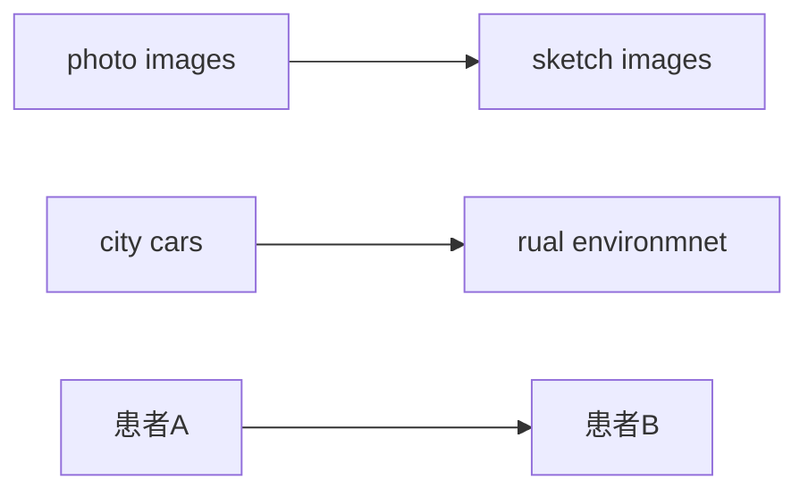

# 领域泛化

## Domain Generalization: A Survey综述

**摘要**：人类很自然地拥有泛化分布外数据的能力（举一反三），然而对机器来说却很难。这是因为大多数学习算法强烈依赖于/目标数据的独立同分布假设，但由于领域偏移，实际常常违反这一假设。领域泛化的目标是，只用源数据来做模型的学习，实现域外分布数据的泛化。在过去10年，领域泛化方面的工作已经取得了巨大的进步，催生了多种多样的工作，例如，领域对齐、元学习、数据增强、集合学习等；领域泛化在应用领域的研究还有计算机视觉、语音识别、自然语言处理、医学图像和强化学习。在本文中，首次提出领域泛化全面详尽的回顾和总结，进而总结了过去10年的发展。1. 我们首次全面介绍领域泛化的研究背景：正式定义领域泛化并且将它和其他相关的研究领域比如领域自适应、迁移学习联系起来。2. 我们对现有的方法和理论阻止了全面地审查。3. 讨论未来的研究方向。

### **引言**

领域shift问题：源数据到目标数据的分布变化

> A unifying view on dataset shift in classification, 2012
>
> Do image-net classifiers generalize to image-net? 2019
>
> A theory of learning from different domains, 2010
>
> Measuring robustness to natural distribution shifts in image classification, 2020
>
> Domain generalization by marginal transfer learning

大多数统计学习算法依赖于源数据和目标数据的独立同分布假设，而忽视了实际中常见的分布外场景。

深度学习模型在分布外数据集上的性能会显著下降。迄今深度学习取得的成功，主要依赖于Image-Net等大规模标注数据的监督学习——建立在独立同分布假设的基础之上。

> image-net classifiers generalize to image-net? 2019
>
> Benchmarking neural network robustness to common corruptions and perturbations, 2019
>
> 神经网络对常见扰动的鲁棒性基准测试
>
> Generalized out-of-distribution detection: A survey, 2021

解决领域偏移的直接思路是从目标域收集数据，微调用源数据训练的模型——自适应问题。

领域自适应依赖假设：目标领域数据可用于模型适应。

**实际是：目标域数据难以获取**

因此引入领域泛化问题。

领域泛化：利用多个相关但是不同的源域数据学习，使模型能很好地推广到任何O-O-D目标域。

> Generalizing from several related classification tasks to a new unlabeled sample, 2011

1. 基于源域分布对齐的domain-invariant 表达学习

> Domain generalization with adversarial feature learning, 2018
>
> 领域泛化 with 对抗性特征学习
>
> Deep domain generalization via conditional invariant adversarial networks, 2018
>
> 基于条件不变对抗网络的深度领域泛化

2. 通过元学习的方法，让模型主动适应不用域的差异

> Learning to generalize: Meta-learning for domain generalization, 2018
>
> Metareg: Towards domain generalization using meta-regularization, 2018

3. Augmenting data with domain synthesis

> 通过领域综合来增强数据
>
> Learning to generate novel domain for domain generalization, 2020
>
> Deep domain-adversarial image generation for domain generalization, 2020

**与目标检测相关：**

> Deeper, broader and artier domain generalization, 2017
>
> Feature-critic networks for heterogeneous domain generalization, 2019
>
> 评论家网络：特征异质领域泛化

**语义分割：**

> Domain randomization and pyramid consistency: Simulation-to-real generalization without accessing target domain data, 2019
>
> 领域随机化与金字塔一致性：无需访问目标域数据的仿真-现实泛化
>
> Addressing model vulnerability to distributional shifts over image transformation sets, 2019
>
> 解决模型在面对一组图像变换时因分布偏移而产生的脆弱性问题

**行人重识别：**

> Domain generalization with mixstyle, 2021
>
> 基于MixStyle的领域泛化
> Learning to generate novel domains for domain generalization, 2018

### 问题定义

We first introduce some notations that will be used throughout this survey. Let $\mathit{X}$ be the input (feature) space and $\mathit{Y}$ the target (label) space, a domain is defined as a joint distribution $\mathit{P_{XY}}$ on $\mathit{X \times Y}$. For a specific domain $\mathit{P_{XY}}$ , we refer to $P_X$ as the marginal distribution on $X$, $P_{Y|X}$ the posterior distribution of $Y$ given $X$, and $P_{X|Y}$ the class-conditional distribution of $X$ given $Y$.

> **首先介绍符号：**
>
> $X$: 输入特征空间
>
> $Y$: 目标标签空间
>
> $P_{XY}$联合分布描述了数据x和它对应的标签y的组合，也就是这个数据域的表示。
>
> $P_X$: 边缘分布，输入x本身的概率分布
>
> $P_{Y|X}$: 后验分布，给定输入x时，标签y的条件概率
>
> $P_{X|Y}$: 类条件分布，给定标签y时，输入x的条件概率

In the context of DG, we have access to $K$ similar but distinct source domain $S=\{ S_k = {\{ \( x^{(k)} , y^{(k)} \) \} \}}_{k=1}^{K}$ , each associated with a joint distribution $P_{XY}^{(k)}$ . Note that $P_{XY}^{(k)} \neq P_{XY}^{(k)}$ with $k \neq k^{'}$ and $k, k^{'} \in \{ 1, ..., K \}$ . The goal of DG is to learn a predictive model $f: X \rightarrow Y$ using only source domain data such that the prediction error on an unseen target domain $T=\{ x^T \}$ is minimized. The corresponding joint distribution of the target domain $T$ is denoted by $P_{XY}^T$. Also, $P_{XY}^T \neq P_{XY}^{(k)}, \forall k \in \{ 1, ..., K \}$.

>  K个相似但是有差异的源域数据，每个都对应一个联合分布 $P_{XY}^{(k)}$ . 
>
> 领域泛化的目标是，只使用源域数据训练预测模型，以便使在未知目标域上的预测错误最小。

**多源领域泛化：**

领域泛化分为两种：1. 多源DG 2. 单源DG

多源用的多，单源用的少。

> Generalizing from several related classification tasks to a new unlabeled sample

### 数据集和应用

暂时空着，感觉没必要看

### 方法综述

#### **领域对齐：**

现存大多数方法属于领域对齐

**核心思想：**

最小化域间差异以学习domain-invariant表示，需要域标签。

> Domain generalization via invariant feature representation, 2013
>
> Domain generalization with adversarial feature learning, 2018
>
> Deep domain generalization via conditional invariant adversarial networks, 2018
>
> Multi-adversarial discriminative deep domain generalization for face presentation attack detection, 2019
>
> Unified deep supervised domain adaptation and generalization, 2017
>
> Respecting domain relations: Hypothesis invariance for domain generalization, 2020
>
> Deep domain generalization via conditional invariant adversarial networks, 2018
>
> Domain generalization for object recognition with multi-task auto-encoders, 2015

**对齐什么？**
$$
P(X,Y)=P(Y|X)P(X)=P(X|Y)P(Y)
$$
**假设1：分布偏移只发生在边缘分布P(x)，后验分布P(Y|X)保持不变**

原理：

> Domain generalization via invariant feature representation, 2013

举例说明：

物体形状--->是否是猫，这个因果关系保持不变。

需要对齐的是领域无关特征，domain-invariant feature

相关方法：

> Domain randomization and pyramid consistency: Simulation-to-real generalization without accessing target domain data, 2019
>
> Domain generalization with adversarial feature learning, 2018
>
> Robust domain generalization by enforcing distribution invariance, 2016
>
> Scatter component analysis: A unified framework for domain adaptation and domain generalization, 2017

从因果学习的角度，只有当X是Y的原因时，对齐P(X)才有效果。

> On causal and anti-causal learning, 2012

这种情况下，P(X)和P(Y|X)不耦合，当P(X)变化时，P(Y|X)保持稳定。

------

但如果Y是X的原因，P(X)变化，对P(Y|X)会产生影响。

**假设2: P(Y)不变，而类条件概率P(X|Y)变化，Y是X的原因**

原理：

> Deep domain generalization via conditional invariant adversarial networks, 2018
>
> Domain generalization via conditional invariant representations, 2018
>
> Domain generalization via multi-domain discriminant analysis, 2020

举例说明：

P(Y)不变：每个域里猫狗比例一样

P(X|Y)：因为是猫，所以图片中像素应当怎么表现，不会因为图片风格改变而改变

方法：

> Domain generalization via conditional invariant representations, 2018

**假设3: 允许P(Y)跟随P(X|Y)变化，异质DG**

暂时搞不太懂

原理

> Domain generalization via multi-domain discriminant analysis, 2020

**假设4: 直接对齐P(Y|X)**

前三种方法的问题：**对齐了输入，不一定能保证预测结果P(Y|X)保持一致**

理论：

> Respecting domain relations: Hypothesis invariance for domain generalization, 2020

**怎么对齐**

1. **最小化矩差异**
2. **最小化对比损失**
3. **最小化KL散度**
4. **最小化最大均值差异**
5. **领域对抗学习**
6. **多任务学习**

#### 元学习

元学习理论

> Meta-learning in neural networks: A survey, 2020

与领域学习相关的元学习论文

> Model-agnostic meta-learning for fast adaptation of deep networks, 2017

将训练数据划分为元训练集和元测试集，并利用元训练集训练模型，以提升元测试集的性能。

这部分感觉都没什么用，之后再看吧。

#### 数据增强

# 面向全天候无人机监控的模态自适应单流目标检测研究

